# 节点提取

<cite>
**本文档引用的文件**   
- [extract_nodes.py](file://graphiti_core/prompts/extract_nodes.py)
- [nodes.py](file://graphiti_core/nodes.py)
- [entity_types_utils.py](file://graphiti_core/utils/ontology_utils/entity_types_utils.py)
- [client.py](file://graphiti_core/llm_client/client.py)
- [graphiti.py](file://graphiti_core/graphiti.py)
- [lib.py](file://graphiti_core/prompts/lib.py)
- [prompt_helpers.py](file://graphiti_core/prompts/prompt_helpers.py)
- [models.py](file://graphiti_core/prompts/models.py)
- [text_utils.py](file://graphiti_core/utils/text_utils.py)
</cite>

## 目录
1. [简介](#简介)
2. [核心节点类型](#核心节点类型)
3. [节点提取提示模板设计](#节点提取提示模板设计)
4. [节点提取调用流程](#节点提取调用流程)
5. [与本体工具模块的集成](#与本体工具模块的集成)
6. [错误处理机制](#错误处理机制)
7. [性能优化建议](#性能优化建议)
8. [质量控制策略](#质量控制策略)
9. [实际代码示例](#实际代码示例)
10. [结论](#结论)

## 简介
节点提取功能是Graphiti系统的核心组件，负责从非结构化文本中识别和创建EpisodicNode、EntityNode和CommunityNode。该功能利用大型语言模型（LLM）的强大能力，通过精心设计的提示模板，从原始文本中提取实体节点，并对其进行分类和属性提取。系统支持多种输入类型，包括对话消息、JSON数据和纯文本，并通过反射机制确保提取的完整性。节点提取过程与图数据库紧密集成，确保提取的节点能够正确地存储和关联。

## 核心节点类型
Graphiti系统定义了三种核心节点类型，每种类型都有其特定的用途和属性。

### EpisodicNode
EpisodicNode表示从原始数据源（如对话、文档或JSON）中提取的原始信息片段。它作为信息的来源记录，包含原始内容和元数据。

**节点属性**
- **uuid**: 节点的唯一标识符
- **name**: 节点的名称
- **group_id**: 图的分区标识符
- **labels**: 节点的标签列表
- **created_at**: 节点创建时间
- **source**: 信息来源类型（消息、JSON、文本）
- **source_description**: 数据源描述
- **content**: 原始内容数据
- **valid_at**: 原始文档的创建时间
- **entity_edges**: 引用的实体边列表

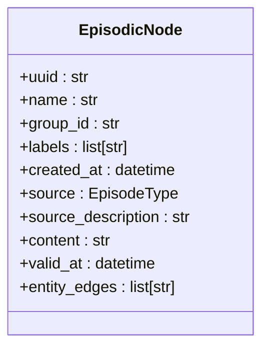

**Diagram sources**
- [nodes.py](file://graphiti_core/nodes.py#L295-L374)

### EntityNode
EntityNode表示从文本中提取的实体，如人物、组织或概念。它是知识图谱中的核心实体，包含实体的名称、摘要和属性。

**节点属性**
- **uuid**: 节点的唯一标识符
- **name**: 实体名称
- **group_id**: 图的分区标识符
- **labels**: 节点的标签列表
- **created_at**: 节点创建时间
- **name_embedding**: 名称的嵌入向量
- **summary**: 实体的摘要信息
- **attributes**: 实体的附加属性

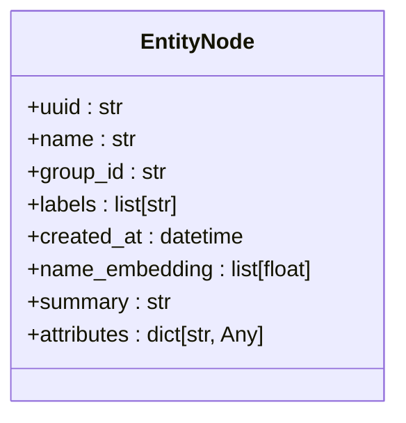

**Diagram sources**
- [nodes.py](file://graphiti_core/nodes.py#L435-L589)

### CommunityNode
CommunityNode表示由多个实体节点组成的社区或群体。它用于组织和聚合相关的实体，提供更高层次的抽象。

**节点属性**
- **uuid**: 节点的唯一标识符
- **name**: 社区名称
- **group_id**: 图的分区标识符
- **labels**: 节点的标签列表
- **created_at**: 节点创建时间
- **name_embedding**: 名称的嵌入向量
- **summary**: 社区的摘要信息

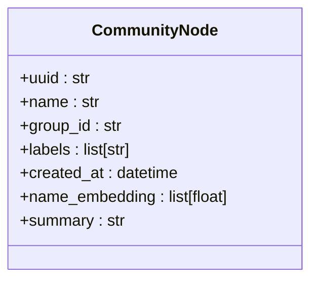

**Diagram sources**
- [nodes.py](file://graphiti_core/nodes.py#L591-L729)

## 节点提取提示模板设计
节点提取功能的核心是其提示模板设计，这些模板指导LLM从非结构化文本中提取和分类实体。

### 实体类型定义
提示模板中包含实体类型定义，用于指导LLM对提取的实体进行分类。每个实体类型都有一个唯一的ID、名称和描述，LLM根据这些信息将实体分配到正确的类别。

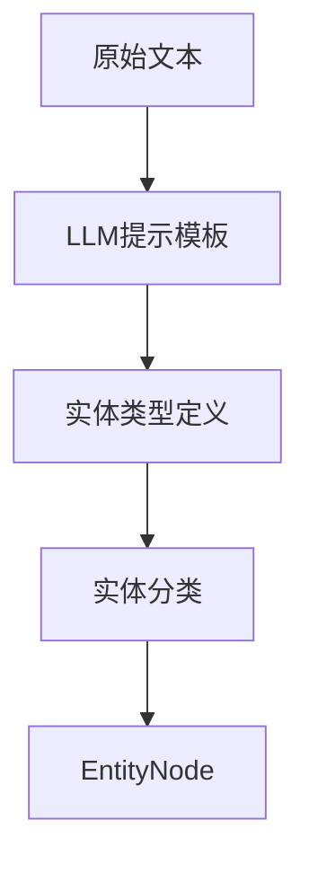

**Diagram sources**
- [extract_nodes.py](file://graphiti_core/prompts/extract_nodes.py#L86-L127)

### 上下文注入
提示模板通过上下文注入机制，将先前的消息和当前消息的上下文提供给LLM，确保提取的实体具有正确的上下文信息。

**上下文注入规则**
- **先前消息**: 提供对话历史作为上下文
- **当前消息**: 提供需要提取实体的当前内容
- **实体类型**: 提供可用的实体类型列表
- **自定义提示**: 允许用户添加自定义指令

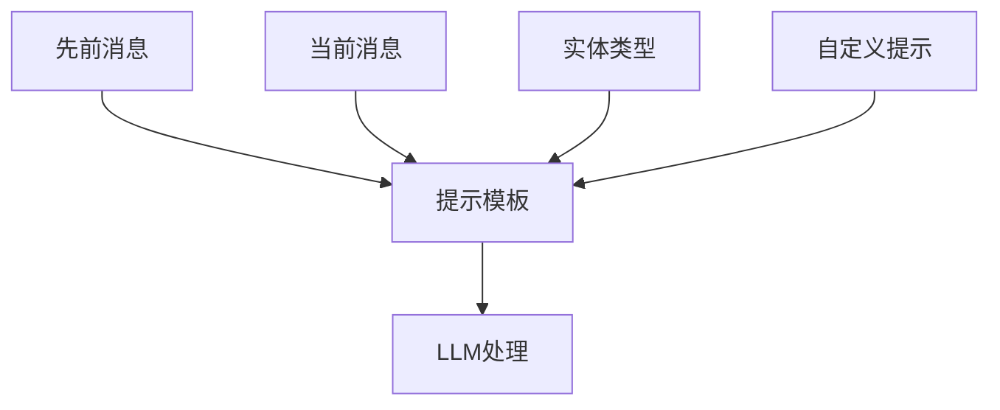

**Diagram sources**
- [extract_nodes.py](file://graphiti_core/prompts/extract_nodes.py#L86-L127)

### 输出格式约束
提示模板通过Pydantic模型严格约束LLM的输出格式，确保提取的实体数据结构化和一致性。

**输出格式约束**
- **ExtractedEntity**: 定义单个提取实体的结构
- **ExtractedEntities**: 定义提取实体列表的结构
- **MissedEntities**: 定义未提取实体的结构
- **EntityClassificationTriple**: 定义实体分类三元组的结构

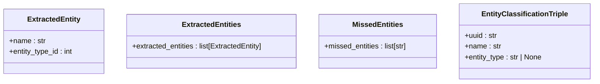

**Diagram sources**
- [extract_nodes.py](file://graphiti_core/prompts/extract_nodes.py#L28-L56)

## 节点提取调用流程
节点提取的调用流程从原始文本输入开始，经过LLM客户端调用，最终解析响应并构建Pydantic模型实例。

### 调用流程概述
1. **输入准备**: 准备原始文本和上下文信息
2. **提示生成**: 根据输入类型生成相应的提示模板
3. **LLM调用**: 调用LLM客户端处理提示
4. **响应解析**: 解析LLM的响应并构建Pydantic模型
5. **节点创建**: 将解析的数据转换为EntityNode实例

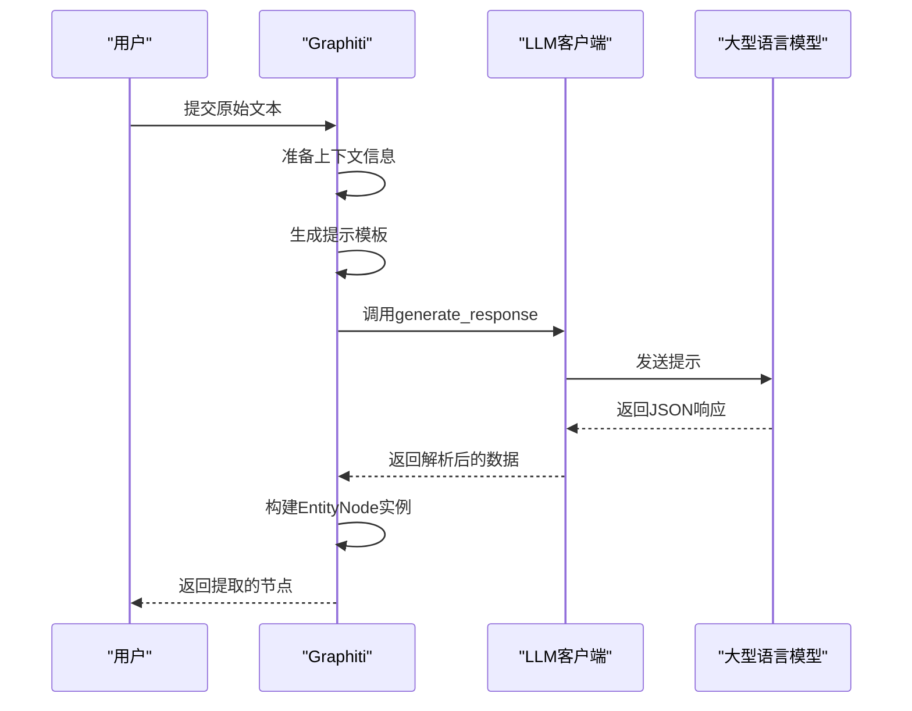

**Diagram sources**
- [graphiti.py](file://graphiti_core/graphiti.py#L354-L374)
- [client.py](file://graphiti_core/llm_client/client.py#L149-L213)

### 反思机制
系统采用反思机制来提高实体提取的完整性。在初次提取后，系统会询问LLM是否有遗漏的实体，并根据反馈进行补充提取。

**反思流程**
1. **初次提取**: 执行初始的实体提取
2. **反思查询**: 询问LLM是否有遗漏的实体
3. **补充提取**: 根据反馈补充提取遗漏的实体
4. **迭代优化**: 最多进行3次迭代以确保完整性

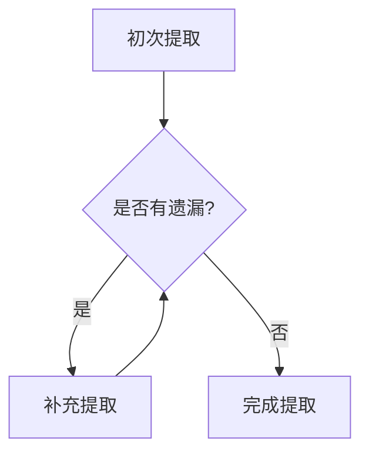

**Diagram sources**
- [node_operations.py](file://graphiti_core/utils/maintenance/node_operations.py#L87-L207)

## 与本体工具模块的集成
节点提取功能与ontology_utils模块紧密集成，支持自定义实体类型的扩展。

### 实体类型验证
系统通过validate_entity_types函数验证自定义实体类型的正确性，确保它们不会与现有节点字段冲突。

**验证规则**
- 自定义实体类型不能与EntityNode的现有字段同名
- 实体类型必须是Pydantic BaseModel的子类
- 实体类型描述将作为分类依据

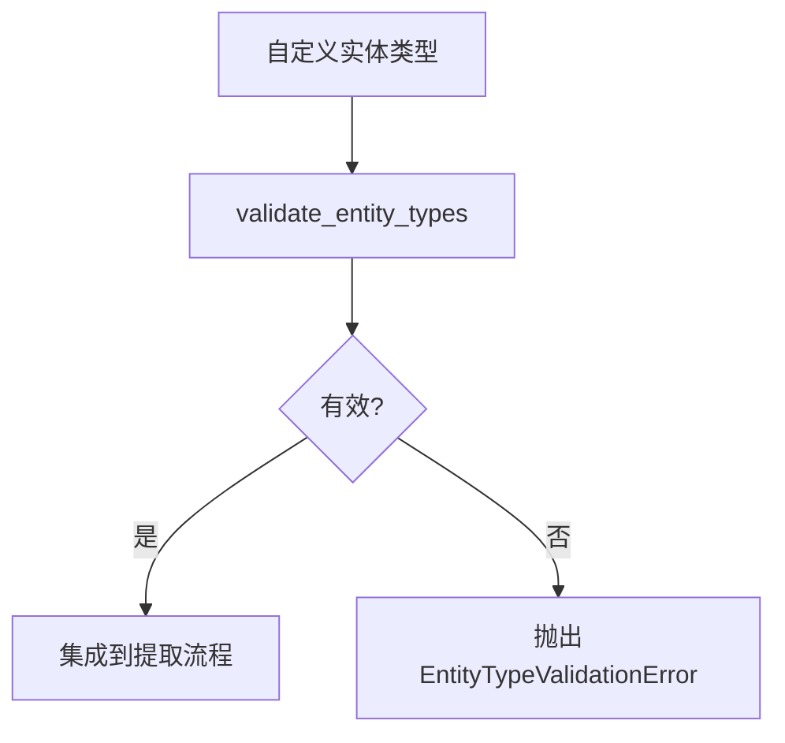

**Diagram sources**
- [entity_types_utils.py](file://graphiti_core/utils/ontology_utils/entity_types_utils.py#L23-L37)

### 自定义类型扩展
用户可以通过定义新的Pydantic模型来扩展实体类型，这些模型将被自动集成到节点提取流程中。

**扩展步骤**
1. 定义新的Pydantic模型
2. 将模型添加到entity_types字典
3. 在节点提取时传递entity_types参数

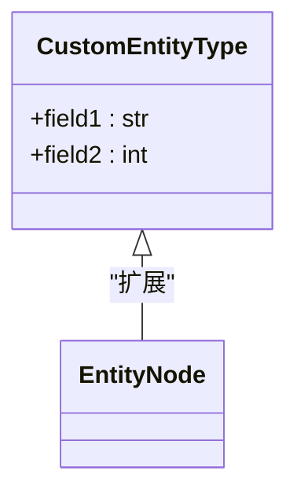

**Diagram sources**
- [entity_types_utils.py](file://graphiti_core/utils/ontology_utils/entity_types_utils.py#L23-L37)

## 错误处理机制
系统实现了全面的错误处理机制，确保在各种异常情况下都能稳定运行。

### 格式解析失败
当LLM返回的JSON格式无效时，系统会捕获JSONDecodeError并进行重试。

**处理策略**
- 最多重试4次
- 指数退避等待
- 记录详细的错误日志

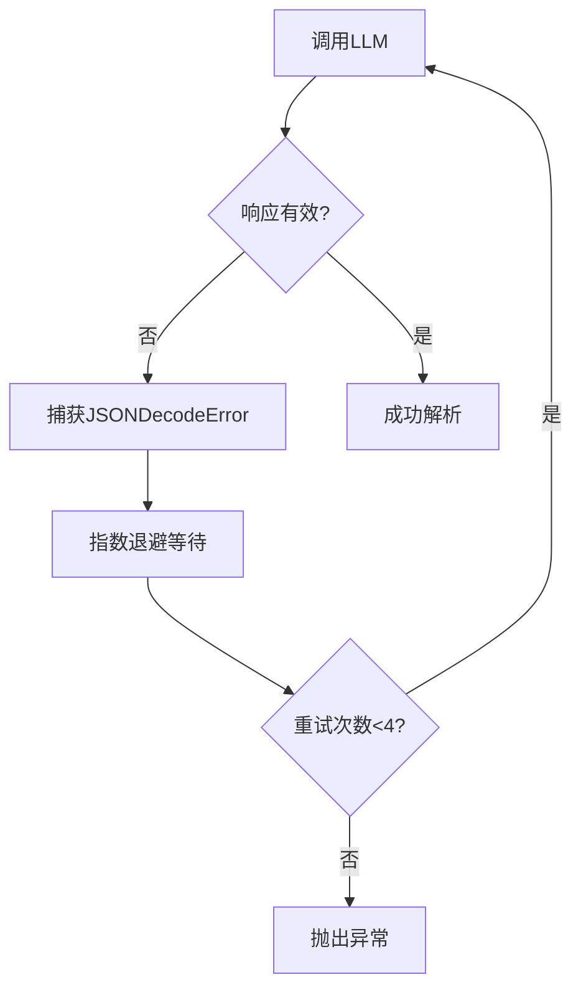

**Diagram sources**
- [client.py](file://graphiti_core/llm_client/client.py#L57-L63)

### 速率限制处理
系统能够识别和处理速率限制错误，通过重试机制应对API调用限制。

**速率限制策略**
- 识别429状态码
- 指数退避重试
- 最大重试4次

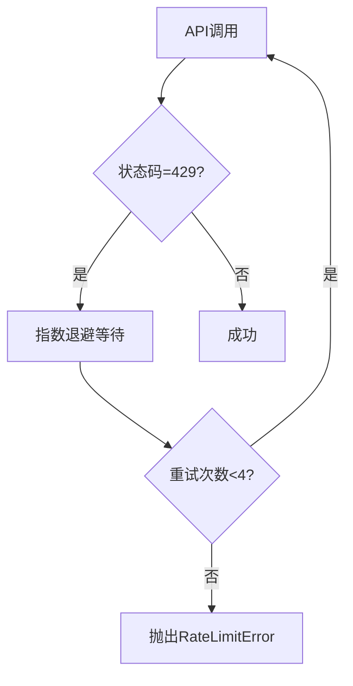

**Diagram sources**
- [client.py](file://graphiti_core/llm_client/client.py#L57-L63)

## 性能优化建议
为了提高节点提取的性能，系统提供了多种优化策略。

### 批量处理
系统支持批量处理多个Episode，通过semaphore_gather并发执行提取任务，显著提高处理效率。

**批量处理优势**
- 减少I/O等待时间
- 提高资源利用率
- 降低总体处理时间

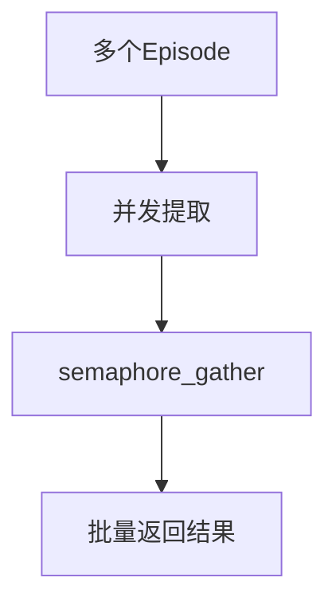

**Diagram sources**
- [bulk_utils.py](file://graphiti_core/utils/bulk_utils.py#L253-L283)

### 缓存机制
系统实现了磁盘缓存机制，避免重复处理相同的提示，显著减少LLM调用次数和成本。

**缓存策略**
- 使用MD5哈希作为缓存键
- 缓存目录默认为./llm_cache
- 可通过cache参数启用/禁用

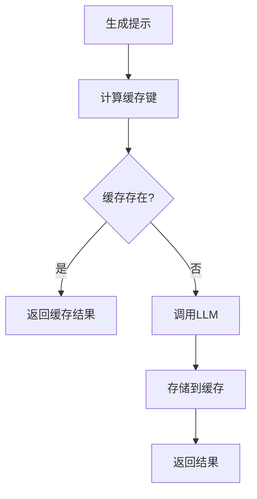

**Diagram sources**
- [client.py](file://graphiti_core/llm_client/client.py#L187-L212)

## 质量控制策略
系统采用多种质量控制策略，确保提取的节点具有高质量和准确性。

### 置信度评分
通过反思机制和多次提取，系统可以评估提取结果的置信度，确保关键实体不被遗漏。

**置信度评估**
- 比较多次提取结果
- 识别一致的实体
- 标记低置信度的提取

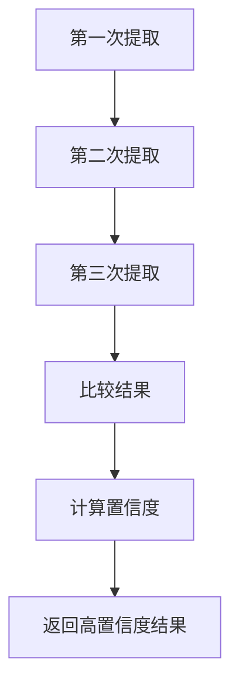

**Diagram sources**
- [node_operations.py](file://graphiti_core/utils/maintenance/node_operations.py#L87-L207)

### 后处理验证
在提取完成后，系统会对结果进行验证和过滤，确保数据的质量和一致性。

**验证规则**
- 过滤空名称的实体
- 排除指定类型的实体
- 验证实体类型的正确性

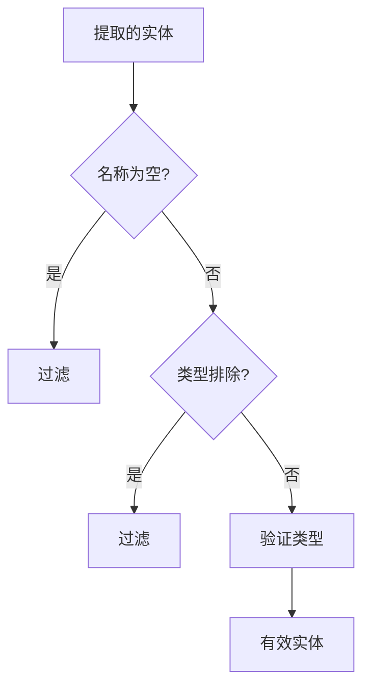

**Diagram sources**
- [node_operations.py](file://graphiti_core/utils/maintenance/node_operations.py#L174-L192)

## 实际代码示例
以下代码示例展示了如何配置和调用节点提取功能。

### 基本节点提取
```python
from graphiti_core import Graphiti
from graphiti_core.nodes import EpisodeType

# 初始化Graphiti实例
graphiti = Graphiti("bolt://localhost:7687", "neo4j", "password")

# 添加文本片段作为Episode
await graphiti.add_episode(
    name="示例片段",
    episode_body="Kamala Harris是加利福尼亚州的总检察长。",
    source=EpisodeType.text,
    source_description="新闻报道",
    reference_time=datetime.now(timezone.utc),
)
```

**Section sources**
- [graphiti.py](file://graphiti_core/graphiti.py#L128-L236)
- [quickstart_neo4j.py](file://examples/quickstart/quickstart_neo4j.py#L67-L127)

### 自定义实体类型
```python
from pydantic import BaseModel

# 定义自定义实体类型
class Politician(BaseModel):
    """政治家实体类型，包含职位和任期信息"""
    position: str
    term_start: str
    term_end: str

# 配置实体类型映射
entity_types = {"Politician": Politician}

# 在节点提取时使用自定义类型
await graphiti.add_episode(
    name="政治家信息",
    episode_body="Gavin Newsom是加利福尼亚州的州长，任期从2019年1月7日开始。",
    source=EpisodeType.text,
    source_description="政府网站",
    reference_time=datetime.now(timezone.utc),
    entity_types=entity_types,
)
```

**Section sources**
- [entity_types_utils.py](file://graphiti_core/utils/ontology_utils/entity_types_utils.py#L23-L37)
- [graphiti.py](file://graphiti_core/graphiti.py#L436-L464)

## 结论
节点提取功能是Graphiti系统的核心，它通过精心设计的提示模板和LLM集成，实现了从非结构化文本中高效、准确地提取实体节点。系统支持多种输入类型和自定义实体扩展，具有完善的错误处理和性能优化机制。通过反思机制和质量控制策略，确保了提取结果的完整性和准确性。该功能为构建高质量的知识图谱提供了坚实的基础，适用于各种自然语言处理和信息提取场景。