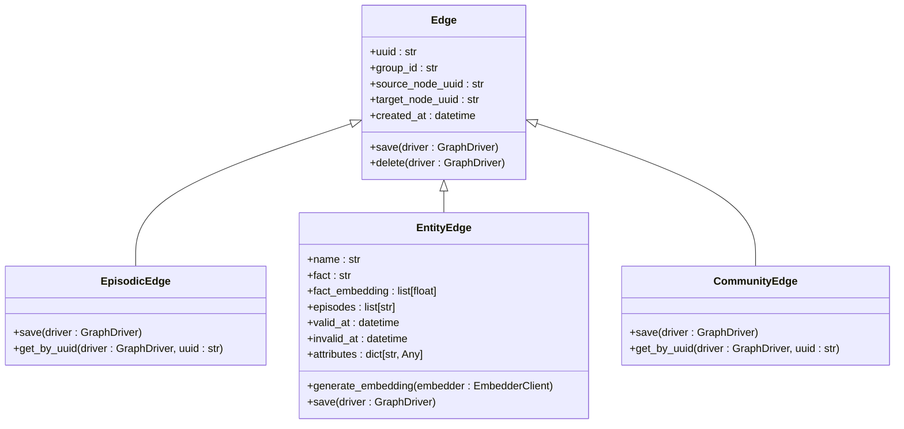
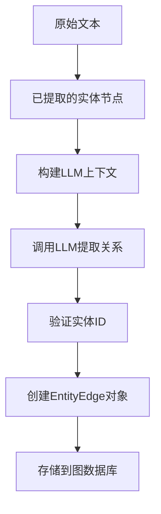
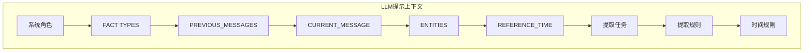
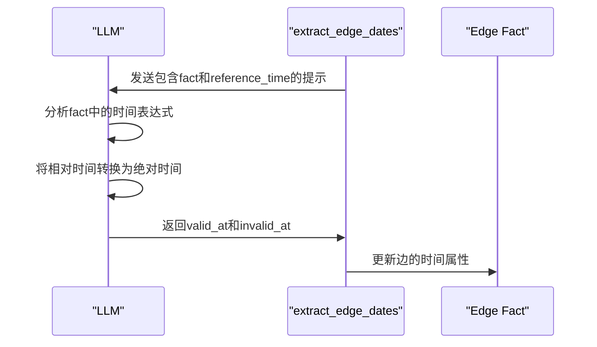
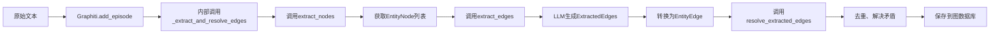

# 边提取

<cite>
**本文档引用的文件**   
- [extract_edges.py](file://graphiti_core/prompts/extract_edges.py)
- [extract_edge_dates.py](file://graphiti_core/prompts/extract_edge_dates.py)
- [edges.py](file://graphiti_core/edges.py)
- [edge_operations.py](file://graphiti_core/utils/maintenance/edge_operations.py)
- [edge_db_queries.py](file://graphiti_core/models/edges/edge_db_queries.py)
- [nodes.py](file://graphiti_core/nodes.py)
- [datetime_utils.py](file://graphiti_core/utils/datetime_utils.py)
- [graphiti.py](file://graphiti_core/graphiti.py)
- [quickstart_neo4j.py](file://examples/quickstart/quickstart_neo4j.py)
</cite>

## 目录
1. [引言](#引言)
2. [核心边类型](#核心边类型)
3. [关系识别与边提取](#关系识别与边提取)
4. [提示工程实现](#提示工程实现)
5. [时间信息提取](#时间信息提取)
6. [输入依赖与输出结构](#输入依赖与输出结构)
7. [实际调用示例](#实际调用示例)
8. [挑战与解决方案](#挑战与解决方案)
9. [结论](#结论)

## 引言
边提取是知识图谱构建中的关键环节，负责识别实体之间的关系并将其结构化为图中的边。本系统通过大语言模型（LLM）驱动的提示工程，实现了从非结构化文本中自动提取实体关系的功能。该过程不仅识别关系类型和方向，还支持复杂的时间信息建模，包括事务时间与有效时间的双时间模型。边提取依赖于先前提取的节点信息，确保图谱的引用一致性，并通过一系列优化策略处理长距离依赖等挑战。

## 核心边类型
系统定义了多种核心边类型，用于表示不同层级的图谱关系。这些边类型在代码中通过继承抽象基类 `Edge` 实现，每种类型对应特定的图数据库查询和存储逻辑。

**图源**
- [edges.py](file://graphiti_core/edges.py#L45-L494)

### EpisodicEdge
`EpisodicEdge` 类型表示从“事件”节点（`EpisodicNode`）到“实体”节点（`EntityNode`）的引用关系。它记录了某个事件（如一段对话或文档）提到了哪些实体。这种边不包含关系的语义信息，仅表示提及（MENTIONS）。

**边源**
- [edges.py](file://graphiti_core/edges.py#L131-L182)
- [edge_db_queries.py](file://graphiti_core/models/edges/edge_db_queries.py#L19-L27)

### EntityEdge
`EntityEdge` 是最核心的关系边类型，表示两个实体节点之间的语义关系。它包含丰富的属性，如 `name`（关系类型，如 FOUNDED）、`fact`（自然语言描述）、`valid_at` 和 `invalid_at`（时间有效性）等。`fact_embedding` 字段存储了关系描述的向量嵌入，用于后续的语义搜索。

**边源**
- [edges.py](file://graphiti_core/edges.py#L221-L316)
- [edge_db_queries.py](file://graphiti_core/models/edges/edge_db_queries.py#L63-L122)

### CommunityEdge
`CommunityEdge` 表示“社区”节点（`CommunityNode`）与其成员节点（可以是实体或其他社区）之间的包含关系。它用于组织图谱中的节点，形成层次化的社区结构。

**边源**
- [edges.py](file://graphiti_core/edges.py#L480-L493)
- [edge_db_queries.py](file://graphiti_core/models/edges/edge_db_queries.py#L225-L273)

## 关系识别与边提取
边提取过程的核心是识别实体之间的关系，并将其构造成 `EntityEdge` 对象。这一过程依赖于已提取的节点集合，确保边的源和目标节点在图谱中是有效的。

### 实体关系识别
系统通过分析文本内容，结合已识别的实体列表，来确定实体间的关系。在 `extract_edges` 函数中，实体列表以索引形式提供给 LLM，LLM 在提取关系时使用这些索引作为 `source_entity_id` 和 `target_entity_id`。这确保了边的引用一致性，避免了因实体名称模糊或变化导致的错误链接。

**边源**
- [edge_operations.py](file://graphiti_core/utils/maintenance/edge_operations.py#L89-L238)
- [extract_edges.py](file://graphiti_core/prompts/extract_edges.py#L67-L136)

### 方向性处理
关系的方向性由 `source_entity_id` 和 `target_entity_id` 明确指定。例如，对于“Kamala Harris 是 California 的总检察长”这一事实，`source_entity_id` 指向 "Kamala Harris" 的节点，`target_entity_id` 指向 "California" 的节点，关系类型为 `IS_ATTORNEY_GENERAL_OF`。这种设计确保了图谱中关系的有向性，支持精确的图遍历查询。

## 提示工程实现
边提取的提示工程是整个流程的核心，它指导 LLM 如何从文本中提取结构化的边信息。提示模板定义了关系类型、提取规则和时间处理逻辑。

### 关系类型定义
提示模板通过 `<FACT TYPES>` 部分向 LLM 提供预定义的关系类型及其签名（source 和 target 的实体类型）。例如，一个 `WORKS_AT` 关系可能定义为源是 `Person`，目标是 `Organization`。LLM 被要求优先提取这些类型的关系，但也可以提取未列出的其他关系。

**边源**
- [extract_edges.py](file://graphiti_core/prompts/extract_edges.py#L78-L107)

### 提示规则与上下文管理
提示工程中包含了严格的提取规则，以确保输出的准确性和一致性：
- **实体ID验证**：要求 LLM 必须使用提供的实体列表中的 ID，否则边将被拒绝。
- **事实去重**：禁止提取重复或语义冗余的事实。
- **事实描述**：要求 `fact` 字段是对原文的意译，而非直接引用。
- **上下文窗口管理**：通过 `<PREVIOUS_MESSAGES>` 和 `<CURRENT_MESSAGE>` 结构，LLM 可以利用历史上下文来消除指代歧义，但主要任务是基于当前消息提取事实。

**边源**
- [extract_edges.py](file://graphiti_core/prompts/extract_edges.py#L67-L136)

## 时间信息提取
系统支持对关系进行时间建模，区分事务时间（when the fact was recorded）和有效时间（when the fact was true in the real world）。`extract_edge_dates.py` 文件专门负责提取有效时间。

### 双时间模型
- **有效时间 (valid_at/invalid_at)**：表示关系在现实世界中成立的时间段。例如，`valid_at` 可以是 "2011-01-03T00:00:00Z"，表示某人开始担任某个职位的日期。
- **事务时间 (created_at)**：记录在 `Edge` 基类中，表示该关系被添加到图谱中的时间，由系统自动生成。

### extract_edge_dates.py 的作用
`extract_edge_dates.py` 提供了一个独立的提示函数 `v1`，专门用于从已提取的 `fact` 中解析时间信息。它接收 `edge_fact`、`current_episode` 和 `reference_timestamp` 作为输入，分析关系描述中的时间表达式（如“昨天”、“2011年”），并将其转换为 ISO 8601 格式的 UTC 时间戳。这确保了时间信息的精确性和一致性。

**边源**
- [extract_edge_dates.py](file://graphiti_core/prompts/extract_edge_dates.py#L43-L86)
- [edges.py](file://graphiti_core/edges.py#L232-L237)

## 输入依赖与输出结构
边提取过程具有明确的输入依赖和结构化的输出。

### 输入依赖
边提取的首要输入是已提取的节点集合（`nodes`）。这些节点是通过 `extract_nodes.py` 从同一段文本中提取的。边提取过程依赖于这些节点的 ID 和名称，以建立正确的连接。此外，过程还依赖于 `episode_content`（当前文本）、`previous_episodes`（历史上下文）和 `reference_time`（参考时间戳）。

**边源**
- [edge_operations.py](file://graphiti_core/utils/maintenance/edge_operations.py#L123-L133)

### 输出结构
边提取的输出是一个 `ExtractedEdges` 对象，其核心是 `edges` 字段，包含一个 `Edge` 对象列表。每个 `Edge` 对象包含：
- `relation_type`: 关系类型（大写蛇形命名）。
- `source_entity_id` 和 `target_entity_id`: 源和目标实体的索引。
- `fact`: 关系的自然语言描述。
- `valid_at` 和 `invalid_at`: 关系的有效时间。

这些数据随后被转换为 `EntityEdge` 对象并持久化到图数据库中。

**边源**
- [extract_edges.py](file://graphiti_core/prompts/extract_edges.py#L25-L48)

## 实际调用示例
以下是一个从节点集合到关系生成的完整流程示例，基于 `quickstart_neo4j.py` 中的代码逻辑。

**边源**
- [graphiti.py](file://graphiti_core/graphiti.py#L128-L200)
- [quickstart_neo4j.py](file://examples/quickstart/quickstart_neo4j.py#L118-L127)

1.  **添加事件**：调用 `graphiti.add_episode()` 方法，传入文本内容和元数据。
2.  **提取节点**：系统内部调用 `extract_nodes` 函数，从文本中识别出实体（如 "Kamala Harris", "California"）。
3.  **提取边**：系统调用 `extract_edges` 函数，将节点列表和文本内容作为上下文发送给 LLM。
4.  **生成边**：LLM 返回 `ExtractedEdges`，例如一个关系类型为 `IS_ATTORNEY_GENERAL_OF` 的边。
5.  **解析与保存**：系统将 `ExtractedEdges` 转换为 `EntityEdge` 对象，处理时间信息，并最终调用 `save()` 方法将其持久化。

## 挑战与解决方案
边提取面临一些潜在挑战，系统通过特定策略来应对。

### 长距离依赖关系识别
当关系的源和目标实体在文本中相隔很远，或需要跨多个句子推断时，LLM 可能难以识别。例如，一个段落开头提到一个人，结尾提到一个公司，中间描述了其工作经历。

**解决方案**：
- **分块处理**：将长文本分割成较小的块（chunks），对每个块独立进行节点和边提取。这可以确保每个块的上下文足够集中。
- **上下文增强**：在提取边时，提供 `previous_episodes` 作为上下文，帮助 LLM 理解跨段落的指代和关系。`reflexion` 机制也允许系统进行多轮迭代，检查是否有遗漏的事实。

**边源**
- [extract_edges.py](file://graphiti_core/prompts/extract_edges.py#L139-L164)
- [edge_operations.py](file://graphiti_core/utils/maintenance/edge_operations.py#L137-L168)

## 结论
本文档详细阐述了 Graphiti 系统中边提取功能的实现机制。通过精心设计的提示工程，系统能够有效地识别实体间的关系，处理方向性和时间信息，并确保与节点的引用一致性。`extract_edges.py` 和 `extract_edge_dates.py` 文件共同构成了关系提取的核心，而 `EntityEdge`、`EpisodicEdge` 等类型则提供了灵活的数据模型。尽管存在长距离依赖等挑战，但通过分块处理和上下文增强等策略，系统能够稳健地构建高质量的知识图谱。实际调用示例展示了从原始文本到结构化边的完整流程，体现了系统的易用性和强大功能。