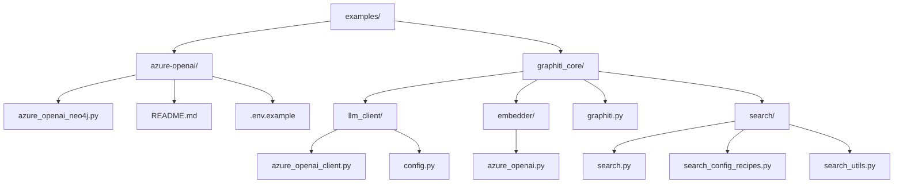
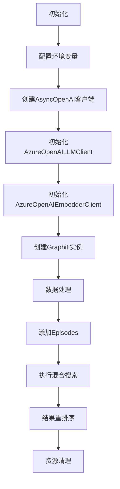
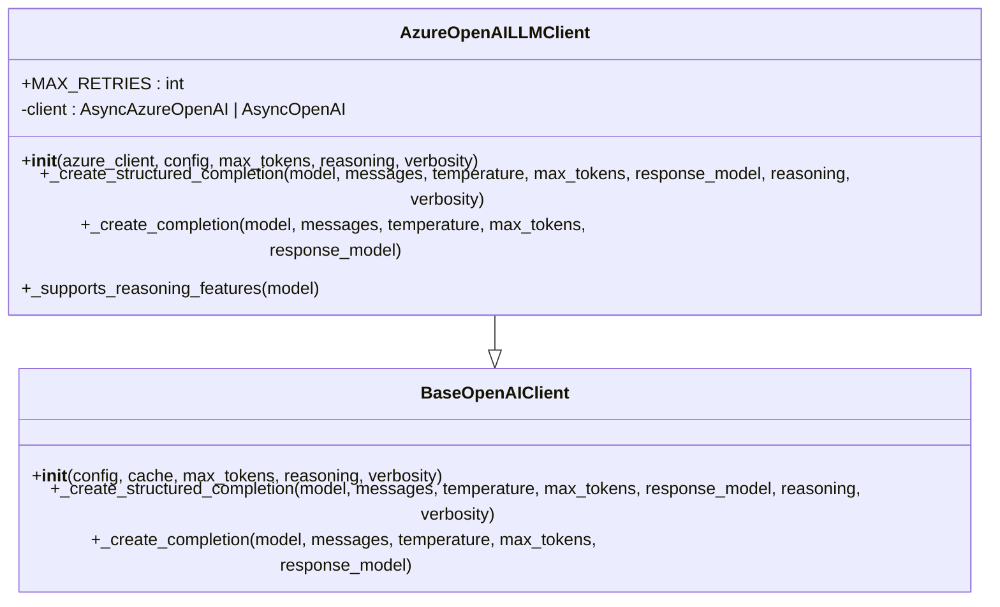
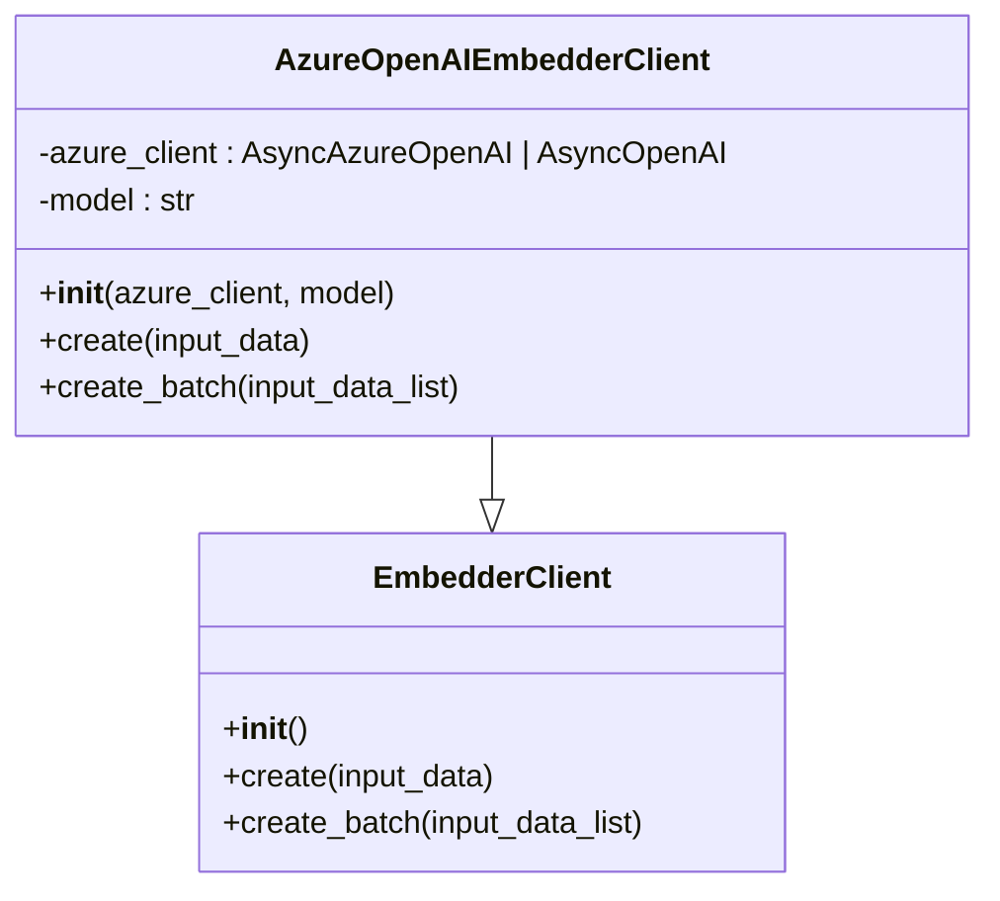
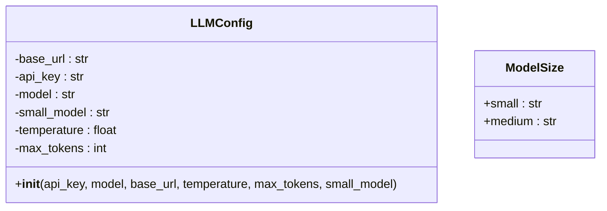
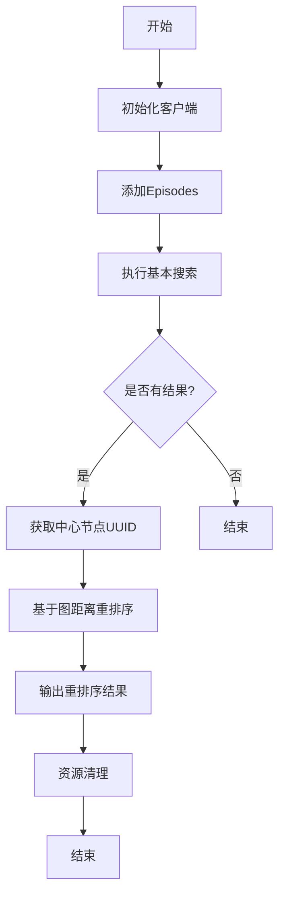
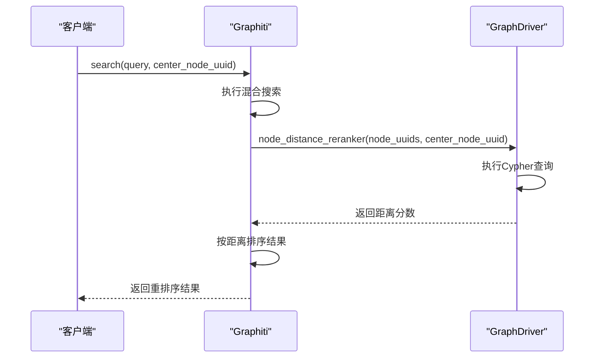
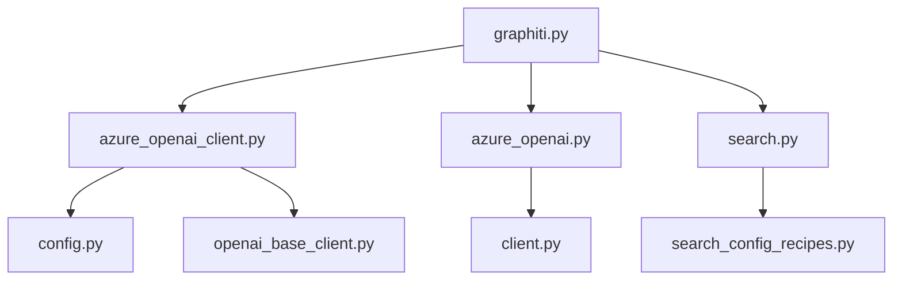

# Azure OpenAI 集成

<cite>
**本文档中引用的文件**  
- [azure_openai_neo4j.py](file://examples/azure-openai/azure_openai_neo4j.py)
- [README.md](file://examples/azure-openai/README.md)
- [.env.example](file://examples/azure-openai/.env.example)
- [azure_openai_client.py](file://graphiti_core/llm_client/azure_openai_client.py)
- [azure_openai.py](file://graphiti_core/embedder/azure_openai.py)
- [config.py](file://graphiti_core/llm_client/config.py)
- [graphiti.py](file://graphiti_core/graphiti.py)
- [search.py](file://graphiti_core/search/search.py)
- [search_config_recipes.py](file://graphiti_core/search/search_config_recipes.py)
- [search_utils.py](file://graphiti_core/search/search_utils.py)
</cite>

## 目录
1. [简介](#简介)
2. [项目结构](#项目结构)
3. [核心组件](#核心组件)
4. [架构概述](#架构概述)
5. [详细组件分析](#详细组件分析)
6. [依赖分析](#依赖分析)
7. [性能考虑](#性能考虑)
8. [故障排除指南](#故障排除指南)
9. [结论](#结论)

## 简介
本文档全面介绍Azure OpenAI与Graphiti的集成方式。基于`azure_openai_neo4j.py`详细说明如何配置`AzureOpenAILLMClient`和`AzureOpenAIEmbedderClient`客户端。解释如何通过`AsyncOpenAI`设置`base_url`和API密钥连接到Azure端点，并正确指定部署名称（如gpt-4.1和text-embedding-3-small）。展示`LLMConfig`在大模型与小模型之间的调度逻辑。演示从初始化客户端、添加文本/JSON格式的episodes到执行混合搜索（hybrid search）的全流程。特别说明`center_node_uuid`在结果重排序中的应用，以及如何基于图距离提升相关性。包含错误处理（如环境变量缺失）和资源清理（close方法）的最佳实践。

**Section sources**
- [azure_openai_neo4j.py](file://examples/azure-openai/azure_openai_neo4j.py#L1-L226)
- [README.md](file://examples/azure-openai/README.md#L1-L155)

## 项目结构
Graphiti项目中的Azure OpenAI集成主要位于`examples/azure-openai/`目录下，包含示例代码、配置文件和文档。核心功能实现分布在`graphiti_core`模块中，特别是`llm_client`和`embedder`子模块。

**Diagram sources**
- [azure_openai_neo4j.py](file://examples/azure-openai/azure_openai_neo4j.py#L1-L226)
- [azure_openai_client.py](file://graphiti_core/llm_client/azure_openai_client.py#L1-L116)
- [azure_openai.py](file://graphiti_core/embedder/azure_openai.py#L1-L72)

**Section sources**
- [azure_openai_neo4j.py](file://examples/azure-openai/azure_openai_neo4j.py#L1-L226)
- [azure_openai_client.py](file://graphiti_core/llm_client/azure_openai_client.py#L1-L116)
- [azure_openai.py](file://graphiti_core/embedder/azure_openai.py#L1-L72)

## 核心组件
本节分析Azure OpenAI集成的核心组件，包括LLM客户端、嵌入客户端、配置管理和搜索功能。

**Section sources**
- [azure_openai_client.py](file://graphiti_core/llm_client/azure_openai_client.py#L1-L116)
- [azure_openai.py](file://graphiti_core/embedder/azure_openai.py#L1-L72)
- [config.py](file://graphiti_core/llm_client/config.py#L1-L69)

## 架构概述
Azure OpenAI与Graphiti的集成架构主要包括客户端初始化、数据处理和搜索三个主要阶段。系统通过`AsyncOpenAI`连接到Azure OpenAI服务，使用指定的部署名称进行LLM和嵌入操作。

**Diagram sources**
- [azure_openai_neo4j.py](file://examples/azure-openai/azure_openai_neo4j.py#L77-L220)
- [graphiti.py](file://graphiti_core/graphiti.py#L128-L800)

## 详细组件分析

### Azure OpenAI 客户端配置
本节详细分析`AzureOpenAILLMClient`和`AzureOpenAIEmbedderClient`的配置和使用。

#### AzureOpenAILLMClient 分析
`AzureOpenAILLMClient`是Azure OpenAI的包装类，实现了LLMClient接口，支持`AsyncAzureOpenAI`和`AsyncOpenAI`（使用Azure v1 API端点）。

**Diagram sources**
- [azure_openai_client.py](file://graphiti_core/llm_client/azure_openai_client.py#L30-L116)

**Section sources**
- [azure_openai_client.py](file://graphiti_core/llm_client/azure_openai_client.py#L30-L116)

#### AzureOpenAIEmbedderClient 分析
`AzureOpenAIEmbedderClient`是Azure OpenAI嵌入服务的包装类，实现了`EmbedderClient`接口。

**Diagram sources**
- [azure_openai.py](file://graphiti_core/embedder/azure_openai.py#L27-L72)

**Section sources**
- [azure_openai.py](file://graphiti_core/embedder/azure_openai.py#L27-L72)

### LLM 配置与调度
本节分析`LLMConfig`在大模型与小模型之间的调度逻辑。

#### LLMConfig 分析
`LLMConfig`类封装了LLM API的必要参数，包括API密钥、模型名称和基础URL。

**Diagram sources**
- [config.py](file://graphiti_core/llm_client/config.py#L28-L69)

**Section sources**
- [config.py](file://graphiti_core/llm_client/config.py#L28-L69)

### 混合搜索流程
本节演示从初始化客户端到执行混合搜索的全流程。

#### 混合搜索流程分析
混合搜索结合了语义相似性、BM25文本检索和图遍历等多种搜索策略。

**Diagram sources**
- [azure_openai_neo4j.py](file://examples/azure-openai/azure_openai_neo4j.py#L162-L207)

**Section sources**
- [azure_openai_neo4j.py](file://examples/azure-openai/azure_openai_neo4j.py#L162-L207)

### 结果重排序机制
本节特别说明`center_node_uuid`在结果重排序中的应用，以及如何基于图距离提升相关性。

#### 基于图距离的重排序分析
`node_distance_reranker`函数通过计算节点与中心节点的图距离来提升搜索结果的相关性。

**Diagram sources**
- [search.py](file://graphiti_core/search/search.py#L68-L520)
- [search_utils.py](file://graphiti_core/search/search_utils.py#L1750-L1802)

**Section sources**
- [search.py](file://graphiti_core/search/search.py#L68-L520)
- [search_utils.py](file://graphiti_core/search/search_utils.py#L1750-L1802)

## 依赖分析
本节分析Azure OpenAI集成的依赖关系。

**Diagram sources**
- [azure_openai_client.py](file://graphiti_core/llm_client/azure_openai_client.py#L1-L116)
- [azure_openai.py](file://graphiti_core/embedder/azure_openai.py#L1-L72)
- [graphiti.py](file://graphiti_core/graphiti.py#L1-L1264)
- [search.py](file://graphiti_core/search/search.py#L1-L520)
- [search_config_recipes.py](file://graphiti_core/search/search_config_recipes.py#L1-L224)

**Section sources**
- [azure_openai_client.py](file://graphiti_core/llm_client/azure_openai_client.py#L1-L116)
- [azure_openai.py](file://graphiti_core/embedder/azure_openai.py#L1-L72)
- [graphiti.py](file://graphiti_core/graphiti.py#L1-L1264)
- [search.py](file://graphiti_core/search/search.py#L1-L520)
- [search_config_recipes.py](file://graphiti_core/search/search_config_recipes.py#L1-L224)

## 性能考虑
在使用Azure OpenAI与Graphiti集成时，需要注意以下性能考虑：

1. **并发限制**：通过`max_coroutines`参数控制最大并发操作数
2. **缓存机制**：LLM客户端支持缓存以减少重复请求
3. **批量操作**：使用批量API（如`create_batch`）提高效率
4. **搜索优化**：合理配置搜索限制和重排序策略

**Section sources**
- [graphiti.py](file://graphiti_core/graphiti.py#L128-L800)
- [azure_openai.py](file://graphiti_core/embedder/azure_openai.py#L41-L69)

## 故障排除指南
本节提供Azure OpenAI集成的常见问题和解决方案。

**Section sources**
- [README.md](file://examples/azure-openai/README.md#L127-L142)
- [azure_openai_neo4j.py](file://examples/azure-openai/azure_openai_neo4j.py#L64-L65)

## 结论
本文档全面介绍了Azure OpenAI与Graphiti的集成方式，涵盖了从客户端配置、数据处理到搜索和重排序的完整流程。通过`AzureOpenAILLMClient`和`AzureOpenAIEmbedderClient`，系统能够有效地利用Azure OpenAI服务进行自然语言处理和嵌入生成。混合搜索和基于图距离的重排序机制显著提升了搜索结果的相关性和准确性。遵循文档中的最佳实践，可以确保系统的稳定性和性能。