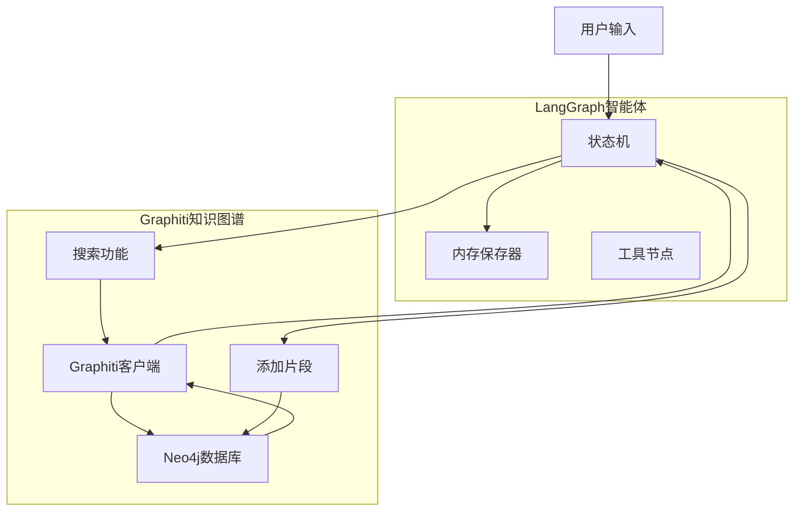
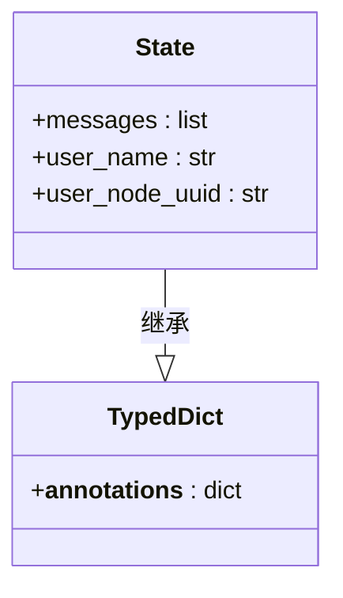
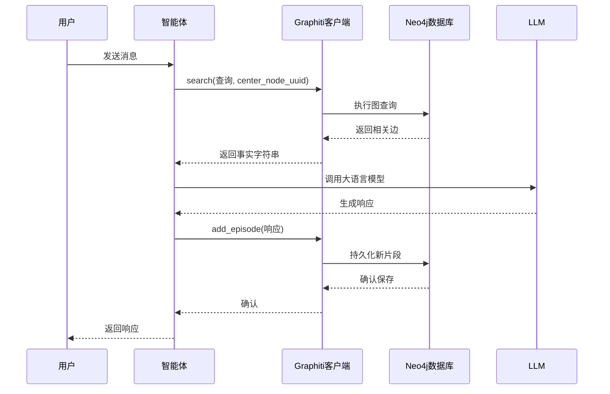
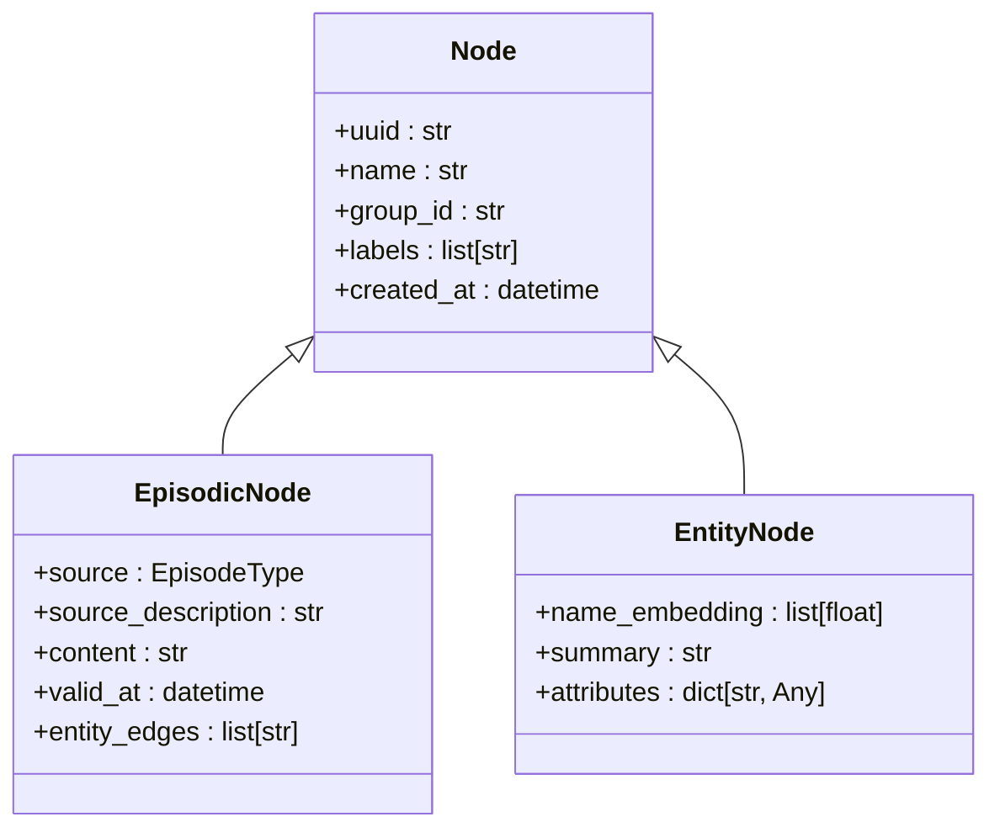
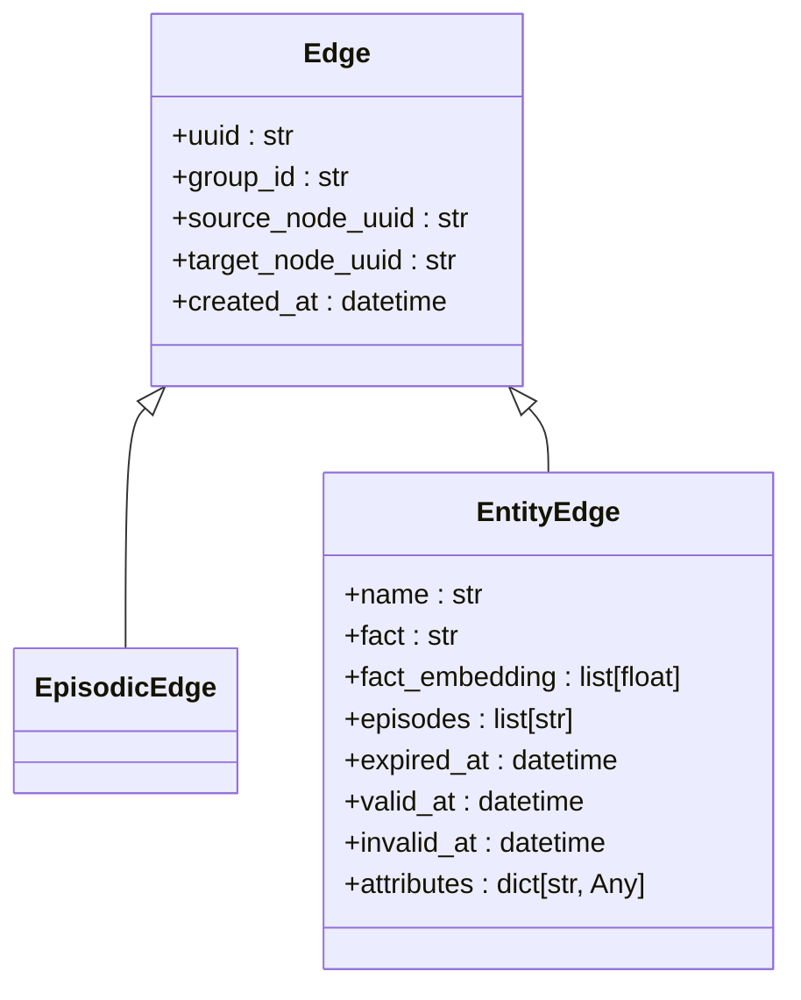
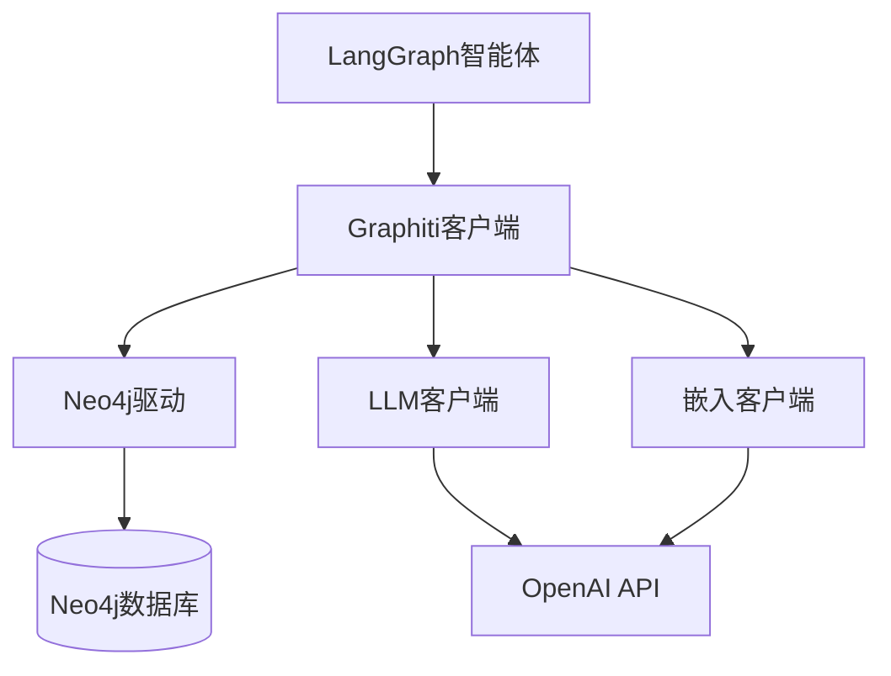

# LangGraph 智能体集成

<cite>
**本文档中引用的文件**   
- [agent.ipynb](file://examples/langgraph-agent/agent.ipynb)
- [graphiti.py](file://graphiti_core/graphiti.py)
- [search.py](file://graphiti_core/search/search.py)
- [nodes.py](file://graphiti_core/nodes.py)
- [edges.py](file://graphiti_core/edges.py)
- [manybirds_products.json](file://examples/data/manybirds_products.json)
</cite>

## 目录
1. [简介](#简介)
2. [项目结构](#项目结构)
3. [核心组件](#核心组件)
4. [架构概述](#架构概述)
5. [详细组件分析](#详细组件分析)
6. [依赖关系分析](#依赖关系分析)
7. [性能考虑](#性能考虑)
8. [故障排除指南](#故障排除指南)
9. [结论](#结论)

## 简介
本文档提供了一个交互式教程，展示如何将LangGraph智能体与Graphiti知识图谱系统集成。通过Jupyter Notebook示例，详细说明了如何在智能体工作流中嵌入知识图谱能力，实现记忆持久化和上下文检索功能。

## 项目结构
该代码库的结构围绕Graphiti核心功能和示例应用组织。核心功能位于`graphiti_core`目录中，包含图操作、搜索、嵌入和驱动等模块。示例应用位于`examples`目录中，包括LangGraph智能体集成、电子商务场景和快速入门指南等。

**Section sources**
- [agent.ipynb](file://examples/langgraph-agent/agent.ipynb)
- [graphiti.py](file://graphiti_core/graphiti.py)

## 核心组件
文档的核心是LangGraph智能体与Graphiti的集成实现。通过`agent.ipynb`示例，展示了如何配置Graphiti客户端、加载产品数据、创建用户节点，并构建能够利用知识图谱进行上下文感知响应的智能体。

**Section sources**
- [agent.ipynb](file://examples/langgraph-agent/agent.ipynb)
- [graphiti.py](file://graphiti_core/graphiti.py)

## 架构概述
系统架构由LangGraph状态机和Graphiti知识图谱组成。智能体在处理用户请求时，会从图谱中检索相关信息，并将新的交互持久化到图谱中，形成闭环的知识管理。

**Diagram sources**
- [agent.ipynb](file://examples/langgraph-agent/agent.ipynb)
- [graphiti.py](file://graphiti_core/graphiti.py)

## 详细组件分析
### 智能体工作流分析
智能体工作流的核心是`chatbot`函数，它实现了上下文感知的对话处理。该函数首先从知识图谱中检索与当前对话相关的事实，然后构建系统消息，最后生成响应并将其持久化到图谱中。

#### 状态管理

**Diagram sources**
- [agent.ipynb](file://examples/langgraph-agent/agent.ipynb)

#### 图谱交互

**Diagram sources**
- [agent.ipynb](file://examples/langgraph-agent/agent.ipynb)
- [graphiti.py](file://graphiti_core/graphiti.py)

### 数据模型分析
Graphiti系统使用节点和边来表示知识。节点代表实体（如用户、产品），边代表实体间的关系。

#### 节点模型

**Diagram sources**
- [nodes.py](file://graphiti_core/nodes.py)

#### 边模型

**Diagram sources**
- [edges.py](file://graphiti_core/edges.py)

**Section sources**
- [nodes.py](file://graphiti_core/nodes.py)
- [edges.py](file://graphiti_core/edges.py)

## 依赖关系分析
系统依赖关系清晰，LangGraph智能体依赖Graphiti客户端，Graphiti客户端又依赖Neo4j数据库驱动。

**Diagram sources**
- [graphiti.py](file://graphiti_core/graphiti.py)

## 性能考虑
在集成过程中需要考虑性能因素。异步操作被用于避免阻塞图执行，特别是在调用`add_episode`方法时使用`asyncio.create_task`。

**Section sources**
- [agent.ipynb](file://examples/langgraph-agent/agent.ipynb)

## 故障排除指南
常见问题包括环境配置、数据库连接和API密钥设置。确保正确设置NEO4J_URI、NEO4J_USER和NEO4J_PASSWORD环境变量。

**Section sources**
- [agent.ipynb](file://examples/langgraph-agent/agent.ipynb)

## 结论
通过本文档，开发者可以了解如何将LangGraph智能体与Graphiti知识图谱集成，构建具备长期记忆能力的复合智能体系统。这种集成方式使得智能体能够利用历史交互数据做出更智能的决策。