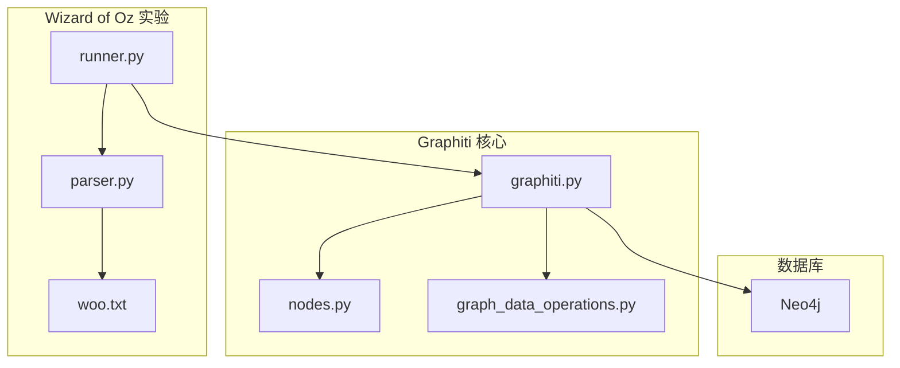
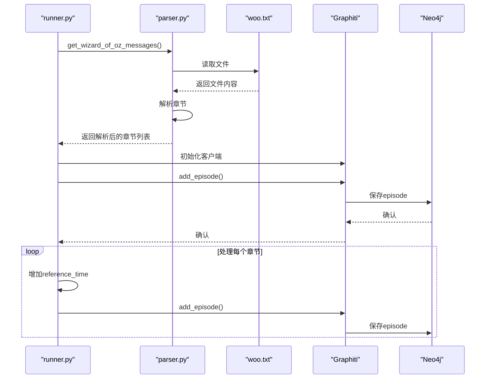
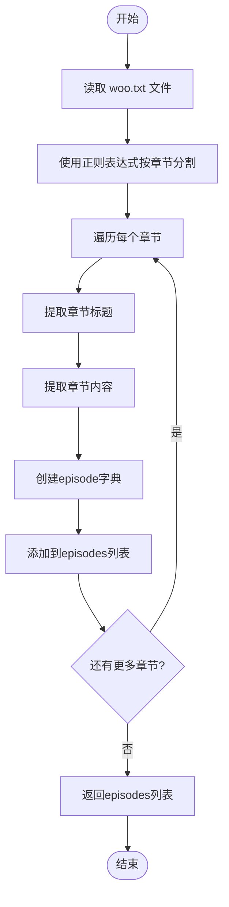
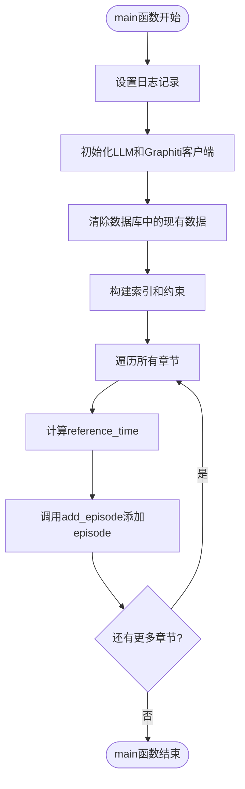
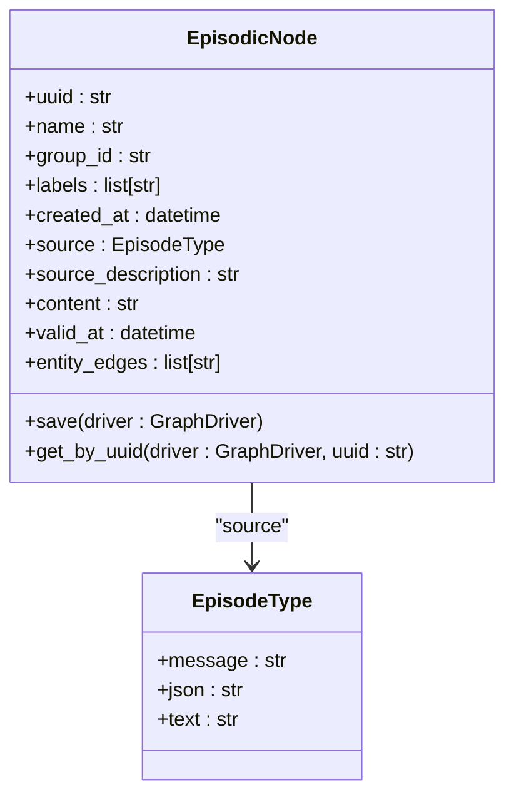
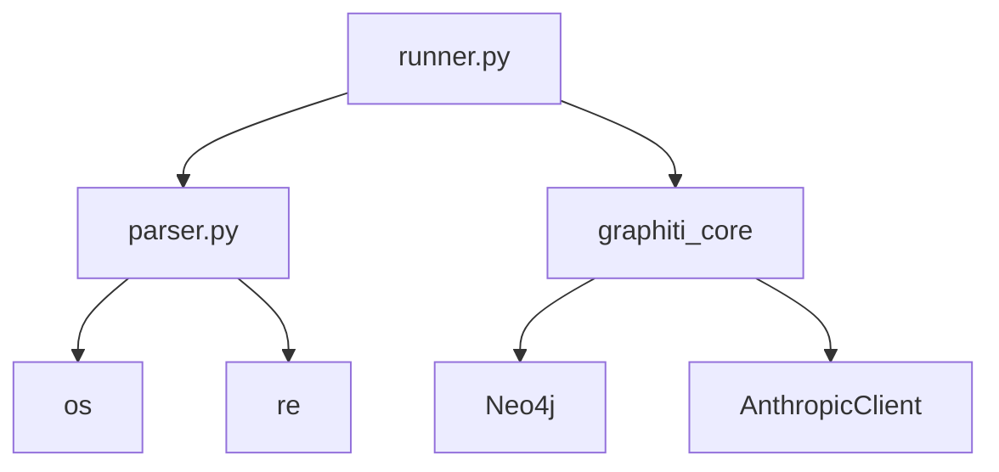

# ‘Wizard of Oz’ 实验模拟

<cite>
**本文档引用的文件**
- [runner.py](file://examples/wizard_of_oz/runner.py)
- [parser.py](file://examples/wizard_of_oz/parser.py)
- [woo.txt](file://examples/wizard_of_oz/woo.txt)
- [graphiti.py](file://graphiti_core/graphiti.py)
- [nodes.py](file://graphiti_core/nodes.py)
- [graph_data_operations.py](file://graphiti_core/utils/maintenance/graph_data_operations.py)
</cite>

## 目录
1. [引言](#引言)
2. [项目结构](#项目结构)
3. [核心组件](#核心组件)
4. [架构概述](#架构概述)
5. [详细组件分析](#详细组件分析)
6. [依赖分析](#依赖分析)
7. [性能考虑](#性能考虑)
8. [故障排除指南](#故障排除指南)
9. [结论](#结论)

## 引言
本文档详细阐述了Graphiti项目中‘Wizard of Oz’实验的实现机制。该实验通过模拟人类干预下的AI代理行为，为评估代理性能、测试提示工程效果和生成训练数据提供了有效方法。实验利用预设的对话脚本，通过精确的时间控制和会话隔离，构建了一个临时的知识图谱用于行为分析。

## 项目结构
‘Wizard of Oz’实验位于项目的`examples/wizard_of_oz`目录下，包含三个核心文件：`runner.py`作为主执行脚本，`parser.py`负责解析预设脚本，`woo.txt`存储了实验的对话内容。该实验通过Graphiti核心库与Neo4j图数据库交互，记录和分析模拟的交互过程。

**Diagram sources**
- [runner.py](file://examples/wizard_of_oz/runner.py)
- [parser.py](file://examples/wizard_of_oz/parser.py)
- [woo.txt](file://examples/wizard_of_oz/woo.txt)
- [graphiti.py](file://graphiti_core/graphiti.py)
- [nodes.py](file://graphiti_core/nodes.py)
- [graph_data_operations.py](file://graphiti_core/utils/maintenance/graph_data_operations.py)

**Section sources**
- [runner.py](file://examples/wizard_of_oz/runner.py)
- [parser.py](file://examples/wizard_of_oz/parser.py)
- [woo.txt](file://examples/wizard_of_oz/woo.txt)

## 核心组件
‘Wizard of Oz’实验的核心组件包括脚本解析器、实验运行器和知识图谱记录系统。`parser.py`文件中的`parse_wizard_of_oz`函数负责读取`woo.txt`中的预设对话脚本，并将其分割成独立的章节或事件。`runner.py`文件中的`main`函数则负责协调整个实验流程，包括初始化Graphiti客户端、解析脚本和将事件添加到知识图谱中。

**Section sources**
- [runner.py](file://examples/wizard_of_oz/runner.py#L59-L93)
- [parser.py](file://examples/wizard_of_oz/parser.py#L5-L37)

## 架构概述
‘Wizard of Oz’实验的架构基于事件驱动的模式，通过模拟时间序列中的交互事件来构建知识图谱。实验开始时，`runner.py`会清除数据库中的现有数据，然后逐个处理从`woo.txt`解析出的每个章节。每个章节作为一个独立的“episode”被添加到图数据库中，并通过`reference_time`参数精确控制其时间感知特性。

**Diagram sources**
- [runner.py](file://examples/wizard_of_oz/runner.py#L59-L93)
- [parser.py](file://examples/wizard_of_oz/parser.py#L5-L37)
- [graphiti.py](file://graphiti_core/graphiti.py#L615-L809)
- [nodes.py](file://graphiti_core/nodes.py#L294-L352)

## 详细组件分析

### 脚本解析机制
`parser.py`文件实现了从纯文本文件中提取结构化数据的功能。`parse_wizard_of_oz`函数使用正则表达式将`woo.txt`文件按章节分割，并为每个章节提取标题和内容。`get_wizard_of_oz_messages`函数则负责确定文件路径并调用解析函数，返回一个包含所有章节信息的列表。

**Diagram sources**
- [parser.py](file://examples/wizard_of_oz/parser.py#L5-L37)

**Section sources**
- [parser.py](file://examples/wizard_of_oz/parser.py#L5-L37)

### 实验运行与知识图谱构建
`runner.py`文件中的`main`函数是实验的执行入口。它首先设置日志记录，然后初始化Graphiti客户端和Anthropic LLM客户端。在处理每个章节时，它会调用`client.add_episode`方法，将章节内容作为episode添加到知识图谱中。`reference_time`参数通过`now + timedelta(seconds=i * 10)`计算，确保每个episode在时间轴上间隔10秒。

**Diagram sources**
- [runner.py](file://examples/wizard_of_oz/runner.py#L59-L93)
- [graphiti.py](file://graphiti_core/graphiti.py#L615-L809)

**Section sources**
- [runner.py](file://examples/wizard_of_oz/runner.py#L59-L93)

### 时间感知与会话隔离
`add_episode`方法是Graphiti核心功能的关键，它接收`reference_time`参数来精确控制episode的时间感知。`reference_time`被存储在`EpisodicNode`的`valid_at`字段中，表示该episode内容在现实世界中的有效时间。`group_id`参数用于隔离不同的实验会话，确保不同实验的数据不会相互干扰。

**Diagram sources**
- [nodes.py](file://graphiti_core/nodes.py#L294-L352)
- [graphiti.py](file://graphiti_core/graphiti.py#L615-L809)

**Section sources**
- [graphiti.py](file://graphiti_core/graphiti.py#L615-L809)
- [nodes.py](file://graphiti_core/nodes.py#L294-L352)

## 依赖分析
‘Wizard of Oz’实验依赖于多个核心组件。`runner.py`依赖于`parser.py`来获取脚本内容，并依赖于`graphiti_core`库与数据库交互。`parser.py`直接依赖于Python的`os`和`re`模块来处理文件路径和正则表达式。整个实验依赖于Neo4j数据库来持久化知识图谱。

**Diagram sources**
- [runner.py](file://examples/wizard_of_oz/runner.py)
- [parser.py](file://examples/wizard_of_oz/parser.py)

**Section sources**
- [runner.py](file://examples/wizard_of_oz/runner.py)
- [parser.py](file://examples/wizard_of_oz/parser.py)

## 性能考虑
‘Wizard of Oz’实验在性能方面进行了优化。`add_episode_bulk`方法允许批量添加episode，显著提高了处理大量数据时的效率。然而，该方法不执行边失效和日期提取等操作，因此在需要这些功能时，应使用单个`add_episode`调用。实验通过`semaphore_gather`函数控制并发操作的数量，防止系统资源被耗尽。

## 故障排除指南
如果实验运行失败，首先检查环境变量是否正确设置，特别是`NEO4J_URI`、`NEO4J_USER`、`NEO4J_PASSWORD`和`ANTHROPIC_API_KEY`。确保Neo4j数据库正在运行并且可以从客户端访问。如果遇到解析错误，检查`woo.txt`文件的格式是否符合预期。日志记录已配置为输出到控制台，可以帮助诊断问题。

**Section sources**
- [runner.py](file://examples/wizard_of_oz/runner.py#L33-L35)
- [runner.py](file://examples/wizard_of_oz/runner.py#L38-L56)

## 结论
‘Wizard of Oz’实验提供了一个强大的框架，用于模拟和分析AI代理在人类干预下的行为。通过精确控制时间感知和会话隔离，研究人员可以创建受控的实验环境来评估代理性能、测试提示工程策略和生成高质量的训练数据。该实验展示了如何利用知识图谱技术来记录和分析复杂的交互过程，为AI系统的发展和评估提供了宝贵的工具。