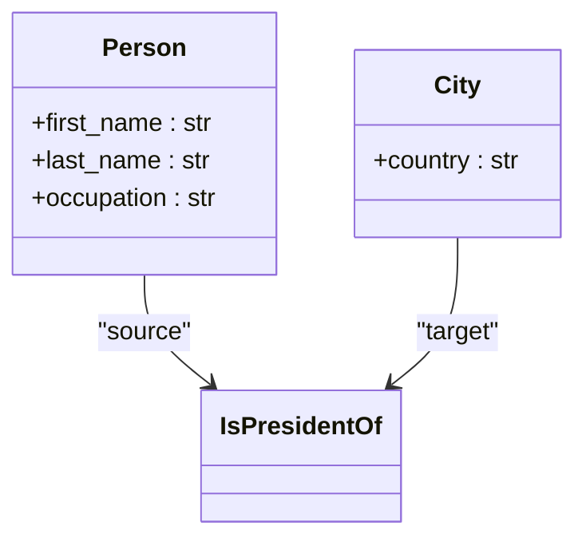
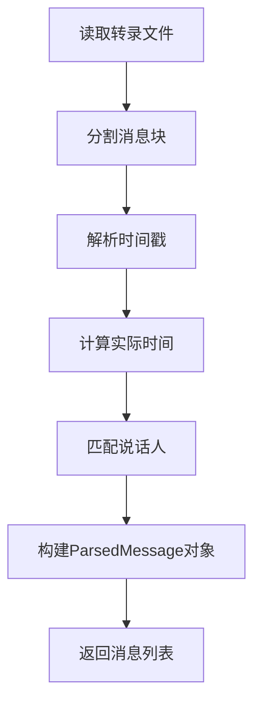
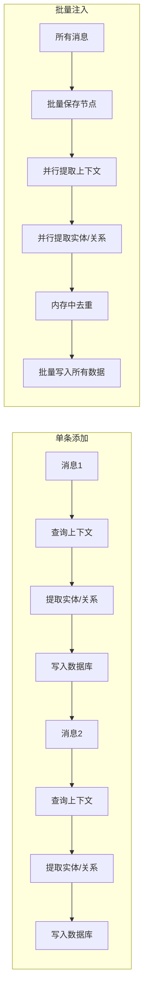

# 播客内容分析

<cite>
**本文档中引用的文件**  
- [podcast_runner.py](file://examples/podcast/podcast_runner.py)
- [transcript_parser.py](file://examples/podcast/transcript_parser.py)
- [podcast_transcript.txt](file://examples/podcast/podcast_transcript.txt)
- [bulk_utils.py](file://graphiti_core/utils/bulk_utils.py)
- [graphiti.py](file://graphiti_core/graphiti.py)
</cite>

## 目录
1. [引言](#引言)
2. [实体与关系建模](#实体与关系建模)
3. 转录文本解析机制
4. 批量注入与性能优化
5. 会话上下文管理
6. 实际运行结果与图谱结构
7. 结论

## 引言

本文档深入解析播客分析用例，重点展示如何从转录文本中提取人物、地点和事件之间的关系，并构建知识图谱。通过分析 `podcast_runner.py` 和 `transcript_parser.py` 等核心文件，阐述系统如何利用自定义Pydantic模型定义实体类型，通过关系类型建立连接，并采用批量注入机制实现高效的数据处理。同时，文档将说明会话上下文管理在维护对话时序中的关键作用。

## 实体与关系建模

在播客分析系统中，实体与关系的建模是构建知识图谱的核心。系统通过定义自定义的Pydantic模型来精确描述特定领域的实体类型及其属性。

在 `podcast_runner.py` 文件中，定义了 `Person`（人物）和 `City`（城市）两个实体模型。`Person` 模型包含 `first_name`（名）、`last_name`（姓）和 `occupation`（职业）等字段，用于捕捉说话人的基本信息。`City` 模型则包含 `country`（国家）字段，用于描述城市所属的国家。这些模型作为数据结构的模板，指导系统从非结构化的文本中提取结构化的实体信息。

**图谱来源**
- [podcast_runner.py](file://examples/podcast/podcast_runner.py#L60-L77)

关系的建立通过 `IsPresidentOf` 这样的边类型（Edge Type）来实现。在 `podcast_runner.py` 的 `main` 函数中，通过 `edge_types` 和 `edge_type_map` 参数，系统被明确告知如何建立关系。`edge_types` 字典将关系名称（如 `'IS_PRESIDENT_OF'`）映射到其对应的Pydantic模型（`IsPresidentOf`）。`edge_type_map` 字典则定义了关系的连接规则，例如 `{('Person', 'Entity'): ['IS_PRESIDENT_OF']}` 表示允许从 `Person` 类型的节点到任何 `Entity` 类型的节点创建 `IS_PRESIDENT_OF` 关系。这种声明式的配置使得系统能够理解并提取文本中隐含的语义关系。

**本节来源**
- [podcast_runner.py](file://examples/podcast/podcast_runner.py#L60-L108)

## 转录文本解析机制

转录文本解析是将原始播客对话转换为结构化数据的关键第一步。`transcript_parser.py` 文件中的代码负责处理 `podcast_transcript.txt` 文件，从中提取说话人、时间戳和内容等关键信息。

解析过程始于 `parse_podcast_messages()` 函数，它会读取转录文件并调用 `parse_conversation_file()` 函数进行处理。该函数首先根据换行符将文本分割成独立的消息块。然后，它利用正则表达式 `parse_timestamp()` 函数来解析每条消息开头的时间戳（如 `3s` 或 `1m 3s`），并将其转换为 `timedelta` 对象。接着，通过计算整个播客的持续时间，系统可以推算出每条消息相对于当前时间的“实际时间戳”（`actual_timestamp`），这对于构建时间序列知识图谱至关重要。

**图谱来源**
- [transcript_parser.py](file://examples/podcast/transcript_parser.py#L38-L104)

在解析过程中，系统维护了一个 `Speaker` 对象列表，其中包含了说话人的索引、姓名和角色。当解析每条消息时，系统会根据消息开头的索引（如 `0` 或 `1`）查找对应的 `Speaker`，从而确定说话人姓名和角色。最终，所有信息被封装在 `ParsedMessage` 对象中，包含了 `speaker_name`、`role`、`relative_timestamp`、`actual_timestamp` 和 `content` 等字段。这些结构化的消息为后续的知识图谱构建提供了丰富的上下文信息。

**本节来源**
- [transcript_parser.py](file://examples/podcast/transcript_parser.py#L8-L124)
- [podcast_transcript.txt](file://examples/podcast/podcast_transcript.txt)

## 批量注入与性能优化

系统提供了两种数据注入方式：单条添加（`add_episode`）和批量注入（`add_episode_bulk`）。两者在性能和功能上存在显著差异。

`add_episode` 方法适用于实时或顺序处理场景。它在每次调用时，会先查询数据库以获取与当前消息相关的上下文（通过 `retrieve_episodes`），然后进行实体和关系的提取、去重，并最终将单条数据写入图数据库。这种方式保证了每条数据都能基于最新的图谱状态进行处理，支持边缘失效（edge invalidation）等复杂操作，但频繁的数据库交互带来了较高的性能开销。

相比之下，`add_episode_bulk` 方法专为高效处理大量数据而设计。其核心优势在于性能优化。如 `graphiti.py` 文件中的 `add_episode_bulk` 方法所示，该机制首先将所有待处理的 `RawEpisode` 对象一次性转换为 `EpisodicNode` 对象，并批量保存到数据库中。随后，系统会并行地为所有节点提取上下文、提取实体和关系、进行内存中的去重（deduplication），最后将所有处理好的节点和边一次性批量写入图数据库。

**图谱来源**
- [graphiti.py](file://graphiti_core/graphiti.py#L825-L1006)
- [bulk_utils.py](file://graphiti_core/utils/bulk_utils.py#L128-L252)

通过减少数据库往返次数、利用并行处理（`semaphore_gather`）以及在内存中完成大部分计算，`add_episode_bulk` 显著提升了处理速度。然而，为了追求性能，它牺牲了部分功能，例如不执行边缘失效步骤。因此，批量注入更适合于对历史数据进行一次性导入，而单条添加更适合于需要实时性和复杂逻辑的在线处理。

**本节来源**
- [podcast_runner.py](file://examples/podcast/podcast_runner.py#L101-L108)
- [graphiti.py](file://graphiti_core/graphiti.py#L825-L1006)

## 会话上下文管理

会话上下文管理是确保知识图谱能理解对话连贯性的关键机制。系统通过 `group_id` 和 `previous_episode_uuids` 两个核心概念来实现这一点。

`group_id` 是一个字符串标识符，用于将相关的数据点划分到同一个逻辑“会话”或“图分区”中。在 `podcast_runner.py` 中，每次运行 `main` 函数时，都会生成一个唯一的 `group_id`（使用 `uuid4()`）。所有通过 `add_episode` 或 `add_episode_bulk` 方法添加的节点和边，如果指定了相同的 `group_id`，就会被归入同一个上下文环境中。这使得系统可以轻松地隔离不同播客、不同用户会话或不同主题的数据，避免信息混淆。

`previous_episode_uuids` 参数则用于维护对话的时序关系。当添加一条新的消息（episode）时，系统可以通过 `retrieve_episodes` 函数，根据当前消息的 `reference_time` 和 `group_id`，查询出最近的几条历史消息。这些历史消息的UUID列表（`previous_episode_uuids`）会被传递给实体提取模型，为模型提供上下文，使其能够理解当前话语的指代和背景。例如，当听到“他”时，模型可以结合前文判断“他”指的是谁。在批量处理时，`retrieve_previous_episodes_bulk` 函数会并行地为所有新消息获取其上下文，确保了效率。

**本节来源**
- [podcast_runner.py](file://examples/podcast/podcast_runner.py#L88-L114)
- [graphiti.py](file://graphiti_core/graphiti.py#L576-L613)

## 实际运行结果与图谱结构

通过运行 `podcast_runner.py` 示例，系统能够从播客转录文本中成功构建出一个丰富的知识图谱。最终生成的图谱结构包含多个实体节点和它们之间的关系。

例如，系统会识别出 `Tania Tetlow` 作为 `Person` 实体，并可能提取其职业为“Fordham University president”。同时，`New York City` 和 `New Orleans` 会被识别为 `City` 实体。更重要的是，系统能够建立 `IS_PRESIDENT_OF` 这样的关系，将 `Tania Tetlow` 节点与 `Fordham University` 节点连接起来。

可查询的关系模式包括：
- **人物-组织关系**：查询某人担任什么职务（如 `MATCH (p:Person)-[:IS_PRESIDENT_OF]->(o:Entity) RETURN p.name, o.name`）。
- **人物-地点关系**：查询某人与哪些城市有关联（如 `MATCH (p:Person)-[]->(:Entity)-[]->(c:City) RETURN p.name, c.name`）。
- **时间序列查询**：根据 `actual_timestamp` 查询在特定时间点前后发生的事件和对话。

这些结构化的数据使得对播客内容进行深度分析和问答成为可能，将非结构化的音频内容转化为可计算、可查询的知识资产。

**本节来源**
- [podcast_runner.py](file://examples/podcast/podcast_runner.py)
- [podcast_transcript.txt](file://examples/podcast/podcast_transcript.txt)

## 结论

本文档详细阐述了播客内容分析系统的实现机制。系统通过自定义Pydantic模型灵活定义实体和关系，利用 `transcript_parser.py` 精确解析转录文本中的时间戳和说话人信息，并将这些上下文信息融入知识图谱的构建过程。`add_episode_bulk` 批量注入机制通过减少数据库交互和并行处理，实现了远超单条添加的性能优势，适用于大规模数据处理。`group_id` 和 `previous_episode_uuids` 共同作用，有效地管理了会话上下文，确保了图谱的连贯性和准确性。最终，该系统能够将复杂的播客对话转化为结构化的知识图谱，为后续的分析和应用提供了坚实的基础。