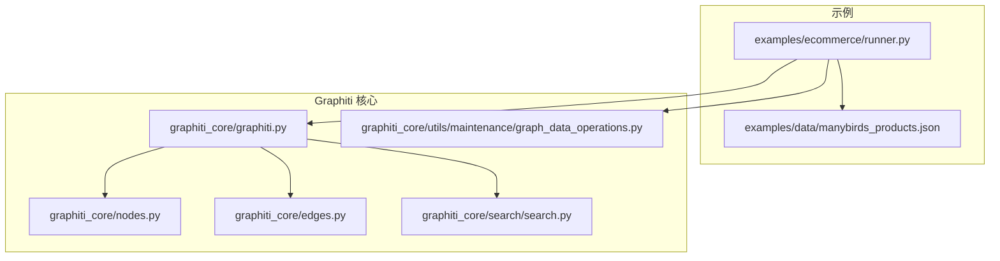
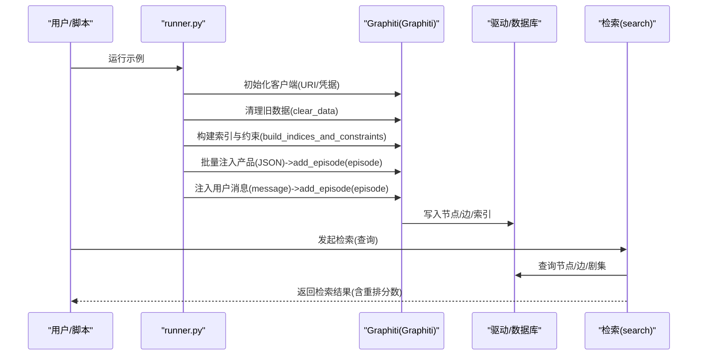
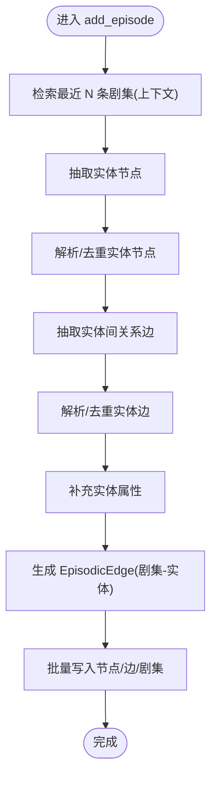
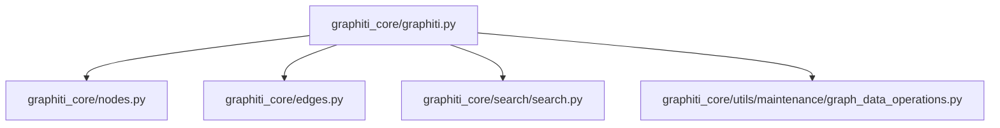

# 电商推荐系统

<cite>
**本文引用的文件**
- [runner.py](file://examples/ecommerce/runner.py)
- [manybirds_products.json](file://examples/data/manybirds_products.json)
- [graphiti.py](file://graphiti_core/graphiti.py)
- [nodes.py](file://graphiti_core/nodes.py)
- [edges.py](file://graphiti_core/edges.py)
- [graph_data_operations.py](file://graphiti_core/utils/maintenance/graph_data_operations.py)
- [search.py](file://graphiti_core/search/search.py)
- [.env.example](file://examples/azure-openai/.env.example)
- [requirements.txt](file://examples/quickstart/requirements.txt)
- [pyproject.toml](file://pyproject.toml)
- [README.md](file://README.md)
</cite>

## 目录
1. [简介](#简介)
2. [项目结构](#项目结构)
3. [核心组件](#核心组件)
4. [架构总览](#架构总览)
5. [详细组件分析](#详细组件分析)
6. [依赖关系分析](#依赖关系分析)
7. [性能考量](#性能考量)
8. [故障排查指南](#故障排查指南)
9. [结论](#结论)
10. [附录：环境与依赖配置](#附录环境与依赖配置)

## 简介
本示例演示如何使用 Graphiti 构建电商场景下的“用户交互历史”知识图谱，实现从产品结构化数据到用户对话记录的注入与检索，从而支撑个性化推荐。Runner 脚本展示了完整的端到端流程：初始化 Graphiti 客户端、清理旧数据、构建索引与约束、批量注入产品 JSON 数据、逐条注入用户消息，最终形成可查询的知识图谱。

该用例的关键在于：
- 使用 EpisodeType.message 和 EpisodeType.json 对不同来源的“剧集”进行分类与处理；
- 通过 add_episode 方法将用户消息与产品信息抽取为实体节点与关系边；
- 基于知识图谱的实体提取、关系构建与检索策略，为个性化推荐提供语义与上下文能力。

## 项目结构
电商推荐示例位于 examples/ecommerce，核心文件包括：
- runner.py：示例入口，负责加载产品数据、注入对话消息、初始化 Graphiti 客户端、清理与索引构建；
- manybirds_products.json：产品结构化数据，包含多品类鞋袜等商品信息；
- graphiti 核心库：graphiti.py、nodes.py、edges.py 提供知识图谱节点、边与核心 API；search.py 提供检索能力；graph_data_operations.py 提供清理与检索工具。

图表来源
- [runner.py](file://examples/ecommerce/runner.py#L1-L124)
- [graphiti.py](file://graphiti_core/graphiti.py#L128-L800)
- [nodes.py](file://graphiti_core/nodes.py#L51-L120)
- [edges.py](file://graphiti_core/edges.py#L1-L120)
- [search.py](file://graphiti_core/search/search.py#L68-L184)
- [graph_data_operations.py](file://graphiti_core/utils/maintenance/graph_data_operations.py#L34-L121)

章节来源
- [runner.py](file://examples/ecommerce/runner.py#L1-L124)
- [graphiti.py](file://graphiti_core/graphiti.py#L128-L800)

## 核心组件
- Graphiti 客户端：负责连接数据库、构建索引与约束、添加剧集、检索与重排等。
- EpisodeType：对剧集来源进行枚举分类（message/json/text），用于区分消息与结构化 JSON 的处理路径。
- 节点与边：EpisodicNode（剧集节点）、EntityNode（实体节点）、EpisodicEdge（剧集-实体边）、EntityEdge（实体-实体边）。
- 检索模块：基于 BM25、向量相似度、BFS、交叉编码器等混合策略进行检索与重排。

章节来源
- [graphiti.py](file://graphiti_core/graphiti.py#L128-L800)
- [nodes.py](file://graphiti_core/nodes.py#L51-L120)
- [edges.py](file://graphiti_core/edges.py#L1-L120)
- [search.py](file://graphiti_core/search/search.py#L68-L184)

## 架构总览
下图展示了从产品 JSON 到用户消息注入，再到检索与重排的整体流程。

图表来源
- [runner.py](file://examples/ecommerce/runner.py#L60-L124)
- [graphiti.py](file://graphiti_core/graphiti.py#L321-L354)
- [graph_data_operations.py](file://graphiti_core/utils/maintenance/graph_data_operations.py#L34-L59)
- [search.py](file://graphiti_core/search/search.py#L68-L184)

## 详细组件分析

### 1) 初始化 Graphiti 客户端与环境准备
- 从环境变量读取 Neo4j 连接参数（URI、用户名、密码），创建 Graphiti 实例；
- 可选：自定义数据库名或传入已实例化的驱动；
- 通过 build_indices_and_constraints 在数据库上建立索引与约束，提升检索性能。

代码片段路径
- [初始化客户端与索引](file://examples/ecommerce/runner.py#L86-L93)
- [Graphiti 构造与索引构建](file://graphiti_core/graphiti.py#L128-L354)

章节来源
- [runner.py](file://examples/ecommerce/runner.py#L34-L40)
- [graphiti.py](file://graphiti_core/graphiti.py#L128-L354)

### 2) 清理旧数据与构建索引
- 清理：支持按 group_id 或全库删除，确保示例干净；
- 索引：在节点与边层面建立必要索引，加速检索。

代码片段路径
- [清理数据](file://examples/ecommerce/runner.py#L89-L89)
- [清理实现](file://graphiti_core/utils/maintenance/graph_data_operations.py#L34-L59)
- [构建索引与约束](file://graphiti_core/graphiti.py#L321-L354)

章节来源
- [graph_data_operations.py](file://graphiti_core/utils/maintenance/graph_data_operations.py#L34-L59)
- [graphiti.py](file://graphiti_core/graphiti.py#L321-L354)

### 3) 产品数据注入：从 JSON 到知识图谱
- 读取 manybirds_products.json，将每个产品转换为 RawEpisode；
- 使用 EpisodeType.json 将结构化 JSON 作为“剧集”注入；
- 通过 add_episode 完成实体抽取、去重、边构建与落库。

代码片段路径
- [产品数据加载与注入](file://examples/ecommerce/runner.py#L95-L121)
- [EpisodeType.json](file://graphiti_core/nodes.py#L51-L86)

章节来源
- [runner.py](file://examples/ecommerce/runner.py#L95-L121)
- [nodes.py](file://graphiti_core/nodes.py#L51-L86)

### 4) 用户消息注入：从对话到知识图谱
- 定义对话数组，逐条调用 add_episode，source 设置为 EpisodeType.message；
- Graphiti 会基于消息内容抽取实体、构建实体间关系、生成 EpisodicEdge 并保存。

代码片段路径
- [对话注入循环](file://examples/ecommerce/runner.py#L75-L84)
- [EpisodeType.message](file://graphiti_core/nodes.py#L51-L86)

章节来源
- [runner.py](file://examples/ecommerce/runner.py#L60-L84)
- [nodes.py](file://graphiti_core/nodes.py#L51-L86)

### 5) add_episode 处理流程（算法级）
下图展示 add_episode 的关键步骤：上下文检索、节点与边抽取、去重与解析、属性补充、Episodic 边生成与落库。

图表来源
- [graphiti.py](file://graphiti_core/graphiti.py#L576-L800)

章节来源
- [graphiti.py](file://graphiti_core/graphiti.py#L576-L800)

### 6) 知识图谱如何支持个性化推荐
- 实体提取：从用户消息与产品 JSON 中识别“用户”“品牌”“品类”“颜色”“尺码”等实体；
- 关系构建：基于对话与产品描述构建“用户偏好”“购买意向”“相似商品”等关系；
- 检索策略：结合 BM25、向量相似度、BFS 与交叉编码器重排，返回与用户意图最相关的结果；
- 推荐闭环：以“用户偏好”为中心，通过 BFS 扩展到相似实体与关联边，再用重排策略筛选高置信度候选。

代码片段路径
- [检索主流程](file://graphiti_core/search/search.py#L68-L184)
- [节点/边/剧集检索与重排](file://graphiti_core/search/search.py#L186-L520)

章节来源
- [search.py](file://graphiti_core/search/search.py#L68-L184)
- [search.py](file://graphiti_core/search/search.py#L186-L520)

### 7) EpisodeType 的分类与使用
- EpisodeType.message：用于消息类输入，适合对话与非结构化文本；
- EpisodeType.json：用于结构化 JSON 输入，适合产品、订单等结构化数据；
- EpisodeType.text：通用文本类型。

代码片段路径
- [EpisodeType 定义](file://graphiti_core/nodes.py#L51-L86)

章节来源
- [nodes.py](file://graphiti_core/nodes.py#L51-L86)

## 依赖关系分析
Graphiti 的核心由以下模块组成：Graphiti 主类、节点与边模型、检索模块、维护工具。它们之间的依赖关系如下：

图表来源
- [graphiti.py](file://graphiti_core/graphiti.py#L128-L800)
- [nodes.py](file://graphiti_core/nodes.py#L1-L120)
- [edges.py](file://graphiti_core/edges.py#L1-L120)
- [search.py](file://graphiti_core/search/search.py#L68-L184)
- [graph_data_operations.py](file://graphiti_core/utils/maintenance/graph_data_operations.py#L34-L121)

章节来源
- [graphiti.py](file://graphiti_core/graphiti.py#L128-L800)
- [nodes.py](file://graphiti_core/nodes.py#L1-L120)
- [edges.py](file://graphiti_core/edges.py#L1-L120)
- [search.py](file://graphiti_core/search/search.py#L68-L184)
- [graph_data_operations.py](file://graphiti_core/utils/maintenance/graph_data_operations.py#L34-L121)

## 性能考量
- 并发与限流：Graphiti 默认并发较低以避免 LLM 429 限流，可通过 SEMAPHORE_LIMIT 调整；
- 向量化与重排：当启用向量相似度或交叉编码器时，需考虑嵌入维度与重排成本；
- 索引与约束：提前构建索引与约束可显著降低检索延迟；
- 批量注入：产品数据采用批量注入，减少多次往返开销。

章节来源
- [README.md](file://README.md#L226-L237)
- [graphiti.py](file://graphiti_core/graphiti.py#L321-L354)
- [search.py](file://graphiti_core/search/search.py#L68-L184)

## 故障排查指南
- 无法连接数据库：检查 NEO4J_URI、NEO4J_USER、NEO4J_PASSWORD 是否正确；
- LLM 429 错误：降低并发（SEMAPHORE_LIMIT）或提高 LLM 速率限制；
- 环境变量缺失：确保 OPENAI_API_KEY（或其他 LLM 提供商）已设置；
- 数据未清理：若历史数据影响检索，先执行 clear_data；
- 检索无结果：确认是否已构建索引与约束，或调整检索配置。

章节来源
- [runner.py](file://examples/ecommerce/runner.py#L34-L40)
- [README.md](file://README.md#L226-L237)
- [graph_data_operations.py](file://graphiti_core/utils/maintenance/graph_data_operations.py#L34-L59)
- [graphiti.py](file://graphiti_core/graphiti.py#L321-L354)

## 结论
该电商推荐示例清晰展示了如何利用 Graphiti 将“产品结构化数据”和“用户对话记录”统一注入到知识图谱中，并通过 EpisodeType 对不同类型输入进行分类处理。借助 Graphiti 的实体抽取、关系构建与混合检索能力，系统能够围绕用户偏好与购买意向生成高质量的个性化推荐结果。通过合理的索引与约束、批量注入与重排策略，可在保证性能的同时提升推荐质量与可解释性。

## 附录：环境与依赖配置
- 运行示例所需依赖：graphiti-core、python-dotenv；
- 数据库：Neo4j（默认）或 FalkorDB/Kuzu/Amazon Neptune；
- LLM 与嵌入：默认使用 OpenAI，也可配置 Azure OpenAI、Gemini、Groq 或本地 Ollama；
- 环境变量示例：NEO4J_URI、NEO4J_USER、NEO4J_PASSWORD、OPENAI_API_KEY 等。

代码片段路径
- [示例依赖](file://examples/quickstart/requirements.txt#L1-L2)
- [项目依赖与可选依赖](file://pyproject.toml#L14-L64)
- [Azure OpenAI 示例环境变量](file://examples/azure-openai/.env.example#L1-L11)
- [README 安装与配置说明](file://README.md#L133-L203)

章节来源
- [requirements.txt](file://examples/quickstart/requirements.txt#L1-L2)
- [pyproject.toml](file://pyproject.toml#L14-L64)
- [.env.example](file://examples/azure-openai/.env.example#L1-L11)
- [README.md](file://README.md#L133-L203)