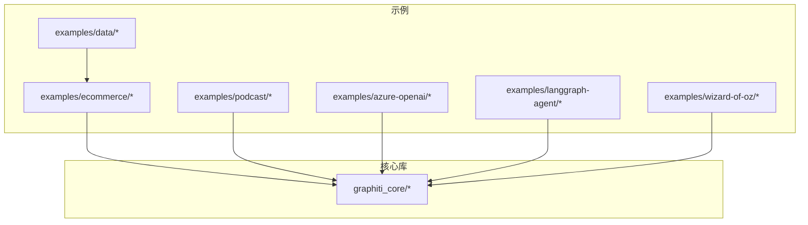
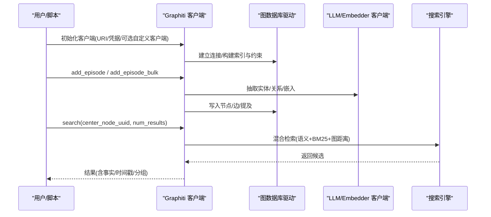
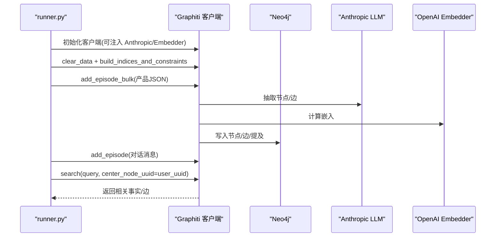
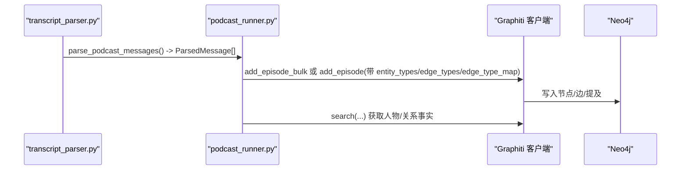
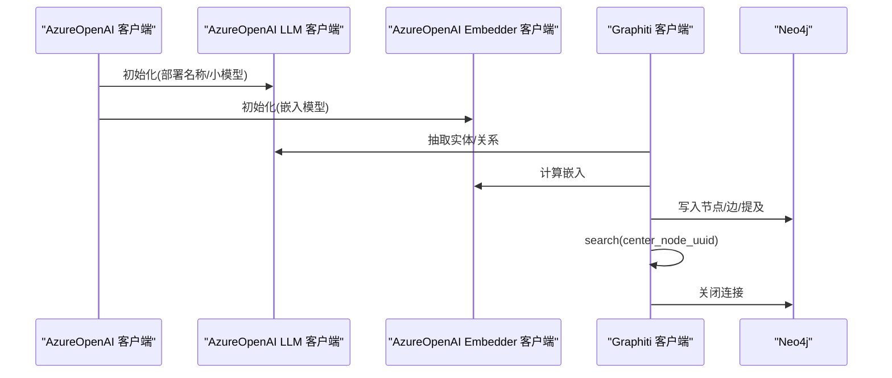
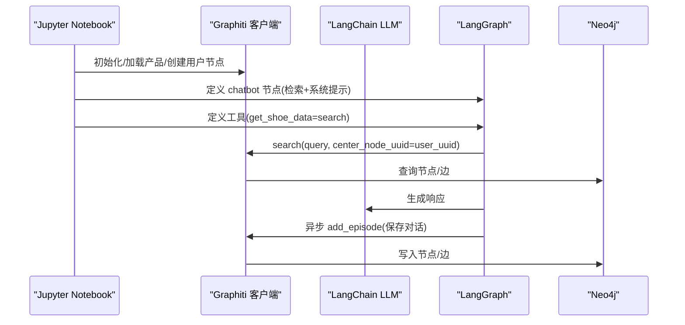
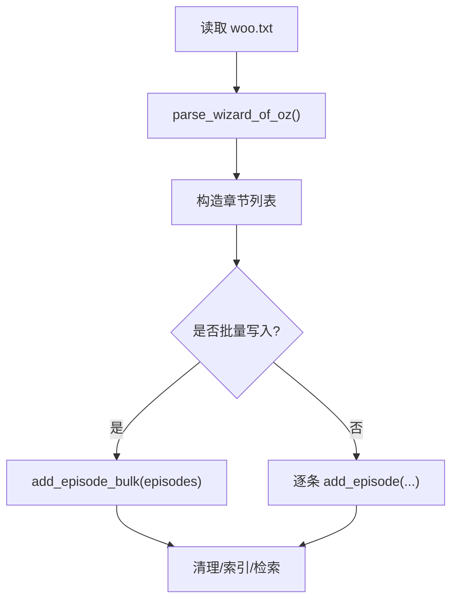
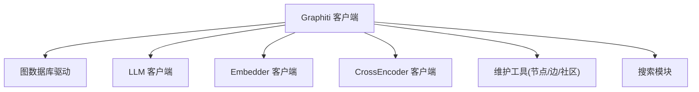

# 示例与用例

<cite>
**本文引用的文件**
- [examples/ecommerce/runner.py](file://examples/ecommerce/runner.py)
- [examples/ecommerce/runner.ipynb](file://examples/ecommerce/runner.ipynb)
- [examples/podcast/podcast_runner.py](file://examples/podcast/podcast_runner.py)
- [examples/podcast/transcript_parser.py](file://examples/podcast/transcript_parser.py)
- [examples/podcast/podcast_transcript.txt](file://examples/podcast/podcast_transcript.txt)
- [examples/azure-openai/azure_openai_neo4j.py](file://examples/azure-openai/azure_openai_neo4j.py)
- [examples/azure-openai/README.md](file://examples/azure-openai/README.md)
- [examples/langgraph-agent/agent.ipynb](file://examples/langgraph-agent/agent.ipynb)
- [examples/wizard_of_oz/runner.py](file://examples/wizard_of_oz/runner.py)
- [examples/wizard_of_oz/parser.py](file://examples/wizard_of_oz/parser.py)
- [examples/wizard_of_oz/woo.txt](file://examples/wizard_of_oz/woo.txt)
- [examples/data/manybirds_products.json](file://examples/data/manybirds_products.json)
- [graphiti_core/graphiti.py](file://graphiti_core/graphiti.py)
</cite>

## 目录
1. [简介](#简介)
2. [项目结构](#项目结构)
3. [核心组件](#核心组件)
4. [架构总览](#架构总览)
5. [详细用例分析](#详细用例分析)
   - [电商推荐系统（ecommerce）](#电商推荐系统ecommerce)
   - [播客分析（podcast）](#播客分析podcast)
   - [Azure OpenAI 集成](#azure-openai-集成)
   - [LangGraph 智能体集成](#langgraph-智能体集成)
   - [Wizard of Oz 实验](#wizard-of-oz-实验)
6. [依赖关系分析](#依赖关系分析)
7. [性能考量](#性能考量)
8. [故障排查指南](#故障排查指南)
9. [结论](#结论)

## 简介
本文件面向实际应用场景，系统化梳理 Graphiti 在真实业务中的落地用例：电商个性化知识图谱、播客长文本关系抽取、Azure OpenAI 集成、LangGraph 智能体与知识图谱结合、以及 Wizard of Oz 实验的数据处理流程。每个用例均提供背景介绍、架构图、关键代码片段路径与运行结果分析，帮助读者快速理解最佳实践与扩展思路。

## 项目结构
- examples 下包含多个独立示例：
  - ecommerce：电商对话与产品数据的图谱构建与检索
  - podcast：播客转录文本的关系抽取与实体建模
  - azure-openai：Azure OpenAI 与 Neo4j 的端到端示例
  - langgraph-agent：LangGraph 与 Graphiti 结合的智能体教程
  - wizard-of-oz：经典小说文本的章节级数据处理
  - data：电商产品样例数据
- graphiti_core：核心库，提供 Graphiti 客户端、节点/边模型、搜索与维护工具等

图表来源
- [examples/ecommerce/runner.py](file://examples/ecommerce/runner.py#L1-L124)
- [examples/podcast/podcast_runner.py](file://examples/podcast/podcast_runner.py#L1-L130)
- [examples/azure-openai/azure_openai_neo4j.py](file://examples/azure-openai/azure_openai_neo4j.py#L1-L226)
- [examples/langgraph-agent/agent.ipynb](file://examples/langgraph-agent/agent.ipynb#L1-L576)
- [examples/wizard_of_oz/runner.py](file://examples/wizard_of_oz/runner.py#L1-L94)
- [examples/data/manybirds_products.json](file://examples/data/manybirds_products.json#L1-L200)
- [graphiti_core/graphiti.py](file://graphiti_core/graphiti.py#L1-L200)

章节来源
- [examples/ecommerce/runner.py](file://examples/ecommerce/runner.py#L1-L124)
- [examples/podcast/podcast_runner.py](file://examples/podcast/podcast_runner.py#L1-L130)
- [examples/azure-openai/azure_openai_neo4j.py](file://examples/azure-openai/azure_openai_neo4j.py#L1-L226)
- [examples/langgraph-agent/agent.ipynb](file://examples/langgraph-agent/agent.ipynb#L1-L576)
- [examples/wizard_of_oz/runner.py](file://examples/wizard_of_oz/runner.py#L1-L94)
- [examples/data/manybirds_products.json](file://examples/data/manybirds_products.json#L1-L200)
- [graphiti_core/graphiti.py](file://graphiti_core/graphiti.py#L1-L200)

## 核心组件
- Graphiti 客户端：统一入口，负责连接数据库、初始化 LLM/Embedder/CrossEncoder 客户端、执行 add_episode/add_episode_bulk、search、索引与约束构建、清理等
- 节点与边模型：EntityNode、EpisodicNode、EntityEdge、EpisodicEdge、CommunityNode/Edge 等
- 维护工具：节点/边抽取与去重、时间窗口检索、社区构建与更新、批量导入等
- 搜索配置：多种混合检索策略（语义+BM25+图遍历）、交叉编码重排等

章节来源
- [graphiti_core/graphiti.py](file://graphiti_core/graphiti.py#L128-L200)

## 架构总览
下图展示了 Graphiti 在各用例中的通用调用链：客户端初始化 → 数据准备 → Episode 写入 → 图谱构建与嵌入 → 搜索与检索。

图表来源
- [examples/azure-openai/azure_openai_neo4j.py](file://examples/azure-openai/azure_openai_neo4j.py#L110-L208)
- [examples/ecommerce/runner.py](file://examples/ecommerce/runner.py#L86-L123)
- [examples/podcast/podcast_runner.py](file://examples/podcast/podcast_runner.py#L78-L128)
- [examples/langgraph-agent/agent.ipynb](file://examples/langgraph-agent/agent.ipynb#L260-L374)
- [graphiti_core/graphiti.py](file://graphiti_core/graphiti.py#L128-L200)

## 详细用例分析

### 电商推荐系统（ecommerce）
- 背景
  - 通过对话与产品 JSON 数据构建个性化知识图谱，支持基于用户兴趣与产品属性的检索与推荐。
  - 使用 Anthropic LLM 进行实体/关系抽取，OpenAI Embedder 进行向量嵌入，Neo4j 存储。
- 关键流程
  - 清理与建索引 → 批量写入产品 JSON → 写入对话消息 → 搜索与检索（可按用户为中心节点 rerank）
- 架构图

图表来源
- [examples/ecommerce/runner.py](file://examples/ecommerce/runner.py#L86-L123)
- [examples/ecommerce/runner.ipynb](file://examples/ecommerce/runner.ipynb#L1-L200)
- [examples/data/manybirds_products.json](file://examples/data/manybirds_products.json#L1-L200)

- 关键代码片段路径
  - 初始化与清理：[examples/ecommerce/runner.py](file://examples/ecommerce/runner.py#L86-L95)
  - 批量写入产品：[examples/ecommerce/runner.py](file://examples/ecommerce/runner.py#L95-L121)
  - 写入对话消息：[examples/ecommerce/runner.py](file://examples/ecommerce/runner.py#L75-L84)
  - 搜索与 rerank：[examples/ecommerce/runner.py](file://examples/ecommerce/runner.py#L110-L123)
  - Notebook 版本（含嵌入与 dedupe 流程日志）：[examples/ecommerce/runner.ipynb](file://examples/ecommerce/runner.ipynb#L1-L200)

- 运行结果分析
  - 产品 JSON 被转换为 RawEpisode 并批量写入，随后抽取节点（品牌、产品、类别、特性等）与边（生产、变体、材料、技术等），并建立向量索引。
  - 对话消息写入后，以用户为中心节点进行 rerank，确保与用户偏好更相关的事实优先返回。
  - Notebook 中的日志显示节点/边抽取耗时、嵌入计算耗时、去重与时间窗口处理过程，体现端到端吞吐与质量控制。

- 最佳实践
  - 使用批量写入提升产品导入效率；对话使用单条写入便于与上下文关联。
  - 通过 center_node_uuid 将检索聚焦到用户或产品，提高相关性。
  - 合理设置参考时间 reference_time，配合时间窗口检索与失效时间 invalid_at，管理事实时效。

章节来源
- [examples/ecommerce/runner.py](file://examples/ecommerce/runner.py#L60-L123)
- [examples/ecommerce/runner.ipynb](file://examples/ecommerce/runner.ipynb#L1-L200)
- [examples/data/manybirds_products.json](file://examples/data/manybirds_products.json#L1-L200)

### 播客分析（podcast）
- 背景
  - 从播客转录文本中抽取人物、城市等实体与“曾任职于”等关系，构建知识图谱，支持基于人物与地点的检索与推理。
- 关键流程
  - 解析转录文件 → 构造 RawEpisode 列表 → 可选批量写入（add_episode_bulk）或逐条写入（add_episode）
  - 通过 Pydantic 模型定义实体类型与关系类型，指导抽取与映射
- 架构图

图表来源
- [examples/podcast/transcript_parser.py](file://examples/podcast/transcript_parser.py#L1-L125)
- [examples/podcast/podcast_runner.py](file://examples/podcast/podcast_runner.py#L78-L128)

- 关键代码片段路径
  - 转录解析：[examples/podcast/transcript_parser.py](file://examples/podcast/transcript_parser.py#L1-L125)
  - 批量/逐条写入与实体/关系类型声明：[examples/podcast/podcast_runner.py](file://examples/podcast/podcast_runner.py#L78-L128)
  - 示例转录文本：[examples/podcast/podcast_transcript.txt](file://examples/podcast/podcast_transcript.txt#L1-L200)

- 运行结果分析
  - 通过 Pydantic 定义的 Person/City/IsPresidentOf 等类型，指导抽取人物与地名，并建立“曾任职于”等关系。
  - 使用 group_id 将同一集播客的消息归组，便于跨消息检索与上下文关联。
  - 检索时可按中心节点（如某人物）rerank，突出与该人物相关的事实。

- 最佳实践
  - 明确实体类型与关系类型，有助于抽取一致性与后续检索。
  - 使用 edge_type_map 将实体对映射到具体关系类型，减少歧义。
  - 利用时间戳与 group_id，构建时序化的知识图谱。

章节来源
- [examples/podcast/transcript_parser.py](file://examples/podcast/transcript_parser.py#L1-L125)
- [examples/podcast/podcast_runner.py](file://examples/podcast/podcast_runner.py#L78-L128)
- [examples/podcast/podcast_transcript.txt](file://examples/podcast/podcast_transcript.txt#L1-L200)

### Azure OpenAI 集成
- 背景
  - 使用 Azure OpenAI 的 v1 兼容接口，结合 Graphiti 的 LLM/Embedder 客户端，完成实体/关系抽取与语义检索。
- 关键流程
  - 初始化 AsyncOpenAI 客户端 → 创建 AzureOpenAILLMClient/AzureOpenAIEmbedderClient → Graphiti 客户端注入 → 写入示例数据 → 基础检索与中心节点 rerank → 清理连接
- 架构图

图表来源
- [examples/azure-openai/azure_openai_neo4j.py](file://examples/azure-openai/azure_openai_neo4j.py#L76-L151)
- [examples/azure-openai/azure_openai_neo4j.py](file://examples/azure-openai/azure_openai_neo4j.py#L153-L208)
- [examples/azure-openai/README.md](file://examples/azure-openai/README.md#L1-L155)

- 关键代码片段路径
  - 客户端初始化与注入：[examples/azure-openai/azure_openai_neo4j.py](file://examples/azure-openai/azure_openai_neo4j.py#L76-L100)
  - 写入示例数据：[examples/azure-openai/azure_openai_neo4j.py](file://examples/azure-openai/azure_openai_neo4j.py#L111-L151)
  - 基础检索与 rerank：[examples/azure-openai/azure_openai_neo4j.py](file://examples/azure-openai/azure_openai_neo4j.py#L153-L208)
  - 环境变量与部署说明：[examples/azure-openai/README.md](file://examples/azure-openai/README.md#L1-L155)

- 运行结果分析
  - 展示了混合检索（语义相似度+BM25）与中心节点 rerank 的效果，输出包含事实、有效起止时间等字段。
  - 通过关闭连接确保资源释放。

- 最佳实践
  - 使用 v1 兼容接口复用标准 OpenAI 客户端，简化集成。
  - 分离 LLM 与 Embedding 部署，按需选择不同模型。
  - 在检索中使用中心节点，提升与目标实体相关的事实排序。

章节来源
- [examples/azure-openai/azure_openai_neo4j.py](file://examples/azure-openai/azure_openai_neo4j.py#L76-L208)
- [examples/azure-openai/README.md](file://examples/azure-openai/README.md#L1-L155)

### LangGraph 智能体集成
- 背景
  - 将 Graphiti 与 LangGraph 结合，构建可记忆、可检索的智能体，基于知识图谱个性化回复。
- 关键流程
  - 初始化 Graphiti → 加载产品数据库 → 创建用户节点 → 定义工具（查询 Graphiti）→ 构建 Agent 图（chatbot + tools）→ 运行与交互
- 架构图

图表来源
- [examples/langgraph-agent/agent.ipynb](file://examples/langgraph-agent/agent.ipynb#L1-L576)

- 关键代码片段路径
  - 初始化与产品加载：[examples/langgraph-agent/agent.ipynb](file://examples/langgraph-agent/agent.ipynb#L110-L187)
  - 用户节点与 ManyBirds 节点获取：[examples/langgraph-agent/agent.ipynb](file://examples/langgraph-agent/agent.ipynb#L198-L224)
  - 工具函数 get_shoe_data：[examples/langgraph-agent/agent.ipynb](file://examples/langgraph-agent/agent.ipynb#L265-L274)
  - chatbot 节点与检索逻辑：[examples/langgraph-agent/agent.ipynb](file://examples/langgraph-agent/agent.ipynb#L322-L374)
  - Agent 图构建与运行：[examples/langgraph-agent/agent.ipynb](file://examples/langgraph-agent/agent.ipynb#L397-L422)

- 运行结果分析
  - 智能体根据用户兴趣与产品知识生成个性化回复，并异步持久化对话，形成可回溯的知识流。
  - 可视化 Graph 结构，展示 agent 与 tools 的循环调用。

- 最佳实践
  - 使用 MemorySaver 保持对话状态，同时用 Graphiti 提供事实增强。
  - 以用户为中心节点 rerank，确保回复与用户偏好高度相关。
  - 工具化查询 Graphiti，避免在提示词中硬编码复杂逻辑。

章节来源
- [examples/langgraph-agent/agent.ipynb](file://examples/langgraph-agent/agent.ipynb#L1-L576)

### Wizard of Oz 实验
- 背景
  - 将经典小说《绿野仙踪》按章节切分为 Episode，用于探索大规模文本的图谱构建与检索能力。
- 关键流程
  - 解析章节文本 → 构造 Episode 列表 → 可选批量写入 → 清理与重建索引
- 架构图

图表来源
- [examples/wizard_of_oz/parser.py](file://examples/wizard_of_oz/parser.py#L1-L37)
- [examples/wizard_of_oz/runner.py](file://examples/wizard_of_oz/runner.py#L60-L93)
- [examples/wizard_of_oz/woo.txt](file://examples/wizard_of_oz/woo.txt#L1-L200)

- 关键代码片段路径
  - 章节解析：[examples/wizard_of_oz/parser.py](file://examples/wizard_of_oz/parser.py#L1-L37)
  - Runner 主流程（批量/逐条切换）：[examples/wizard_of_oz/runner.py](file://examples/wizard_of_oz/runner.py#L60-L93)
  - 示例文本：[examples/wizard_of_oz/woo.txt](file://examples/wizard_of_oz/woo.txt#L1-L200)

- 运行结果分析
  - 展示了从长文本中切分章节并写入图谱的过程，适合验证大规模内容的处理能力与稳定性。

- 最佳实践
  - 大文本建议先做结构化切分（如章节/段落），再批量写入以提升吞吐。
  - 逐步增加检索复杂度，先验证基础检索，再引入中心节点 rerank。

章节来源
- [examples/wizard_of_oz/parser.py](file://examples/wizard_of_oz/parser.py#L1-L37)
- [examples/wizard_of_oz/runner.py](file://examples/wizard_of_oz/runner.py#L60-L93)
- [examples/wizard_of_oz/woo.txt](file://examples/wizard_of_oz/woo.txt#L1-L200)

## 依赖关系分析
- 组件耦合
  - Graphiti 客户端与数据库驱动解耦，可通过 graph_driver 注入不同驱动（Neo4j/FalkorDB/Kuzu/Neptune）。
  - LLM/Embedder/CrossEncoder 客户端可替换，便于对接不同供应商。
  - 维护工具与搜索模块相对独立，便于按需启用。
- 外部依赖
  - Azure OpenAI v1 兼容接口、Neo4j、LangChain/LangGraph、Jupyter/IPython 等。

图表来源
- [graphiti_core/graphiti.py](file://graphiti_core/graphiti.py#L128-L200)

章节来源
- [graphiti_core/graphiti.py](file://graphiti_core/graphiti.py#L128-L200)

## 性能考量
- 批量写入优先：产品与播客等大批量数据建议使用 add_episode_bulk，显著降低网络往返与事务开销。
- 向量索引与全文索引：在首次运行或重置数据库时构建索引，可显著提升检索性能。
- 并发与限流：Graphiti 支持最大协程数限制，避免过载；在 Notebook 环境中注意内存与并发。
- 时间窗口与失效时间：合理设置 valid_at/invalid_at，减少无关边参与检索，提升相关性与性能。

## 故障排查指南
- Azure OpenAI
  - 确认 endpoint、API Key、部署名称正确；检查 v1 接口格式；验证模型部署状态。
- Neo4j
  - 确认 URI/凭据可用；检查防火墙与版本兼容；必要时重建索引。
- LLM/Embedder
  - 确认 API Key 环境变量；检查网络连通性；在 Notebook 中适当降低并发。
- 检索不相关
  - 使用 center_node_uuid；调整 num_results；确认实体/关系类型定义清晰。

章节来源
- [examples/azure-openai/README.md](file://examples/azure-openai/README.md#L128-L155)

## 结论
上述用例展示了 Graphiti 在多场景下的工程化落地：从电商对话与产品知识图谱，到播客长文本关系抽取，再到 Azure OpenAI 集成、LangGraph 智能体与 Wizard of Oz 实验，均体现了“Episode 为单位”的知识建模、LLM/Embedder 驱动的抽取与嵌入、以及混合检索与中心节点 rerank 的检索优化。通过合理的批量写入、索引与时间窗口管理，可在真实业务中获得稳定且可扩展的知识图谱能力。