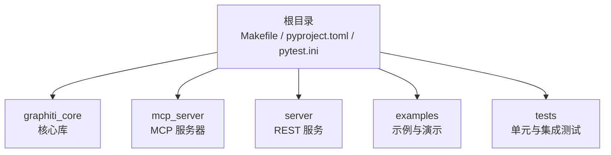
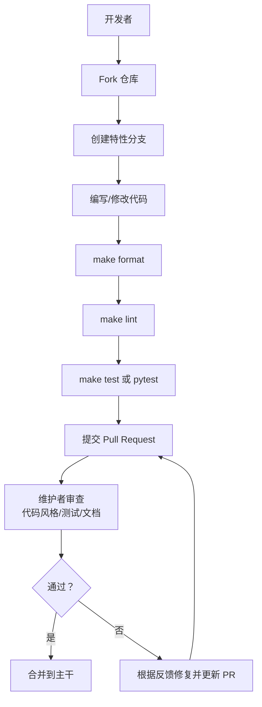
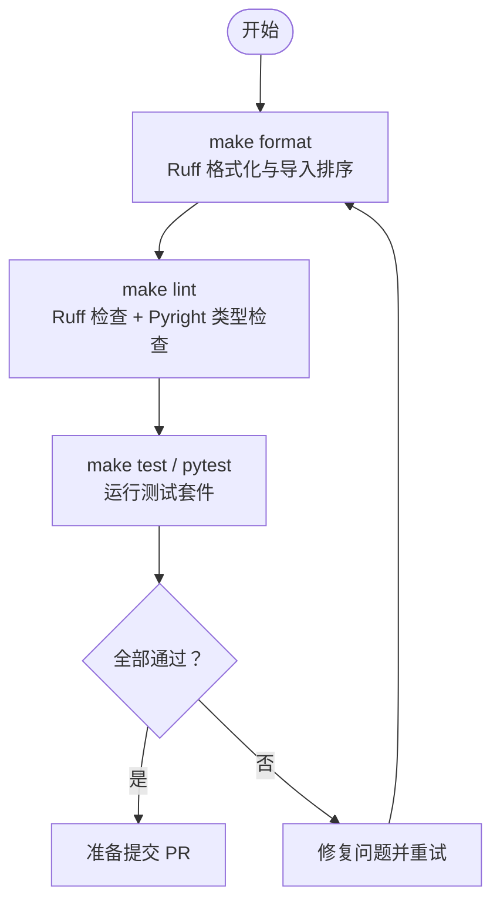
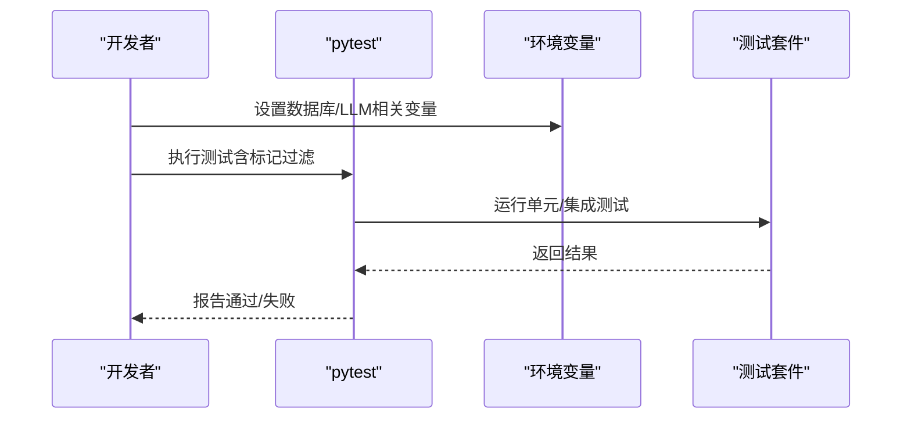
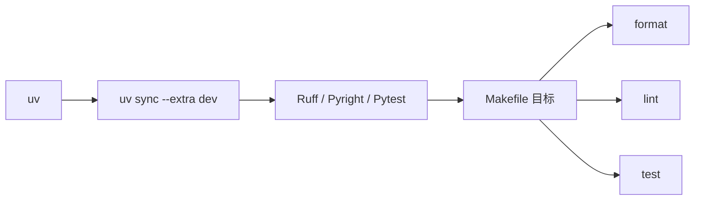

# 贡献指南

<cite>
**本文引用的文件**
- [CONTRIBUTING.md](file://CONTRIBUTING.md)
- [CODE_OF_CONDUCT.md](file://CODE_OF_CONDUCT.md)
- [Makefile](file://Makefile)
- [pyproject.toml](file://pyproject.toml)
- [README.md](file://README.md)
- [pytest.ini](file://pytest.ini)
- [tests/helpers_test.py](file://tests/helpers_test.py)
- [mcp_server/README.md](file://mcp_server/README.md)
- [server/README.md](file://server/README.md)
</cite>

## 目录
1. [引言](#引言)
2. [项目结构](#项目结构)
3. [核心组件](#核心组件)
4. [架构总览](#架构总览)
5. [详细组件分析](#详细组件分析)
6. [依赖关系分析](#依赖关系分析)
7. [性能与质量保障](#性能与质量保障)
8. [故障排查指南](#故障排查指南)
9. [结论](#结论)
10. [附录](#附录)

## 引言
本指南面向希望为 Graphiti 做出贡献的开发者，旨在帮助你快速上手、高效协作，并营造开放包容的社区氛围。内容覆盖环境搭建、分支策略、代码风格与质量工具、测试与审查标准、便捷命令使用、问题与建议提交流程，以及文档改进与行为准则等。

## 项目结构
Graphiti 是一个多模块仓库，包含核心库、MCP 服务器、REST 服务、示例与测试等。贡献流程与质量工具主要集中在根目录与核心子模块中。

[无图表来源；该图为概念性结构示意]

**章节来源**
- [README.md](file://README.md#L1-L120)

## 核心组件
- 环境与依赖管理：使用 uv 进行安装与同步，支持可选依赖与开发依赖分离。
- 代码质量工具链：Ruff（格式化与静态检查）、Pyright（类型检查）、Pytest（测试）。
- 测试策略：区分单元测试与集成测试，支持多数据库后端（Neo4j、FalkorDB、Kuzu、Neptune）。
- 贡献路径：Issue 挑战、自建工单、用例分享、社区互助。

**章节来源**
- [CONTRIBUTING.md](file://CONTRIBUTING.md#L48-L116)
- [Makefile](file://Makefile#L1-L33)
- [pyproject.toml](file://pyproject.toml#L1-L107)
- [pytest.ini](file://pytest.ini#L1-L6)

## 架构总览
下图展示贡献工作流的关键节点：从本地开发到测试、格式化与静态检查，再到 PR 审查与合并。

**图表来源**
- [CONTRIBUTING.md](file://CONTRIBUTING.md#L77-L116)
- [Makefile](file://Makefile#L18-L33)
- [pytest.ini](file://pytest.ini#L1-L6)

**章节来源**
- [CONTRIBUTING.md](file://CONTRIBUTING.md#L48-L116)

## 详细组件分析

### 环境搭建与依赖
- Python 版本要求：Python 3.10 及以上。
- 使用 uv 安装与同步依赖，推荐使用开发额外项以获得完整工具链。
- 集成测试需要设置相关环境变量（如 LLM 与数据库凭据），以便在本地或 CI 中运行。

**章节来源**
- [CONTRIBUTING.md](file://CONTRIBUTING.md#L56-L76)
- [README.md](file://README.md#L133-L225)

### 分支策略与变更流程
- 建议从“good first issue”或“help wanted”标签的任务开始，先在 Issue 或社区频道沟通思路，避免重复劳动。
- 大改动（如超过一定规模的架构变更）建议先行 RFC 讨论，确保设计与动机充分论证。
- 提交 PR 时需清晰标题与描述，关联相关 Issue 编号，确保测试通过且无 Lint 错误，必要时更新文档。

**章节来源**
- [CONTRIBUTING.md](file://CONTRIBUTING.md#L37-L66)
- [CONTRIBUTING.md](file://CONTRIBUTING.md#L98-L116)

### 代码风格与质量工具
- 统一使用 Ruff 进行格式化与静态检查，遵循配置中的规则集与忽略项。
- 类型检查使用 Pyright，范围限定在核心包目录。
- 代码风格与质量检查可通过统一命令一键执行，确保提交前一致性。

**图表来源**
- [Makefile](file://Makefile#L18-L33)
- [pyproject.toml](file://pyproject.toml#L73-L107)

**章节来源**
- [Makefile](file://Makefile#L1-L33)
- [pyproject.toml](file://pyproject.toml#L73-L107)

### 测试要求与组织
- 测试标记：
  - 单元测试：默认运行。
  - 集成测试：使用特定标记进行筛选，部分测试依赖外部服务（如 LLM、数据库）。
- 数据库后端支持：
  - 通过环境变量控制启用/禁用不同驱动，便于在本地选择合适后端。
- 测试夹具与辅助：
  - 提供通用驱动工厂、嵌入器 Mock、Lucene 转义工具等，简化测试编写与数据准备。

**图表来源**
- [pytest.ini](file://pytest.ini#L1-L6)
- [tests/helpers_test.py](file://tests/helpers_test.py#L33-L86)
- [tests/helpers_test.py](file://tests/helpers_test.py#L116-L175)

**章节来源**
- [pytest.ini](file://pytest.ini#L1-L6)
- [tests/helpers_test.py](file://tests/helpers_test.py#L33-L86)
- [tests/helpers_test.py](file://tests/helpers_test.py#L116-L175)

### 第三方集成与可选依赖模式
- 可选依赖必须作为可选额外项提供，并纳入开发额外项，保证核心库轻量。
- 在模块内部使用条件导入与错误提示，确保缺失依赖时给出清晰安装指引。
- 新增第三方集成应遵循现有命名与目录结构（LLM 客户端、嵌入客户端、驱动等）。

**章节来源**
- [CONTRIBUTING.md](file://CONTRIBUTING.md#L133-L193)

### 文档与示例贡献
- 示例与用例分享属于重要贡献形式，可提升他人使用体验与发现新的应用场景。
- 示例目录包含多种数据库与 LLM 的快速起步示例，建议在新增功能时配套示例说明。

**章节来源**
- [CONTRIBUTING.md](file://CONTRIBUTING.md#L29-L36)
- [README.md](file://README.md#L238-L291)
- [examples/quickstart/README.md](file://examples/quickstart/README.md#L1-L129)

### 行为准则与社区协作
- 社区以包容、尊重、建设性反馈为核心，禁止骚扰、歧视与不当言论。
- 违规处理遵循分级机制，从纠正到临时/永久封禁，维护健康生态。
- 任何违规可通过指定渠道举报，社区领导会公正处理并保护举报人隐私。

**章节来源**
- [CODE_OF_CONDUCT.md](file://CODE_OF_CONDUCT.md#L1-L129)

## 依赖关系分析
- 工具链依赖：Ruff、Pyright、Pytest 由 pyproject.toml 与 Makefile 统一调用。
- 开发依赖：集中于 dev 可选额外项，便于本地开发与测试。
- 测试依赖：pytest 标记与夹具提供灵活的测试组织方式。

**图表来源**
- [Makefile](file://Makefile#L14-L33)
- [pyproject.toml](file://pyproject.toml#L28-L65)

**章节来源**
- [Makefile](file://Makefile#L14-L33)
- [pyproject.toml](file://pyproject.toml#L28-L65)

## 性能与质量保障
- 默认并发与限流：README 提供关于并发与 LLM 限流的建议，有助于平衡吞吐与稳定性。
- 质量门禁：统一的格式化、静态检查与测试命令，减少回归风险。
- 可观测性：核心库与 MCP 服务器均内置匿名遥测，便于了解使用情况与优化方向。

**章节来源**
- [README.md](file://README.md#L226-L238)
- [Makefile](file://Makefile#L18-L33)
- [mcp_server/README.md](file://mcp_server/README.md#L655-L684)

## 故障排查指南
- 并发与限流：若出现 LLM 429 错误，适当降低并发限制；若吞吐不足，逐步提高。
- 数据库连接：确认驱动构造参数与环境变量一致，必要时显式传参。
- 测试失败：优先查看失败用例日志，结合夹具与环境变量定位问题；对集成测试注意外部服务可用性。

**章节来源**
- [README.md](file://README.md#L226-L238)
- [tests/helpers_test.py](file://tests/helpers_test.py#L68-L115)

## 结论
通过明确的环境与工具链、清晰的测试与审查标准、友好的行为准则，Graphiti 希望吸引并赋能更多贡献者共同打造高质量的知识图谱基础设施。欢迎你在 Issue、PR 或社区中积极交流，一起推动项目演进。

## 附录

### 快速参考：常用命令
- 安装依赖：make install
- 格式化：make format
- 静态检查：make lint
- 运行测试：make test 或 pytest
- 全流程检查：make check

**章节来源**
- [Makefile](file://Makefile#L14-L33)

### 新功能提议与 Bug 报告
- 新功能提议：在 Issue 中使用“Feature Request”标签，描述目标、痛点与预期收益。
- Bug 报告：提供清晰标题、复现步骤、期望与实际结果、最小可复现样例。

**章节来源**
- [CONTRIBUTING.md](file://CONTRIBUTING.md#L19-L28)

### 文档改进建议
- 对于文档类贡献，建议先在 Issue 中讨论，确认范围与影响后再提交 PR。
- 更新 README、示例说明或贡献指南时，请保持语言简洁、步骤可操作。

**章节来源**
- [CONTRIBUTING.md](file://CONTRIBUTING.md#L29-L36)
- [README.md](file://README.md#L649-L658)