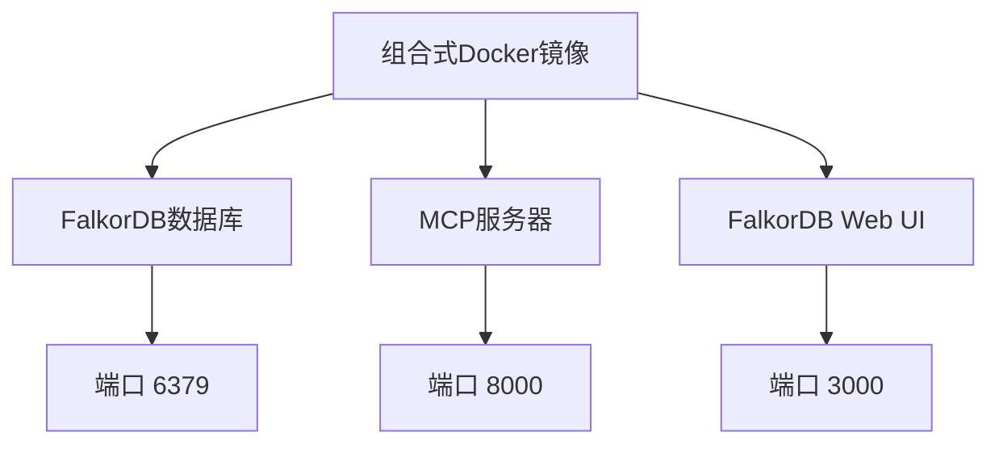
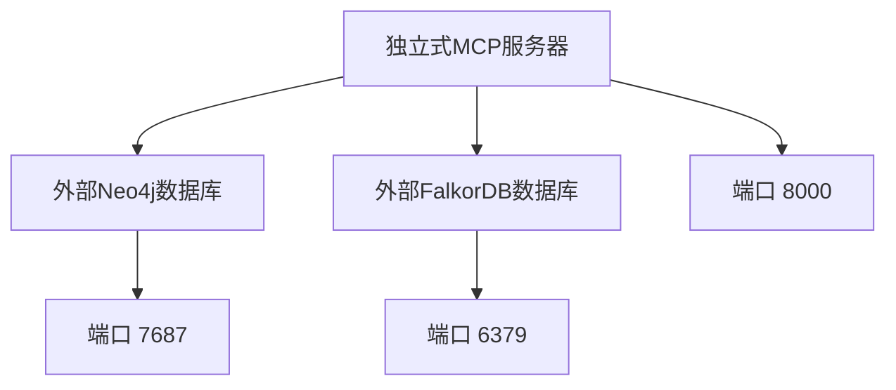
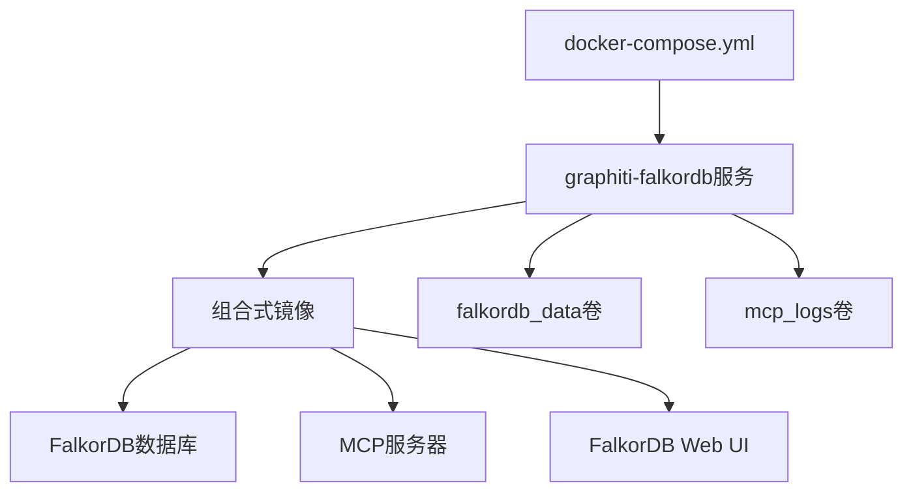
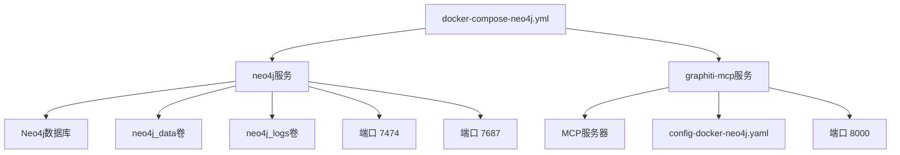
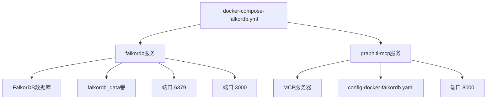
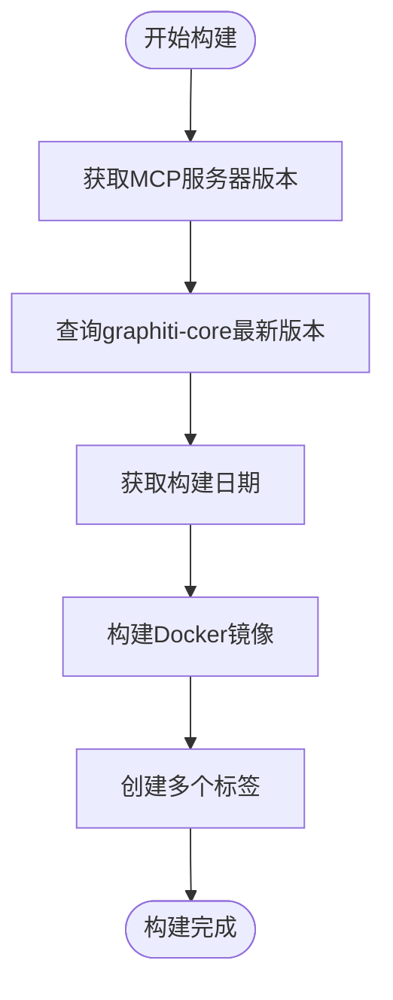
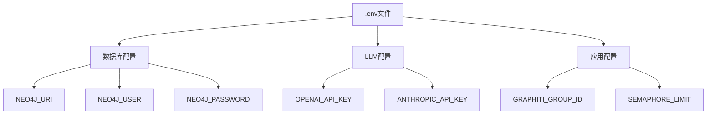

# Docker容器化部署

<cite>
**本文档中引用的文件**  
- [Dockerfile](file://mcp_server/docker/Dockerfile)
- [Dockerfile.standalone](file://mcp_server/docker/Dockerfile.standalone)
- [docker-compose.yml](file://mcp_server/docker/docker-compose.yml)
- [docker-compose-neo4j.yml](file://mcp_server/docker/docker-compose-neo4j.yml)
- [docker-compose-falkordb.yml](file://mcp_server/docker/docker-compose-falkordb.yml)
- [build-with-version.sh](file://mcp_server/docker/build-with-version.sh)
- [build-standalone.sh](file://mcp_server/docker/build-standalone.sh)
- [README.md](file://mcp_server/docker/README.md)
- [config-docker-falkordb-combined.yaml](file://mcp_server/config/config-docker-falkordb-combined.yaml)
- [config-docker-neo4j.yaml](file://mcp_server/config/config-docker-neo4j.yaml)
- [config-docker-falkordb.yaml](file://mcp_server/config/config-docker-falkordb.yaml)
- [.env.example](file://mcp_server/.env.example)
- [pyproject.toml](file://mcp_server/pyproject.toml)
- [github-actions-example.yml](file://mcp_server/docker/github-actions-example.yml)
</cite>

## 目录
1. [简介](#简介)
2. [Dockerfile详解](#dockerfile详解)
3. [Docker Compose服务编排](#docker-compose服务编排)
4. [镜像构建与版本管理](#镜像构建与版本管理)
5. [环境变量与配置集成](#环境变量与配置集成)
6. [部署示例](#部署示例)
7. [常见问题与解决方案](#常见问题与解决方案)
8. [生产环境建议](#生产环境建议)

## 简介

Graphiti MCP服务器提供了完整的Docker容器化部署方案，支持多种图数据库后端。本指南详细说明了如何使用Docker构建和运行Graphiti MCP服务器，包括`Dockerfile`和`Dockerfile.standalone`的区别及适用场景，`docker-compose.yml`及其变体的服务编排逻辑，以及构建镜像和运行容器的具体方法。

**Section sources**
- [README.md](file://mcp_server/README.md#L1-L684)
- [README.md](file://mcp_server/docker/README.md#L1-L264)

## Dockerfile详解

### 组合式Dockerfile (Dockerfile)

`Dockerfile`文件定义了一个组合式镜像，将FalkorDB图数据库与Graphiti MCP服务器打包在同一个容器中。这种设计简化了部署流程，特别适合开发和测试环境。

该镜像基于官方的FalkorDB镜像构建，通过`start-services.sh`启动脚本同时运行FalkorDB和MCP服务器。FalkorDB作为后台守护进程运行，而MCP服务器作为前台进程运行。容器暴露了三个端口：6379（FalkorDB/Redis）、3000（FalkorDB Web UI）和8000（MCP服务器HTTP）。



**Diagram sources**
- [Dockerfile](file://mcp_server/docker/Dockerfile#L1-L138)
- [start-services.sh](file://mcp_server/docker/Dockerfile#L70-L110)

### 独立式Dockerfile (Dockerfile.standalone)

`Dockerfile.standalone`文件定义了一个独立式镜像，仅包含Graphiti MCP服务器，用于连接外部的图数据库（Neo4j或FalkorDB）。这种设计提供了更高的灵活性和可扩展性，适合生产环境。

该镜像基于`python:3.11-slim-bookworm`基础镜像构建，安装了运行MCP服务器所需的所有依赖。与组合式镜像不同，它只暴露8000端口（MCP服务器HTTP），并通过环境变量配置连接到外部数据库。



**Diagram sources**
- [Dockerfile.standalone](file://mcp_server/docker/Dockerfile.standalone#L1-L82)

### Dockerfile对比分析

| 特性 | 组合式镜像 | 独立式镜像 |
|------|------------|------------|
| **部署复杂度** | 简单（单容器） | 中等（多容器） |
| **网络延迟** | 低（本地通信） | 较高（容器间通信） |
| **资源使用** | 较低（共享基础） | 较高（独立镜像） |
| **可扩展性** | 有限 | 更好（可独立扩展） |
| **调试难度** | 较难（多进程） | 较易（服务隔离） |
| **适用场景** | 开发/测试 | 生产环境 |

**Section sources**
- [Dockerfile](file://mcp_server/docker/Dockerfile#L1-L138)
- [Dockerfile.standalone](file://mcp_server/docker/Dockerfile.standalone#L1-L82)

## Docker Compose服务编排

### 默认编排 (docker-compose.yml)

`docker-compose.yml`文件定义了默认的部署配置，使用组合式镜像运行FalkorDB和MCP服务器。该配置通过`build`指令从`Dockerfile`构建镜像，并设置了必要的环境变量和卷挂载。

服务包括`graphiti-falkordb`，它使用构建的镜像并暴露三个端口。环境变量配置了FalkorDB的连接信息和MCP服务器的运行参数。数据持久化通过`falkordb_data`和`mcp_logs`两个命名卷实现。



**Diagram sources**
- [docker-compose.yml](file://mcp_server/docker/docker-compose.yml#L1-L45)

### Neo4j编排 (docker-compose-neo4j.yml)

`docker-compose-neo4j.yml`文件定义了使用Neo4j作为图数据库的部署配置。该配置包含两个服务：`neo4j`和`graphiti-mcp`。

`neo4j`服务使用官方的Neo4j镜像，配置了必要的环境变量和内存设置。`graphiti-mcp`服务使用独立式镜像，并通过`depends_on`确保在Neo4j健康后才启动。配置文件`config-docker-neo4j.yaml`被挂载到容器中，确保MCP服务器使用正确的数据库配置。



**Diagram sources**
- [docker-compose-neo4j.yml](file://mcp_server/docker/docker-compose-neo4j.yml#L1-L56)

### FalkorDB分离编排 (docker-compose-falkordb.yml)

`docker-compose-falkordb.yml`文件定义了使用独立FalkorDB实例的部署配置。与Neo4j配置类似，它也包含两个服务：`falkordb`和`graphiti-mcp`。

`falkordb`服务使用官方的FalkorDB镜像，而`graphiti-mcp`服务使用独立式镜像。这种配置提供了比组合式镜像更好的资源隔离和管理灵活性，同时保留了FalkorDB作为图数据库的优势。



**Diagram sources**
- [docker-compose-falkordb.yml](file://mcp_server/docker/docker-compose-falkordb.yml#L1-L51)

## 镜像构建与版本管理

### 构建脚本 (build-with-version.sh)

`build-with-version.sh`脚本用于构建带有版本标签的Docker镜像。该脚本首先从`pyproject.toml`文件中获取MCP服务器版本，然后从PyPI查询最新的`graphiti-core`版本。

构建过程使用`docker build`命令，传递必要的构建参数（如版本号、构建日期等），并为镜像创建多个标签：基于MCP服务器版本的标签、包含`graphiti-core`版本的标签以及`latest`标签。这种多标签策略便于版本管理和回滚。



**Diagram sources**
- [build-with-version.sh](file://mcp_server/docker/build-with-version.sh#L1-L44)

### 独立构建脚本 (build-standalone.sh)

`build-standalone.sh`脚本专门用于构建独立式镜像。与`build-with-version.sh`类似，它也查询版本信息并构建镜像，但使用`Dockerfile.standalone`作为构建文件。

该脚本为独立式镜像创建了特定的标签，如`standalone`、`{版本}-standalone`等，便于区分不同类型的镜像。这对于需要同时维护组合式和独立式镜像的场景非常有用。

**Section sources**
- [build-with-version.sh](file://mcp_server/docker/build-with-version.sh#L1-L44)
- [build-standalone.sh](file://mcp_server/docker/build-standalone.sh#L1-L51)

## 环境变量与配置集成

### 环境变量配置

Graphiti MCP服务器通过环境变量进行配置，这些变量可以在`.env`文件中定义。关键的环境变量包括：

- **数据库配置**: `NEO4J_URI`, `NEO4J_USER`, `NEO4J_PASSWORD`, `FALKORDB_URI`, `FALKORDB_PASSWORD`
- **LLM配置**: `OPENAI_API_KEY`, `ANTHROPIC_API_KEY`, `GOOGLE_API_KEY`, `GROQ_API_KEY`
- **应用配置**: `GRAPHITI_GROUP_ID`, `SEMAPHORE_LIMIT`, `BROWSER`



**Diagram sources**
- [.env.example](file://mcp_server/.env.example#L1-L50)

### 配置文件集成

配置文件（如`config-docker-neo4j.yaml`）使用环境变量占位符（`${VAR_NAME}`），在运行时被实际值替换。这种机制实现了配置的灵活性和安全性，敏感信息（如API密钥）可以通过环境变量注入，而不需要硬编码在配置文件中。

```yaml
database:
  providers:
    neo4j:
      uri: ${NEO4J_URI:bolt://neo4j:7687}
      username: ${NEO4J_USER:neo4j}
      password: ${NEO4J_PASSWORD:demodemo}
```

**Section sources**
- [config-docker-neo4j.yaml](file://mcp_server/config/config-docker-neo4j.yaml#L1-L103)
- [config-docker-falkordb-combined.yaml](file://mcp_server/config/config-docker-falkordb-combined.yaml#L1-L102)

## 部署示例

### 使用组合式镜像部署

```bash
# 创建.env文件
cd mcp_server
cp .env.example .env
# 编辑.env文件，设置OPENAI_API_KEY

# 启动服务
docker compose up
```

此命令将启动包含FalkorDB和MCP服务器的组合式容器。服务可通过以下地址访问：
- MCP服务器: http://localhost:8000/mcp/
- FalkorDB Web UI: http://localhost:3000
- FalkorDB (Redis): localhost:6379

**Section sources**
- [README.md](file://mcp_server/README.md#L246-L259)
- [README.md](file://mcp_server/docker/README.md#L7-L13)

### 使用Neo4j部署

```bash
# 启动Neo4j配置
docker compose -f docker/docker-compose-neo4j.yml up
```

此命令将启动独立的Neo4j容器和MCP服务器容器。MCP服务器通过`depends_on`条件确保在Neo4j健康后才启动。默认的Neo4j凭据为`neo4j/demodemo`，Web界面可通过http://localhost:7474访问。

**Section sources**
- [README.md](file://mcp_server/README.md#L260-L269)
- [docker-compose-neo4j.yml](file://mcp_server/docker/docker-compose-neo4j.yml#L1-L56)

### 使用独立FalkorDB部署

```bash
# 启动独立FalkorDB配置
docker compose -f docker/docker-compose-falkordb.yml up
```

此配置将FalkorDB和MCP服务器分离到不同的容器中，提供了更好的资源隔离和管理灵活性。MCP服务器通过`config-docker-falkordb.yaml`配置文件连接到FalkorDB实例。

**Section sources**
- [docker-compose-falkordb.yml](file://mcp_server/docker/docker-compose-falkordb.yml#L1-L51)

## 常见问题与解决方案

### 端口冲突

如果端口8000、6379或3000已被占用，可以通过修改`docker-compose.yml`文件中的端口映射来解决：

```yaml
ports:
  - "8001:8000"  # 将外部端口改为8001
  - "6380:6379"
  - "3001:3000"
```

**Section sources**
- [README.md](file://mcp_server/docker/README.md#L163-L172)

### 容器无法启动

1. **检查日志**: `docker-compose logs graphiti-mcp`
2. **验证.env文件**: 确保包含有效的API密钥
3. **检查资源分配**: 确保Docker有足够的内存和CPU资源

### 数据库连接问题

**FalkorDB**:
- 测试Redis连接: `docker compose exec graphiti-falkordb redis-cli ping`
- 检查日志: `docker compose logs graphiti-falkordb`

**Neo4j**:
- 等待健康检查通过（可能需要30秒以上）
- 检查Neo4j日志: `docker-compose -f docker-compose-neo4j.yml logs neo4j`
- 验证凭据是否与环境变量匹配

**Section sources**
- [README.md](file://mcp_server/docker/README.md#L174-L199)

## 生产环境建议

### 资源限制

在生产环境中，应为容器设置资源限制以防止资源耗尽：

```yaml
services:
  graphiti-mcp:
    deploy:
      resources:
        limits:
          cpus: '2.0'
          memory: 4G
```

### 持久化存储

使用命名卷或绑定挂载来确保生产数据的持久化，并定期备份`/var/lib/falkordb/data`或Neo4j数据卷。

### 安全性

在生产环境中设置`FALKORDB_PASSWORD`或Neo4j密码，避免使用默认凭据。敏感信息应通过环境变量注入，而不是硬编码在配置文件中。

**Section sources**
- [README-falkordb-combined.md](file://mcp_server/docker/README-falkordb-combined.md#L231-L246)
- [README.md](file://mcp_server/docker/README.md#L232-L256)