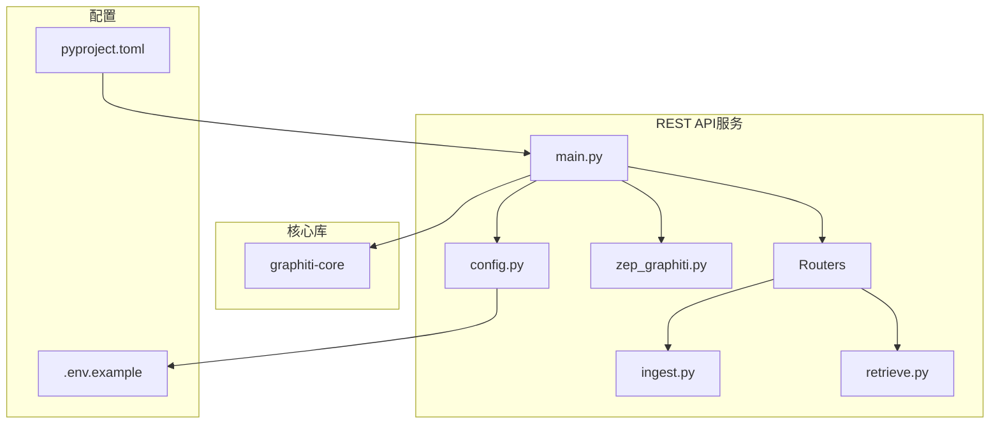

# REST API服务部署

<cite>
**本文档中引用的文件**   
- [pyproject.toml](file://server/pyproject.toml)
- [.env.example](file://server/.env.example)
- [config.py](file://server/graph_service/config.py)
- [main.py](file://server/graph_service/main.py)
- [zep_graphiti.py](file://server/graph_service/zep_graphiti.py)
- [docker-compose.yml](file://docker-compose.yml)
- [mcp_server/docker/docker-compose.yml](file://mcp_server/docker/docker-compose.yml)
- [retrieve.py](file://server/graph_service/routers/retrieve.py)
- [ingest.py](file://server/graph_service/routers/ingest.py)
</cite>

## 目录
1. [项目结构](#项目结构)
2. [依赖管理与打包配置](#依赖管理与打包配置)
3. [环境变量配置](#环境变量配置)
4. [服务配置与初始化](#服务配置与初始化)
5. [REST API路由与功能](#rest-api路由与功能)
6. [Docker集成部署](#docker集成部署)
7. [健康检查与日志](#健康检查与日志)
8. [MCP服务器部署模式对比](#mcp服务器部署模式对比)

## 项目结构

REST API服务位于`server/`目录下，采用FastAPI框架构建，提供图数据库的REST接口。服务通过`graphiti-core`库与底层图数据库交互，支持多种图数据库后端。



**Diagram sources**
- [server/graph_service/main.py](file://server/graph_service/main.py#L1-L30)
- [server/graph_service/config.py](file://server/graph_service/config.py#L1-L27)

**Section sources**
- [server/graph_service/main.py](file://server/graph_service/main.py#L1-L30)
- [server/graph_service/config.py](file://server/graph_service/config.py#L1-L27)
- [server/pyproject.toml](file://server/pyproject.toml#L1-L69)

## 依赖管理与打包配置

`pyproject.toml`文件定义了REST API服务的Python依赖项和打包配置。项目使用`hatchling`作为构建后端，确保一致的包管理。

```toml
[project]
name = "graph-service"
version = "0.1.0"
description = "Zep Graph service implementing Graphiti package"
requires-python = ">=3.10"
dependencies = [
    "fastapi>=0.115.0",
    "graphiti-core",
    "pydantic-settings>=2.4.0",
    "uvicorn>=0.30.6",
    "httpx>=0.28.1",
]
```

核心依赖包括：
- **FastAPI**: 现代Python Web框架，用于构建REST API
- **graphiti-core**: 核心图数据库操作库
- **pydantic-settings**: 用于环境变量和配置管理
- **uvicorn**: ASGI服务器，用于运行FastAPI应用
- **httpx**: HTTP客户端库

开发依赖包括测试和代码质量工具，如pytest、pyright、ruff等。

**Section sources**
- [server/pyproject.toml](file://server/pyproject.toml#L1-L69)

## 环境变量配置

`.env.example`文件定义了服务运行所需的关键环境变量，这些变量与核心库的配置紧密关联：

```env
OPENAI_API_KEY=
NEO4J_PORT=7687
# Only used if not running a neo4j container in docker
NEO4J_URI=bolt://localhost:7687
NEO4J_USER=neo4j
NEO4J_PASSWORD=password
```

这些环境变量在`config.py`中被`Settings`类定义和管理，通过`pydantic-settings`库加载。主要环境变量包括：
- **OPENAI_API_KEY**: OpenAI API密钥，用于LLM操作
- **NEO4J_URI**: Neo4j数据库的Bolt协议URI
- **NEO4J_USER**: Neo4j数据库用户名
- **NEO4J_PASSWORD**: Neo4j数据库密码
- **NEO4J_PORT**: Neo4j数据库端口

**Section sources**
- [server/.env.example](file://server/.env.example#L1-L6)
- [server/graph_service/config.py](file://server/graph_service/config.py#L1-L27)

## 服务配置与初始化

`config.py`文件定义了服务的配置项，使用Pydantic的`BaseSettings`类来管理配置。`Settings`类定义了所有必需的配置参数，并通过`env_file='.env'`指定从`.env`文件加载环境变量。

```python
class Settings(BaseSettings):
    openai_api_key: str
    openai_base_url: str | None = Field(None)
    model_name: str | None = Field(None)
    embedding_model_name: str | None = Field(None)
    neo4j_uri: str
    neo4j_user: str
    neo4j_password: str

    model_config = SettingsConfigDict(env_file='.env', extra='ignore')
```

`main.py`文件负责FastAPI应用的初始化。通过`lifespan`上下文管理器，在应用启动时初始化`graphiti`实例，并在关闭时进行清理。

```python
@asynccontextmanager
async def lifespan(_: FastAPI):
    settings = get_settings()
    await initialize_graphiti(settings)
    yield

app = FastAPI(lifespan=lifespan)
```

`initialize_graphiti`函数在`zep_graphiti.py`中定义，负责创建`ZepGraphiti`实例并构建数据库索引和约束。

**Section sources**
- [server/graph_service/config.py](file://server/graph_service/config.py#L1-L27)
- [server/graph_service/main.py](file://server/graph_service/main.py#L1-L30)
- [server/graph_service/zep_graphiti.py](file://server/graph_service/zep_graphiti.py#L93-L100)

## REST API路由与功能

REST API服务提供了两个主要路由器：`ingest`（摄入）和`retrieve`（检索），分别处理数据写入和读取操作。

### 摄入路由器 (ingest.py)

`ingest.py`路由器处理数据写入操作，包括添加消息、实体节点，以及删除操作：

```python
@router.post('/messages', status_code=status.HTTP_202_ACCEPTED)
async def add_messages(request: AddMessagesRequest, graphiti: ZepGraphitiDep):
    # 异步处理消息添加
    pass

@router.post('/entity-node', status_code=status.HTTP_201_CREATED)
async def add_entity_node(request: AddEntityNodeRequest, graphiti: ZepGraphitiDep):
    # 添加实体节点
    pass

@router.delete('/entity-edge/{uuid}', status_code=status.HTTP_200_OK)
async def delete_entity_edge(uuid: str, graphiti: ZepGraphitiDep):
    # 删除实体边
    pass
```

摄入操作采用异步工作队列模式，通过`AsyncWorker`类实现，确保高并发下的性能和稳定性。

### 检索路由器 (retrieve.py)

`retrieve.py`路由器处理数据读取操作，支持搜索、获取特定实体和会话检索：

```python
@router.post('/search', status_code=status.HTTP_200_OK)
async def search(query: SearchQuery, graphiti: ZepGraphitiDep):
    # 语义搜索
    pass

@router.get('/entity-edge/{uuid}', status_code=status.HTTP_200_OK)
async def get_entity_edge(uuid: str, graphiti: ZepGraphitiDep):
    # 获取特定实体边
    pass

@router.post('/get-memory', status_code=status.HTTP_200_OK)
async def get_memory(request: GetMemoryRequest, graphiti: ZepGraphitiDep):
    # 获取记忆
    pass
```

**Section sources**
- [server/graph_service/routers/ingest.py](file://server/graph_service/routers/ingest.py#L1-L112)
- [server/graph_service/routers/retrieve.py](file://server/graph_service/routers/retrieve.py#L1-L64)

## Docker集成部署

`docker-compose.yml`文件提供了将REST服务与图数据库、MCP服务器等组件集成部署的完整示例。部署配置支持多种图数据库后端，包括Neo4j和FalkorDB。

```yaml
services:
  graph:
    build:
      context: .
    ports:
      - "8000:8000"
    depends_on:
      neo4j:
        condition: service_healthy
    environment:
      - OPENAI_API_KEY=${OPENAI_API_KEY}
      - NEO4J_URI=bolt://neo4j:${NEO4J_PORT:-7687}
      - NEO4J_USER=${NEO4J_USER:-neo4j}
      - NEO4J_PASSWORD=${NEO4J_PASSWORD:-password}
      - PORT=8000
      - db_backend=neo4j
  neo4j:
    image: neo4j:5.26.2
    ports:
      - "7474:7474"
      - "${NEO4J_PORT:-7687}:${NEO4J_PORT:-7687}"
    volumes:
      - neo4j_data:/data
    environment:
      - NEO4J_AUTH=${NEO4J_USER:-neo4j}/${NEO4J_PASSWORD:-password}
```

部署配置的关键特性包括：
- **健康检查**: 确保服务依赖项就绪
- **环境变量注入**: 通过`${VAR_NAME}`语法支持环境变量
- **端口映射**: 将容器端口映射到主机
- **数据卷**: 持久化数据库数据

MCP服务器的Docker部署配置位于`mcp_server/docker/docker-compose.yml`，提供了FalkorDB与MCP服务器的集成部署。

**Section sources**
- [docker-compose.yml](file://docker-compose.yml#L1-L93)
- [mcp_server/docker/docker-compose.yml](file://mcp_server/docker/docker-compose.yml#L1-L45)

## 健康检查与日志

REST API服务提供了健康检查端点`/healthcheck`，用于监控服务状态：

```python
@app.get('/healthcheck')
async def healthcheck():
    return JSONResponse(content={'status': 'healthy'}, status_code=200)
```

Docker部署中配置了健康检查，确保服务完全就绪：

```yaml
healthcheck:
  test:
    [
      "CMD",
      "python",
      "-c",
      "import urllib.request; urllib.request.urlopen('http://localhost:8000/healthcheck')",
    ]
  interval: 10s
  timeout: 5s
  retries: 3
```

日志输出通过Python标准`logging`模块实现，`zep_graphiti.py`中创建了logger实例：

```python
logger = logging.getLogger(__name__)
```

错误处理通过FastAPI的`HTTPException`实现，确保客户端收到适当的错误响应。

**Section sources**
- [server/graph_service/main.py](file://server/graph_service/main.py#L27-L29)
- [docker-compose.yml](file://docker-compose.yml#L8-L18)
- [server/graph_service/zep_graphiti.py](file://server/graph_service/zep_graphiti.py#L1)

## MCP服务器部署模式对比

REST API服务与MCP服务器在部署模式上存在显著差异：

### REST API服务部署模式
- **架构**: FastAPI + 图数据库
- **传输协议**: HTTP/HTTPS
- **部署方式**: Docker Compose
- **配置管理**: 环境变量 + `.env`文件
- **数据库支持**: Neo4j, FalkorDB
- **适用场景**: 通用REST API服务

### MCP服务器部署模式
- **架构**: MCP协议 + 图数据库
- **传输协议**: HTTP, stdio
- **部署方式**: Docker Compose, 直接运行
- **配置管理**: YAML配置文件 + 环境变量
- **数据库支持**: FalkorDB(默认), Neo4j
- **适用场景**: AI代理记忆系统

MCP服务器提供了更丰富的功能，包括：
- **多种LLM提供商支持**: OpenAI, Anthropic, Gemini, Groq
- **多种嵌入提供商**: OpenAI, Voyage, Sentence Transformers
- **队列化处理**: 可配置的并发限制
- **丰富的实体类型**: 预定义的实体类型用于结构化知识提取

两种部署模式可根据具体需求选择，REST API服务更适合通用场景，而MCP服务器更适合AI代理集成。

**Section sources**
- [mcp_server/README.md](file://mcp_server/README.md#L1-L684)
- [server/README.md](file://server/README.md#L1-L78)