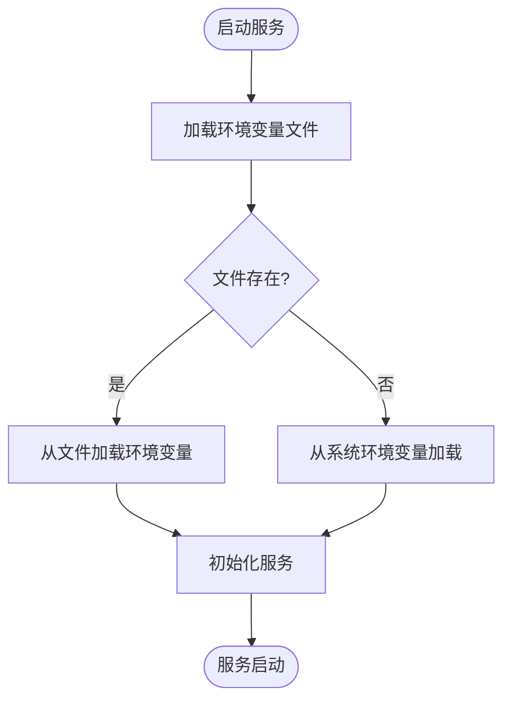

# 环境配置与变量

<cite>
**本文档中引用的文件**  
- [.env.example](file://.env.example)
- [mcp_server/.env.example](file://mcp_server/.env.example)
- [server/.env.example](file://server/.env.example)
- [examples/azure-openai/.env.example](file://examples/azure-openai/.env.example)
- [examples/opentelemetry/.env.example](file://examples/opentelemetry/.env.example)
- [mcp_server/config/config.yaml](file://mcp_server/config/config.yaml)
- [mcp_server/config/config-docker-neo4j.yaml](file://mcp_server/config/config-docker-neo4j.yaml)
- [mcp_server/config/config-docker-falkordb.yaml](file://mcp_server/config/config-docker-falkordb.yaml)
- [mcp_server/src/graphiti_mcp_server.py](file://mcp_server/src/graphiti_mcp_server.py)
- [server/graph_service/config.py](file://server/graph_service/config.py)
</cite>

## 目录
1. [简介](#简介)
2. [项目结构](#项目结构)
3. [核心组件](#核心组件)
4. [架构概述](#架构概述)
5. [详细组件分析](#详细组件分析)
6. [依赖分析](#依赖分析)
7. [性能考虑](#性能考虑)
8. [故障排除指南](#故障排除指南)
9. [结论](#结论)

## 简介
本文档详细说明了 Graphiti 项目中的环境配置与变量使用方法。重点解析了项目中多个 `.env.example` 文件的关键环境变量，包括 API 密钥、数据库连接参数、并发控制参数等。同时，结合 `config.yaml` 文件中的环境变量引用机制，展示了如何在不同部署环境中安全地管理敏感信息和动态配置。文档还提供了实际配置示例，解释了变量之间的依赖关系和优先级，并针对常见配置错误提供了排查建议。

## 项目结构
Graphiti 项目采用模块化设计，主要包含以下几个核心目录：
- `graphiti_core`: 核心功能实现，包括驱动、嵌入器、LLM 客户端等
- `mcp_server`: MCP 服务器实现，提供基于 Model Context Protocol 的服务
- `server`: FastAPI 服务实现，提供 RESTful API 接口
- `examples`: 各种使用示例，展示不同场景下的配置和使用方法

项目通过多个 `.env.example` 文件为不同组件提供环境变量配置模板，并通过 `config.yaml` 文件实现配置的集中管理和环境变量的动态引用。

**图示来源**
- [.env.example](file://.env.example)
- [mcp_server/.env.example](file://mcp_server/.env.example)
- [server/.env.example](file://server/.env.example)
- [examples/azure-openai/.env.example](file://examples/azure-openai/.env.example)
- [examples/opentelemetry/.env.example](file://examples/opentelemetry/.env.example)
- [mcp_server/config/config.yaml](file://mcp_server/config/config.yaml)

**章节来源**
- [.env.example](file://.env.example)
- [mcp_server/.env.example](file://mcp_server/.env.example)
- [server/.env.example](file://server/.env.example)
- [examples/azure-openai/.env.example](file://examples/azure-openai/.env.example)
- [examples/opentelemetry/.env.example](file://examples/opentelemetry/.env.example)
- [mcp_server/config/config.yaml](file://mcp_server/config/config.yaml)

## 核心组件
本项目的核心组件包括环境变量管理、配置文件解析、数据库连接和 LLM 集成。环境变量通过 `.env` 文件加载，并在 `config.yaml` 中通过 `${VAR_NAME}` 语法引用。MCP 服务器和 FastAPI 服务分别使用不同的配置机制来加载环境变量和配置文件。

**章节来源**
- [mcp_server/src/graphiti_mcp_server.py](file://mcp_server/src/graphiti_mcp_server.py)
- [server/graph_service/config.py](file://server/graph_service/config.py)

## 架构概述
Graphiti 项目的配置架构采用分层设计，顶层是环境变量文件，中间层是 YAML 配置文件，底层是服务实现。环境变量文件提供基础配置，YAML 配置文件实现配置的集中管理和动态引用，服务实现层则根据配置启动相应的功能模块。

**图示来源**
- [mcp_server/config/config.yaml](file://mcp_server/config/config.yaml)
- [mcp_server/src/graphiti_mcp_server.py](file://mcp_server/src/graphiti_mcp_server.py)
- [server/graph_service/config.py](file://server/graph_service/config.py)

## 详细组件分析
### 环境变量管理分析
Graphiti 项目通过 `python-dotenv` 库加载环境变量，支持从 `.env` 文件和系统环境变量中读取配置。MCP 服务器在启动时会优先从 `mcp_server/.env` 文件加载环境变量，如果不存在则尝试从当前工作目录加载。

**图示来源**
- [mcp_server/src/graphiti_mcp_server.py](file://mcp_server/src/graphiti_mcp_server.py)

**章节来源**
- [mcp_server/src/graphiti_mcp_server.py](file://mcp_server/src/graphiti_mcp_server.py)

### 配置文件解析分析
`config.yaml` 文件支持环境变量扩展，使用 `${VAR_NAME}` 或 `${VAR_NAME:default_value}` 语法引用环境变量。这种机制允许在不同部署环境中灵活配置，同时保持配置文件的通用性。

**图示来源**
- [mcp_server/config/config.yaml](file://mcp_server/config/config.yaml)

**章节来源**
- [mcp_server/config/config.yaml](file://mcp_server/config/config.yaml)

## 依赖分析
项目中的配置组件存在明确的依赖关系。MCP 服务器依赖于 `config.yaml` 文件和环境变量，而 `config.yaml` 文件又依赖于环境变量的值。这种依赖关系确保了配置的灵活性和安全性。

**图示来源**
- [.env.example](file://.env.example)
- [mcp_server/.env.example](file://mcp_server/.env.example)
- [server/.env.example](file://server/.env.example)
- [mcp_server/config/config.yaml](file://mcp_server/config/config.yaml)

**章节来源**
- [.env.example](file://.env.example)
- [mcp_server/.env.example](file://mcp_server/.env.example)
- [server/.env.example](file://server/.env.example)
- [mcp_server/config/config.yaml](file://mcp_server/config/config.yaml)

## 性能考虑
并发控制参数 `SEMAPHORE_LIMIT` 对系统性能有重要影响。该参数控制同时处理的 episode 数量，需要根据 LLM 提供商的速率限制进行调整。过高的值可能导致 429 速率限制错误，过低的值则会导致吞吐量不足。

## 故障排除指南
### 常见配置错误及解决方法
1. **缺失 API 密钥**
   - 现象：LLM 调用失败，返回 401 错误
   - 解决方法：检查 `.env` 文件中 `OPENAI_API_KEY` 或 `ANTHROPIC_API_KEY` 是否正确配置

2. **数据库 URL 格式错误**
   - 现象：数据库连接失败，返回连接拒绝错误
   - 解决方法：检查 `NEO4J_URI` 或 `FALKORDB_URI` 的格式是否正确，确保包含协议前缀（如 `bolt://`）

3. **环境变量未加载**
   - 现象：配置值为空或使用默认值
   - 解决方法：确认 `.env` 文件位于正确位置，或在启动命令中指定 `--config` 参数

**章节来源**
- [mcp_server/src/graphiti_mcp_server.py](file://mcp_server/src/graphiti_mcp_server.py)
- [mcp_server/.env.example](file://mcp_server/.env.example)

## 结论
Graphiti 项目的环境配置系统设计合理，通过环境变量文件和 YAML 配置文件的结合，实现了配置的灵活性和安全性。开发者可以根据不同部署环境调整配置，同时通过详细的示例文件和配置说明，降低了配置的复杂性。建议在生产环境中使用环境变量管理工具来安全地管理敏感信息。