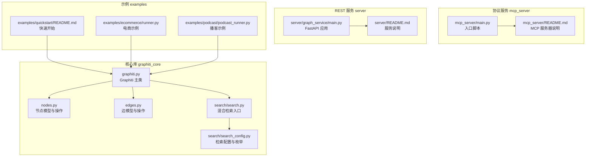
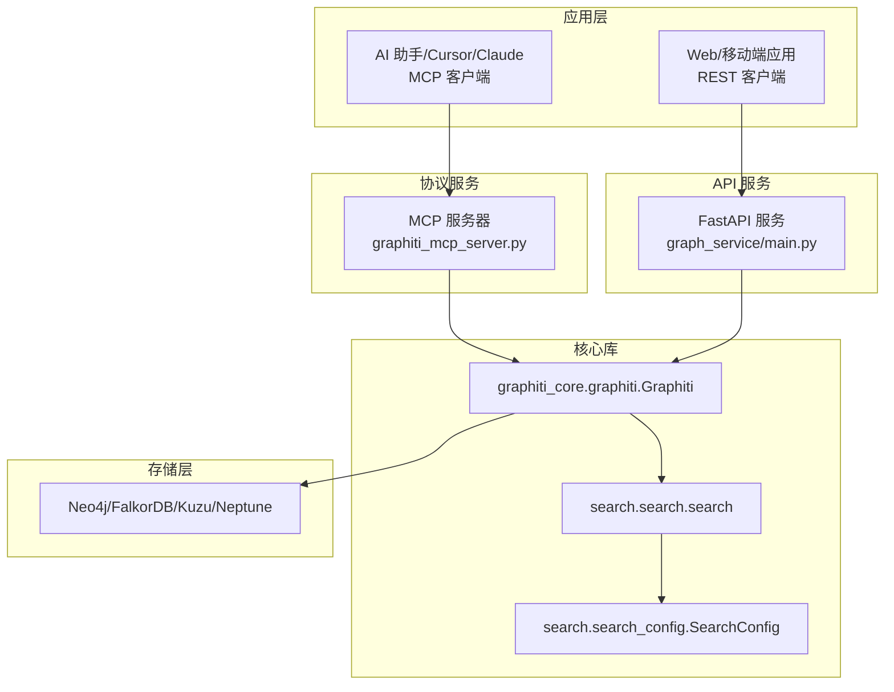
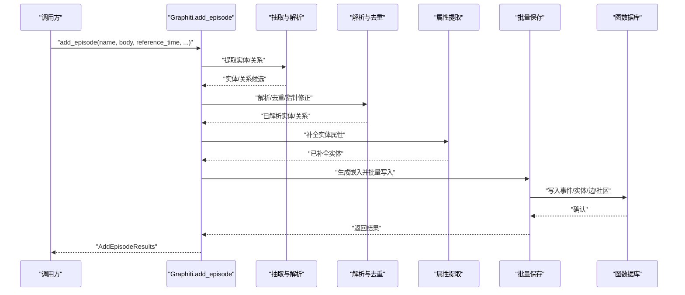
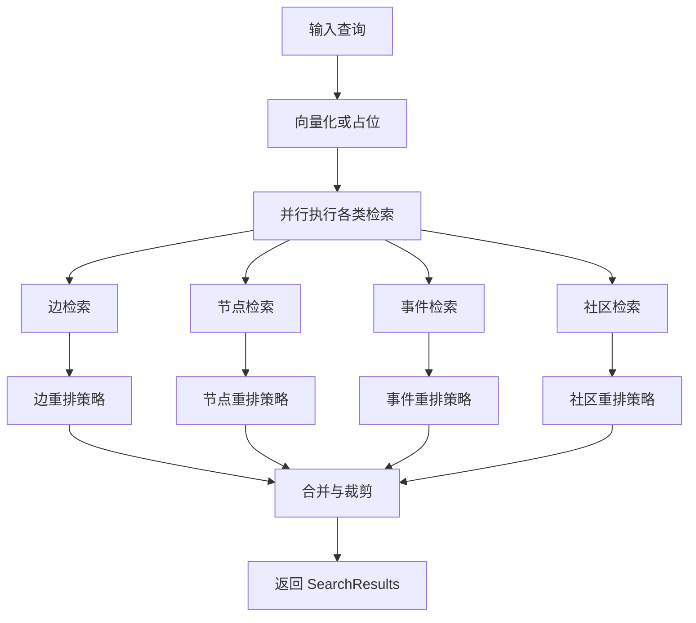
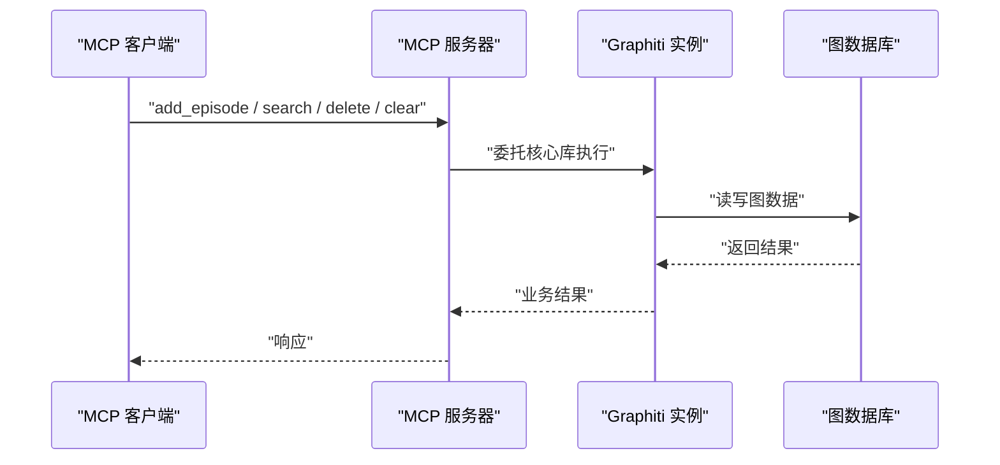
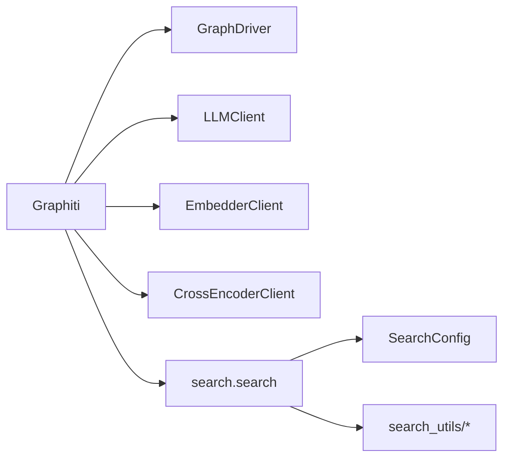

# 项目概述

<cite>
**本文引用的文件列表**
- [README.md](file://README.md)
- [graphiti_core/graphiti.py](file://graphiti_core/graphiti.py)
- [graphiti_core/nodes.py](file://graphiti_core/nodes.py)
- [graphiti_core/edges.py](file://graphiti_core/edges.py)
- [graphiti_core/search/search.py](file://graphiti_core/search/search.py)
- [graphiti_core/search/search_config.py](file://graphiti_core/search/search_config.py)
- [mcp_server/README.md](file://mcp_server/README.md)
- [mcp_server/main.py](file://mcp_server/main.py)
- [server/README.md](file://server/README.md)
- [server/graph_service/main.py](file://server/graph_service/main.py)
- [examples/quickstart/README.md](file://examples/quickstart/README.md)
- [examples/ecommerce/runner.py](file://examples/ecommerce/runner.py)
- [examples/podcast/podcast_runner.py](file://examples/podcast/podcast_runner.py)
</cite>

## 目录
1. [引言](#引言)
2. [项目结构](#项目结构)
3. [核心组件](#核心组件)
4. [架构总览](#架构总览)
5. [详细组件分析](#详细组件分析)
6. [依赖关系分析](#依赖关系分析)
7. [性能考量](#性能考量)
8. [故障排查指南](#故障排查指南)
9. [结论](#结论)
10. [附录](#附录)

## 引言
Graphiti 是一个面向 AI 代理的知识图谱构建与查询框架，专为动态环境下的实时增量更新与精确历史查询而设计。它通过“事件-实体-关系”的三元组建模，将用户交互、结构化与非结构化企业数据、外部信息持续整合到可查询的时序知识图谱中。其关键特性包括：
- 时间感知：显式记录事件发生时间与入库时间，支持点时刻查询与历史回溯。
- 混合检索：融合语义嵌入、关键词（BM25）与图遍历，实现低延迟、高准确率的检索。
- 增量更新：对新数据进行抽取、去重、合并与无效边处理，无需全量重算。
- 可扩展性：支持多种图数据库后端与 LLM/嵌入/重排序器提供商，便于在企业环境中扩展。

Graphiti 的目标用户包括：
- AI 系统开发者：用于构建具备上下文记忆与推理能力的智能体。
- 后端工程师：用于搭建可扩展的记忆服务与检索 API。
- 知识图谱研究人员：用于探索动态数据建模、社区发现与时间维度建模。

## 项目结构
仓库采用分层模块化组织，核心由 graphiti_core 核心库、mcp_server 协议服务、server REST API 服务三部分组成，并配套示例与测试。

图表来源
- [graphiti_core/graphiti.py](file://graphiti_core/graphiti.py#L128-L800)
- [graphiti_core/nodes.py](file://graphiti_core/nodes.py#L1-L200)
- [graphiti_core/edges.py](file://graphiti_core/edges.py#L1-L200)
- [graphiti_core/search/search.py](file://graphiti_core/search/search.py#L1-L200)
- [graphiti_core/search/search_config.py](file://graphiti_core/search/search_config.py#L1-L161)
- [mcp_server/main.py](file://mcp_server/main.py#L1-L27)
- [mcp_server/README.md](file://mcp_server/README.md#L1-L120)
- [server/graph_service/main.py](file://server/graph_service/main.py#L1-L30)
- [server/README.md](file://server/README.md#L1-L78)
- [examples/quickstart/README.md](file://examples/quickstart/README.md#L1-L129)
- [examples/ecommerce/runner.py](file://examples/ecommerce/runner.py#L1-L124)
- [examples/podcast/podcast_runner.py](file://examples/podcast/podcast_runner.py#L1-L130)

章节来源
- [README.md](file://README.md#L133-L225)
- [graphiti_core/graphiti.py](file://graphiti_core/graphiti.py#L128-L800)
- [mcp_server/README.md](file://mcp_server/README.md#L1-L120)
- [server/README.md](file://server/README.md#L1-L78)

## 核心组件
- Graphiti 主类：负责连接图数据库、初始化 LLM/嵌入/重排序客户端、执行索引与约束建立、添加/批量添加事件、检索与维护操作。
- 节点与边模型：定义实体节点、事件节点、社区节点、实体边、事件边等类型及持久化接口；支持按组分区与跨数据库后端删除。
- 检索引擎：统一的混合检索入口，支持边/节点/事件/社区四类对象的多方法检索与重排策略，支持并发与向量化。
- MCP 服务器：基于 MCP 协议的服务端，暴露添加事件、搜索、删除、状态查询等工具，支持 HTTP/stdio 传输与多数据库后端。
- REST 服务：基于 FastAPI 的 API 服务，提供检索与导入路由，便于集成到现有后端系统。

章节来源
- [graphiti_core/graphiti.py](file://graphiti_core/graphiti.py#L128-L800)
- [graphiti_core/nodes.py](file://graphiti_core/nodes.py#L1-L200)
- [graphiti_core/edges.py](file://graphiti_core/edges.py#L1-L200)
- [graphiti_core/search/search.py](file://graphiti_core/search/search.py#L1-L200)
- [graphiti_core/search/search_config.py](file://graphiti_core/search/search_config.py#L1-L161)
- [mcp_server/README.md](file://mcp_server/README.md#L1-L120)
- [server/graph_service/main.py](file://server/graph_service/main.py#L1-L30)

## 架构总览
下图展示了 Graphiti 在不同部署形态下的系统上下文与数据流：核心库负责知识抽取与图维护；MCP 服务器提供协议级访问；REST 服务提供 HTTP API；示例演示典型用例。

图表来源
- [mcp_server/README.md](file://mcp_server/README.md#L1-L120)
- [server/graph_service/main.py](file://server/graph_service/main.py#L1-L30)
- [graphiti_core/graphiti.py](file://graphiti_core/graphiti.py#L128-L800)
- [graphiti_core/search/search.py](file://graphiti_core/search/search.py#L1-L200)
- [graphiti_core/search/search_config.py](file://graphiti_core/search/search_config.py#L1-L161)

## 详细组件分析

### Graphiti 主类与数据流
Graphiti 的核心流程围绕“事件添加”展开：解析输入、抽取实体与关系、去重与属性补全、生成嵌入、保存到图数据库，并可选地更新社区结构。该流程支持单条与批量添加，具备并发控制与分布式追踪。

图表来源
- [graphiti_core/graphiti.py](file://graphiti_core/graphiti.py#L615-L800)

章节来源
- [graphiti_core/graphiti.py](file://graphiti_core/graphiti.py#L615-L800)

### 检索与重排策略
检索模块支持多目标、多方法、多策略组合，统一入口并行执行，最终以重排策略融合输出。检索配置涵盖相似度、BM25、广度优先搜索、互信息最大化、交叉编码重排等多种手段。

图表来源
- [graphiti_core/search/search.py](file://graphiti_core/search/search.py#L68-L184)
- [graphiti_core/search/search_config.py](file://graphiti_core/search/search_config.py#L1-L161)

章节来源
- [graphiti_core/search/search.py](file://graphiti_core/search/search.py#L1-L200)
- [graphiti_core/search/search_config.py](file://graphiti_core/search/search_config.py#L1-L161)

### MCP 服务器与 REST 服务
- MCP 服务器：提供 HTTP/stdio 两种传输方式，默认 HTTP 端点，支持多数据库后端与多 LLM/嵌入提供商，暴露添加事件、搜索、删除、清理、状态查询等工具。
- REST 服务：基于 FastAPI，提供检索与导入路由，容器化发布，便于与现有系统集成。

图表来源
- [mcp_server/README.md](file://mcp_server/README.md#L1-L120)
- [mcp_server/main.py](file://mcp_server/main.py#L1-L27)
- [server/graph_service/main.py](file://server/graph_service/main.py#L1-L30)

章节来源
- [mcp_server/README.md](file://mcp_server/README.md#L1-L120)
- [mcp_server/main.py](file://mcp_server/main.py#L1-L27)
- [server/README.md](file://server/README.md#L1-L78)
- [server/graph_service/main.py](file://server/graph_service/main.py#L1-L30)

### 示例用例与最佳实践
- 快速开始：演示连接数据库、初始化索引、添加事件、混合检索、图距离重排与节点搜索配方。
- 电商上下文记忆：将对话与产品 JSON 数据注入图谱，形成“人物-偏好-商品-品牌”等关系，支撑个性化推荐与上下文记忆。
- 播客内容分析：基于时间戳的转录文本，抽取人物、城市等实体与“总统”等关系，支持基于时间窗口的历史检索。

章节来源
- [examples/quickstart/README.md](file://examples/quickstart/README.md#L1-L129)
- [examples/ecommerce/runner.py](file://examples/ecommerce/runner.py#L1-L124)
- [examples/podcast/podcast_runner.py](file://examples/podcast/podcast_runner.py#L1-L130)

## 依赖关系分析
- 组件耦合：Graphiti 主类聚合驱动、LLM、嵌入与重排序客户端，通过统一的 GraphitiClients 注入；检索模块解耦于具体配置与后端。
- 外部依赖：支持 Neo4j、FalkorDB、Kuzu、Amazon Neptune 等数据库；支持 OpenAI、Azure OpenAI、Gemini、Anthropic、Groq 等 LLM 提供商；嵌入与重排序可替换。
- 并发与稳定性：通过信号量限制并发，避免 LLM 限流；提供分布式追踪与遥测上报。

图表来源
- [graphiti_core/graphiti.py](file://graphiti_core/graphiti.py#L128-L236)
- [graphiti_core/search/search.py](file://graphiti_core/search/search.py#L1-L200)
- [graphiti_core/search/search_config.py](file://graphiti_core/search/search_config.py#L1-L161)

章节来源
- [graphiti_core/graphiti.py](file://graphiti_core/graphiti.py#L128-L236)
- [graphiti_core/search/search.py](file://graphiti_core/search/search.py#L1-L200)
- [graphiti_core/search/search_config.py](file://graphiti_core/search/search_config.py#L1-L161)

## 性能考量
- 并发控制：默认低并发以避免 LLM 429 限流；可通过环境变量调整并发上限，依据不同提供商的配额进行调优。
- 检索效率：混合检索并行执行，向量化仅在需要时计算；BM25 与图遍历减少不必要的 LLM 调用。
- 存储优化：索引与约束在初始化阶段建立；批量写入与去重减少冗余；社区更新按需触发。
- 遥测与可观测性：内置匿名遥测与 OpenTelemetry 追踪，便于定位性能瓶颈。

章节来源
- [README.md](file://README.md#L226-L237)
- [mcp_server/README.md](file://mcp_server/README.md#L330-L371)

## 故障排查指南
- 数据库连接问题：检查 URI、用户名、密码与数据库名称；Neo4j 默认数据库名与自定义数据库名需在驱动构造时指定。
- LLM 限流：降低并发或提升配额；观察日志中的 429 错误并据此调整 SEMAPHORE_LIMIT。
- 环境变量：确保 OPENAI_API_KEY 等必要变量设置正确；MCP/REST 服务均依赖相应环境变量。
- 图清理与重建：使用清理工具或重新初始化索引与约束，确保后续检索稳定。

章节来源
- [examples/quickstart/README.md](file://examples/quickstart/README.md#L92-L129)
- [README.md](file://README.md#L305-L388)
- [mcp_server/README.md](file://mcp_server/README.md#L222-L243)

## 结论
Graphiti 以“时间感知、混合检索、增量更新”为核心，提供从知识抽取到检索重排的完整链路，既适合研究探索也适合工程落地。通过 MCP 与 REST 两种接入方式，可灵活适配不同客户端与系统集成需求。建议初学者从快速开始示例入手，逐步掌握实体/关系抽取、检索配置与并发调优，再结合电商与播客等用例加深理解。

## 附录
- 适用用例
  - 电商上下文记忆：结合对话与产品 JSON，构建“人物-偏好-商品-品牌”知识图谱，支撑个性化推荐与上下文记忆。
  - 播客内容分析：基于时间戳的转录文本，抽取人物、地点、组织等实体与关系，支持历史窗口检索与主题分析。
- 与其他记忆管理方案的对比优势
  - 相比传统 RAG：Graphiti 支持动态增量更新与精确历史查询，避免全量重算。
  - 相比 GraphRAG：Graphiti 更强调动态数据管理、显式双时间模型与高效混合检索。
- 学习路径建议
  1) 阅读 README 与安装说明，准备数据库与 LLM 凭证。
  2) 运行快速开始示例，熟悉事件添加、索引建立与混合检索。
  3) 尝试电商与播客示例，理解实体类型与关系映射。
  4) 探索 MCP 与 REST 服务，评估接入成本与部署方式。
  5) 调整检索配置与并发参数，优化性能与稳定性。

章节来源
- [README.md](file://README.md#L97-L132)
- [README.md](file://README.md#L115-L132)
- [examples/quickstart/README.md](file://examples/quickstart/README.md#L1-L129)
- [examples/ecommerce/runner.py](file://examples/ecommerce/runner.py#L1-L124)
- [examples/podcast/podcast_runner.py](file://examples/podcast/podcast_runner.py#L1-L130)