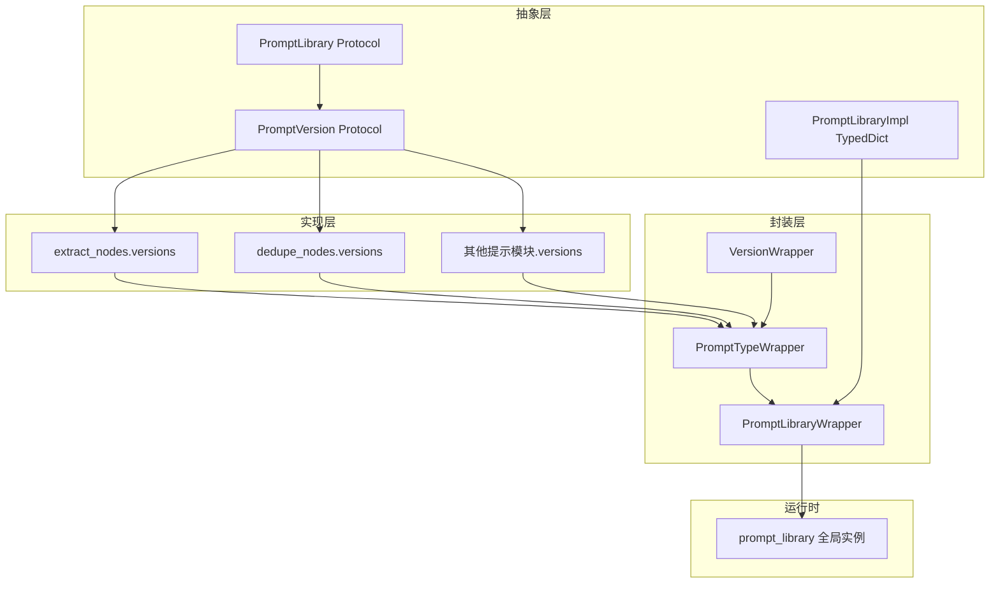
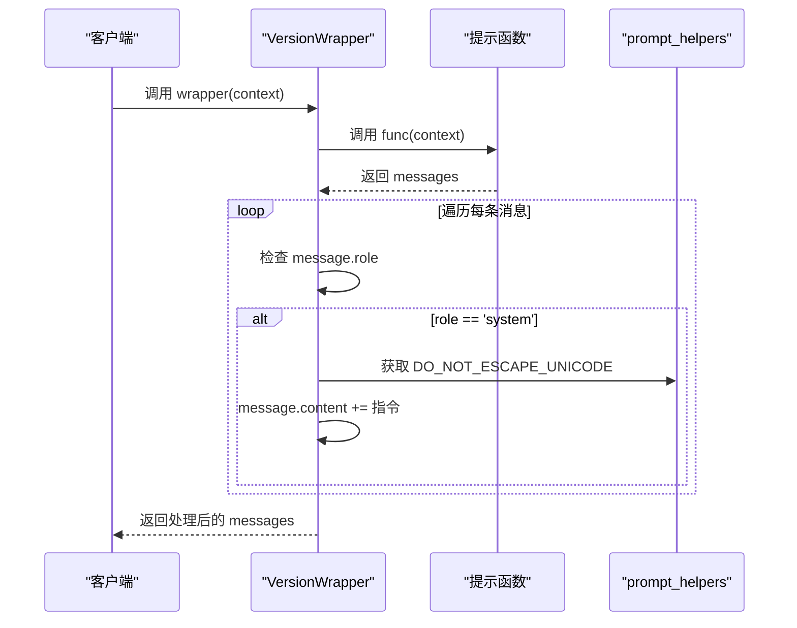
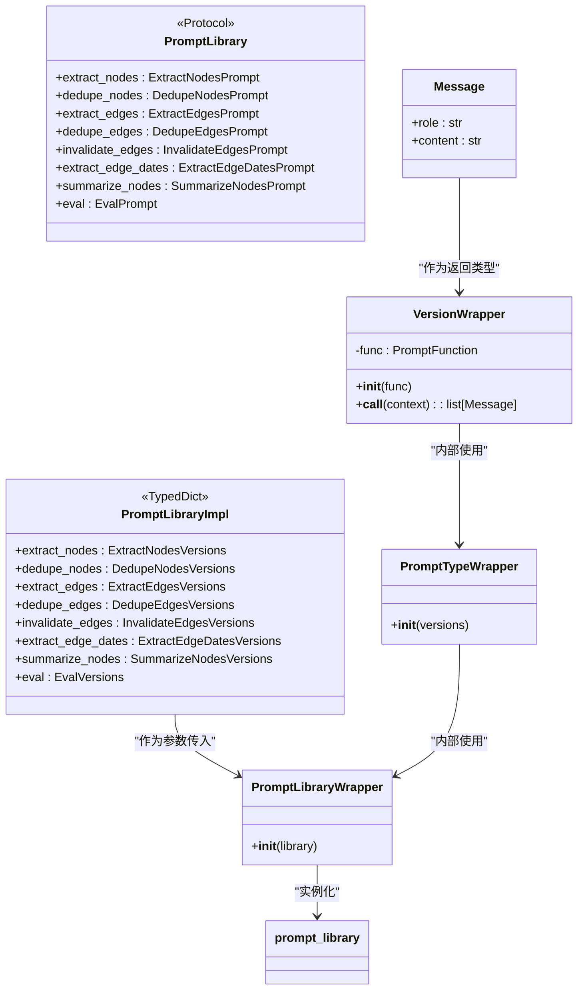
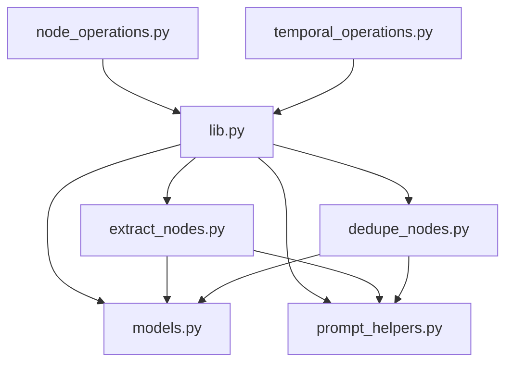

# 提示词架构设计

<cite>
**本文档中引用的文件**  
- [lib.py](file://graphiti_core/prompts/lib.py)
- [models.py](file://graphiti_core/prompts/models.py)
- [prompt_helpers.py](file://graphiti_core/prompts/prompt_helpers.py)
- [extract_nodes.py](file://graphiti_core/prompts/extract_nodes.py)
- [dedupe_nodes.py](file://graphiti_core/prompts/dedupe_nodes.py)
- [snippets.py](file://graphiti_core/prompts/snippets.py)
- [node_operations.py](file://graphiti_core/utils/maintenance/node_operations.py)
- [temporal_operations.py](file://graphiti_core/utils/maintenance/temporal_operations.py)
</cite>

## 目录
1. [引言](#引言)
2. [核心组件](#核心组件)
3. [架构概览](#架构概览)
4. [详细组件分析](#详细组件分析)
5. [依赖关系分析](#依赖关系分析)
6. [性能考量](#性能考量)
7. [故障排除指南](#故障排除指南)
8. [结论](#结论)

## 引言
本文档深入解析Graphiti系统中的提示词（Prompt）架构设计，重点聚焦于`PromptLibrary`协议与`PromptLibraryImpl`实现机制。系统通过类型化字典（TypedDict）和协议（Protocol）确保提示函数的签名一致性，结合`VersionWrapper`和`PromptTypeWrapper`类实现版本封装与调用注入。文档将详细阐述提示库如何在运行时自动注入底层指令（如`DO_NOT_ESCAPE_UNICODE`）以确保安全输出，分析全局实例`prompt_library`的初始化流程与延迟加载机制，并揭示版本化访问模式（如`extract_nodes.v1`）背后的动态属性解析原理。结合上下文构建逻辑，说明提示执行时的数据流与参数绑定过程。

## 核心组件

本系统的核心组件包括`PromptLibrary`协议、`PromptLibraryImpl`实现、`VersionWrapper`、`PromptTypeWrapper`以及`prompt_library`全局实例。这些组件共同构成了一个类型安全且灵活的提示词管理系统，支持多版本提示函数的组织与调用。

**Section sources**
- [lib.py](file://graphiti_core/prompts/lib.py#L47-L102)

## 架构概览

该提示词系统采用分层架构，从抽象协议到具体实现，再到运行时封装，形成了一套完整的提示管理机制。

**Diagram sources**
- [lib.py](file://graphiti_core/prompts/lib.py#L47-L91)
- [models.py](file://graphiti_core/prompts/models.py#L28-L32)

## 详细组件分析

### PromptLibrary 协议与 PromptLibraryImpl 实现

`PromptLibrary`是一个Python协议（Protocol），它为提示库定义了结构化的接口。该协议声明了系统所需的各种提示类型（如`extract_nodes`、`dedupe_nodes`等），但不提供具体实现，仅作为类型检查的契约。

与之对应的`PromptLibraryImpl`是一个`TypedDict`，它在运行时具体化了这个结构。`TypedDict`为每个提示类型指定了其值的类型，即一个版本字典（如`ExtractNodesVersions`）。这种设计在静态类型检查和动态灵活性之间取得了平衡：开发者可以获得IDE的自动补全和类型安全检查，而系统在运行时仍能通过字典操作进行动态访问。

**Section sources**
- [lib.py](file://graphiti_core/prompts/lib.py#L47-L67)

### VersionWrapper 与 运行时指令注入

`VersionWrapper`是实现运行时功能注入的关键组件。它是一个简单的包装类，接收一个具体的提示函数（`PromptFunction`）作为参数。

其核心功能在`__call__`方法中实现：在调用底层提示函数获取消息列表后，遍历所有消息，如果消息角色为`system`，则自动在内容末尾追加`DO_NOT_ESCAPE_UNICODE`指令。这一设计确保了所有系统提示在发送给LLM之前，都包含了防止Unicode字符被转义的安全指令，从而保证了非ASCII字符（如中文、日文）在提示中的正确显示和模型理解。

**Diagram sources**
- [lib.py](file://graphiti_core/prompts/lib.py#L69-L77)
- [prompt_helpers.py](file://graphiti_core/prompts/prompt_helpers.py#L20)

### PromptTypeWrapper 与 动态属性解析

`PromptTypeWrapper`负责将一个版本字典（如`extract_nodes_versions`）转换为可通过属性访问的对象。它在`__init__`方法中接收一个版本字典，然后使用`setattr`为字典中的每一个键（即版本号，如`v1`、`extract_message`）创建一个实例属性。

这个属性的值是一个`VersionWrapper`实例，包装了对应版本的提示函数。这使得原本通过`versions['v1']`访问的函数，现在可以通过`wrapper.v1`这种更直观的点号语法来调用。这是实现`extract_nodes.v1`这种优雅API的关键。

**Section sources**
- [lib.py](file://graphiti_core/prompts/lib.py#L80-L84)

### PromptLibraryWrapper 与 全局实例初始化

`PromptLibraryWrapper`是整个提示库的顶层封装。它接收一个`PromptLibraryImpl`类型的字典（即`PROMPT_LIBRARY_IMPL`），并为字典中的每一个提示类型（如`extract_nodes`）创建一个`PromptTypeWrapper`实例。

`PROMPT_LIBRARY_IMPL`是一个全局常量字典，它将每个提示类型映射到其对应的版本字典（如`extract_nodes_versions`）。最后，`prompt_library`是一个全局变量，它被初始化为`PromptLibraryWrapper(PROMPT_LIBRARY_IMPL)`的实例。由于Python模块的导入机制，这个实例在首次导入时被创建，并在整个应用生命周期中保持单例，实现了延迟加载和全局共享。

**Diagram sources**
- [lib.py](file://graphiti_core/prompts/lib.py#L86-L102)
- [models.py](file://graphiti_core/prompts/models.py#L23-L26)

## 依赖关系分析

该提示词系统的设计具有清晰的依赖关系。核心的`lib.py`模块依赖于`models.py`中定义的`Message`和`PromptFunction`类型，以及`prompt_helpers.py`中的辅助函数和常量。

各个具体的提示模块（如`extract_nodes.py`、`dedupe_nodes.py`）实现了自己的提示函数和版本字典，并被`lib.py`所引用。运行时，`utils/maintenance`等业务逻辑模块通过`prompt_library`全局实例来调用这些提示，形成了从高层业务到底层提示的单向依赖流，保证了系统的模块化和可维护性。

**Diagram sources**
- [lib.py](file://graphiti_core/prompts/lib.py#L40-L44)
- [extract_nodes.py](file://graphiti_core/prompts/extract_nodes.py#L23-L24)
- [dedupe_nodes.py](file://graphiti_core/prompts/dedupe_nodes.py#L21-L22)

## 性能考量

该架构的性能开销主要在于`VersionWrapper`的调用时。每次调用提示函数时，都会执行一次字符串拼接操作（追加`DO_NOT_ESCAPE_UNICODE`）。虽然单次操作成本极低，但在高并发或频繁调用的场景下，累积效应需要考虑。

然而，这种开销是必要的，因为它确保了提示的安全性和正确性。系统通过将包装逻辑集中在`VersionWrapper`中，避免了在每个提示函数内部重复添加相同的安全指令，从而在保证安全的同时，也优化了代码的可维护性。整体而言，该设计在性能和安全性之间做出了合理的权衡。

## 故障排除指南

当提示系统出现问题时，应按以下步骤排查：

1.  **检查类型错误**：如果出现属性访问错误（如`'PromptLibraryWrapper' object has no attribute 'xxx'`），请检查`PROMPT_LIBRARY_IMPL`字典和`PromptLibraryImpl` TypedDict是否都包含了该提示类型。
2.  **验证版本存在**：如果调用`extract_nodes.v1`时报错，需确认`extract_nodes.py`中的`versions`字典是否定义了`'v1'`键。
3.  **审查提示内容**：若LLM输出不符合预期，特别是Unicode字符被转义，应检查`VersionWrapper.__call__`方法是否被正确执行，确认`DO_NOT_ESCAPE_UNICODE`指令是否已成功注入到系统消息中。
4.  **调试上下文数据**：利用`to_prompt_json`工具函数，检查传递给提示函数的`context`字典是否包含所有必需的字段，且数据格式正确。

**Section sources**
- [lib.py](file://graphiti_core/prompts/lib.py#L73-L77)
- [prompt_helpers.py](file://graphiti_core/prompts/prompt_helpers.py#L23-L40)

## 结论

Graphiti的提示词架构通过巧妙结合Python的类型系统（Protocol和TypedDict）与动态特性（`setattr`和`__call__`），构建了一个既类型安全又高度灵活的提示管理系统。`PromptLibrary`协议为系统提供了清晰的接口契约，`PromptLibraryImpl`和`PROMPT_LIBRARY_IMPL`实现了具体的提示组织。`VersionWrapper`和`PromptTypeWrapper`类则通过动态属性注入，实现了优雅的版本化API和运行时功能增强（如自动注入安全指令）。`prompt_library`全局实例的设计确保了提示库的单例性和延迟初始化。这一系列设计共同解决了提示管理中的关键挑战，包括类型安全、版本控制、代码复用和运行时扩展，为系统的稳定性和可维护性奠定了坚实基础。