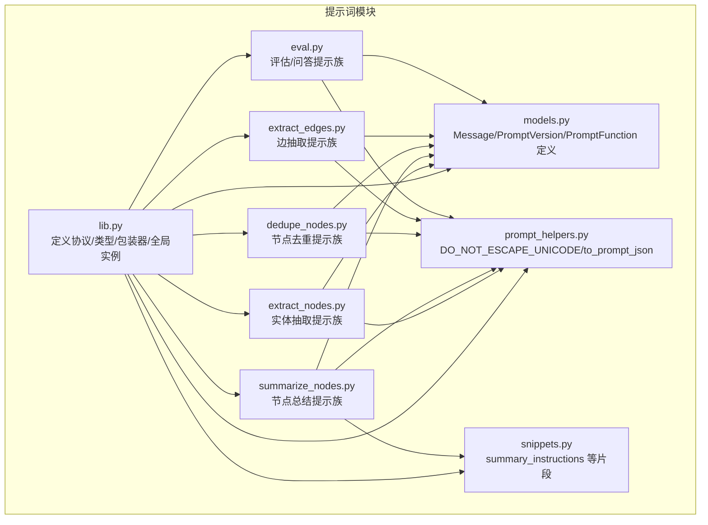
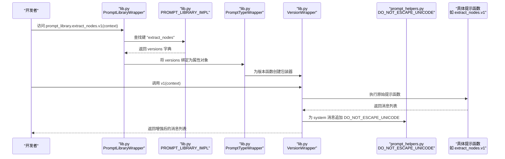
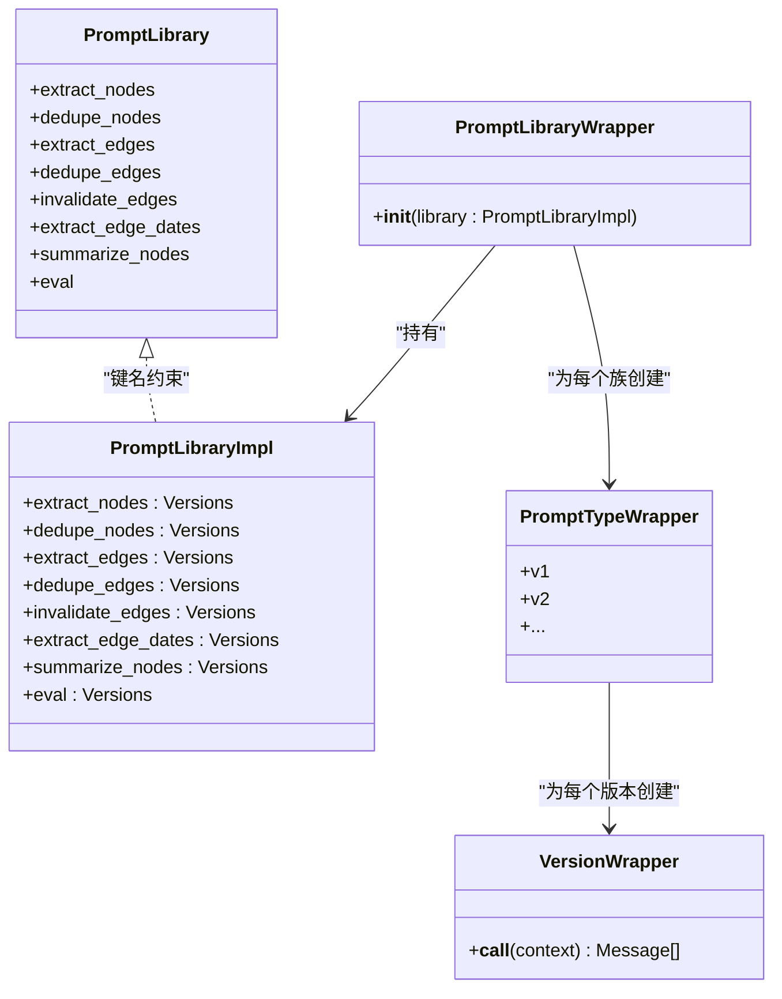
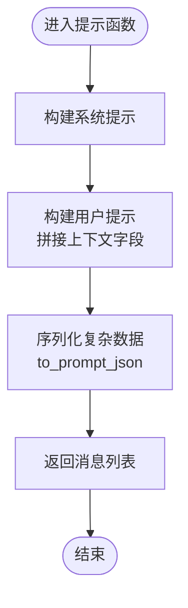
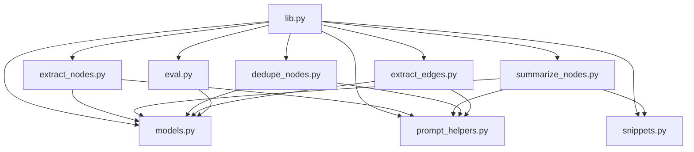

# 提示词管理

<cite>
**本文引用的文件**
- [graphiti_core/prompts/lib.py](file://graphiti_core/prompts/lib.py)
- [graphiti_core/prompts/__init__.py](file://graphiti_core/prompts/__init__.py)
- [graphiti_core/prompts/models.py](file://graphiti_core/prompts/models.py)
- [graphiti_core/prompts/prompt_helpers.py](file://graphiti_core/prompts/prompt_helpers.py)
- [graphiti_core/prompts/snippets.py](file://graphiti_core/prompts/snippets.py)
- [graphiti_core/prompts/extract_nodes.py](file://graphiti_core/prompts/extract_nodes.py)
- [graphiti_core/prompts/summarize_nodes.py](file://graphiti_core/prompts/summarize_nodes.py)
- [graphiti_core/prompts/dedupe_nodes.py](file://graphiti_core/prompts/dedupe_nodes.py)
- [graphiti_core/prompts/extract_edges.py](file://graphiti_core/prompts/extract_edges.py)
- [graphiti_core/prompts/eval.py](file://graphiti_core/prompts/eval.py)
</cite>

## 目录
1. [简介](#简介)
2. [项目结构](#项目结构)
3. [核心组件](#核心组件)
4. [架构总览](#架构总览)
5. [详细组件分析](#详细组件分析)
6. [依赖关系分析](#依赖关系分析)
7. [性能考量](#性能考量)
8. [故障排查指南](#故障排查指南)
9. [结论](#结论)
10. [附录：新增提示类型最佳实践](#附录新增提示类型最佳实践)

## 简介
本技术文档面向高级用户，系统性阐述提示词管理系统的架构与实现细节，重点覆盖：
- PromptLibrary 协议与 PromptLibraryImpl 类型字典的设计与职责边界
- 版本化管理机制（如 extract_nodes_versions、summarize_nodes_versions）如何支撑提示词的迭代与兼容
- VersionWrapper 与 PromptTypeWrapper 如何封装不同版本的提示函数，并在调用时自动注入 DO_NOT_ESCAPE_UNICODE 等系统指令
- prompt_library 全局实例的初始化流程，以及如何通过 prompt_library.extract_nodes.v1(context) 等方式安全访问特定版本的提示模板
- 新增提示类型的开发流程：在 promtps/ 目录下添加新提示类型（例如自定义实体抽取），定义其 Prompt 和 Versions 类型，并将其注册到 PROMPT_LIBRARY_IMPL 中
- 最佳实践：提示词版本控制策略、上下文（context）数据结构设计规范，以及如何利用现有提示库（如 summarize_pair）进行组合式提示工程

## 项目结构
提示词系统位于 graphiti_core/prompts 目录，采用“按功能模块划分”的组织方式，每个模块对应一类提示词能力（如实体抽取、边抽取、去重、总结等）。核心入口为 lib.py，负责统一导出全局实例 prompt_library；各功能模块通过 __init__.py 暴露必要的符号。

图表来源
- [graphiti_core/prompts/lib.py](file://graphiti_core/prompts/lib.py#L1-L103)
- [graphiti_core/prompts/models.py](file://graphiti_core/prompts/models.py#L1-L33)
- [graphiti_core/prompts/prompt_helpers.py](file://graphiti_core/prompts/prompt_helpers.py#L1-L41)
- [graphiti_core/prompts/snippets.py](file://graphiti_core/prompts/snippets.py#L1-L30)
- [graphiti_core/prompts/extract_nodes.py](file://graphiti_core/prompts/extract_nodes.py#L1-L320)
- [graphiti_core/prompts/summarize_nodes.py](file://graphiti_core/prompts/summarize_nodes.py#L1-L132)
- [graphiti_core/prompts/dedupe_nodes.py](file://graphiti_core/prompts/dedupe_nodes.py#L1-L226)
- [graphiti_core/prompts/extract_edges.py](file://graphiti_core/prompts/extract_edges.py#L1-L204)
- [graphiti_core/prompts/eval.py](file://graphiti_core/prompts/eval.py#L1-L165)

章节来源
- [graphiti_core/prompts/lib.py](file://graphiti_core/prompts/lib.py#L1-L103)
- [graphiti_core/prompts/__init__.py](file://graphiti_core/prompts/__init__.py#L1-L5)

## 核心组件
- PromptLibrary 协议：定义可用的提示族名称（如 extract_nodes、summarize_nodes 等），用于静态约束外部使用者的访问接口。
- PromptLibraryImpl 类型字典：以字符串键映射到各提示族的版本集合（Versions），作为实际实现的容器。
- VersionWrapper：对单个版本函数进行包装，在生成的消息列表中为 system 角色自动追加 DO_NOT_ESCAPE_UNICODE 指令，确保非 ASCII 字符在日志与模型输出中可读。
- PromptTypeWrapper：对某个提示族的所有版本进行动态属性绑定，使调用者能以 prompt_library.extract_nodes.v1(...) 的形式访问指定版本。
- PromptLibraryWrapper：对整个 PromptLibraryImpl 进行二次包装，将每个提示族映射为 PromptTypeWrapper 实例，形成最终的全局入口 prompt_library。
- PROMPT_LIBRARY_IMPL：全局字典，登记所有提示族与其版本集合。
- prompt_library：全局实例，对外暴露统一的访问入口。

章节来源
- [graphiti_core/prompts/lib.py](file://graphiti_core/prompts/lib.py#L47-L103)
- [graphiti_core/prompts/prompt_helpers.py](file://graphiti_core/prompts/prompt_helpers.py#L1-L41)

## 架构总览
提示词系统通过“协议约束 + 类型字典 + 包装器链”实现强类型、可扩展、可演进的提示模板管理。调用路径如下：

图表来源
- [graphiti_core/prompts/lib.py](file://graphiti_core/prompts/lib.py#L69-L103)
- [graphiti_core/prompts/prompt_helpers.py](file://graphiti_core/prompts/prompt_helpers.py#L1-L41)
- [graphiti_core/prompts/extract_nodes.py](file://graphiti_core/prompts/extract_nodes.py#L311-L320)

## 详细组件分析

### 协议与类型字典：PromptLibrary 与 PromptLibraryImpl
- PromptLibrary 使用 Protocol 定义提示族名称集合，保证外部使用者只能通过已声明的键访问，避免拼写错误或越界访问。
- PromptLibraryImpl 使用 TypedDict 将每个提示族映射到对应的 Versions 类型，明确版本函数签名与返回值结构。
- 两者配合实现了“编译期可见、运行期可替换”的提示族契约。

章节来源
- [graphiti_core/prompts/lib.py](file://graphiti_core/prompts/lib.py#L47-L67)

### 版本化管理：以 extract_nodes 为例
- 每个提示族在其模块内定义 Versions（TypedDict）与 versions（字典常量），键为版本名（如 v1、v2 等），值为具体提示函数。
- 通过 PROMPT_LIBRARY_IMPL 将各族的 versions 集合集中注册，形成统一的版本索引。
- 调用时使用 prompt_library.extract_nodes.v1(context) 访问指定版本，既保证了向后兼容，又允许平滑演进。

章节来源
- [graphiti_core/prompts/extract_nodes.py](file://graphiti_core/prompts/extract_nodes.py#L311-L320)
- [graphiti_core/prompts/lib.py](file://graphiti_core/prompts/lib.py#L92-L101)

### 包装器：VersionWrapper 与 PromptTypeWrapper
- VersionWrapper：接收一个 PromptFunction，拦截其返回的消息列表，对 role 为 system 的消息追加 DO_NOT_ESCAPE_UNICODE，确保非 ASCII 内容在日志与模型输出中保持可读性。
- PromptTypeWrapper：遍历某提示族的所有版本，将每个版本函数绑定为同名属性，从而支持 prompt_library.extract_nodes.v1(...) 的调用风格。
- PromptLibraryWrapper：遍历 PROMPT_LIBRARY_IMPL，将每个提示族映射为 PromptTypeWrapper，完成全局实例的构建。

图表来源
- [graphiti_core/prompts/lib.py](file://graphiti_core/prompts/lib.py#L47-L103)

章节来源
- [graphiti_core/prompts/lib.py](file://graphiti_core/prompts/lib.py#L69-L103)

### 提示函数与上下文：以 extract_nodes 为例
- 提示函数接收 context（字典）作为输入，返回 list[Message]。
- 常见字段包括 entity_types、episode_content、previous_episodes、custom_prompt 等，用于构造系统提示与用户提示。
- 通过 prompt_helpers.to_prompt_json 将复杂数据序列化为 JSON 字符串，便于嵌入到提示中；默认保留非 ASCII 字符，提升多语言场景下的可读性。

图表来源
- [graphiti_core/prompts/extract_nodes.py](file://graphiti_core/prompts/extract_nodes.py#L86-L133)
- [graphiti_core/prompts/prompt_helpers.py](file://graphiti_core/prompts/prompt_helpers.py#L23-L41)

章节来源
- [graphiti_core/prompts/extract_nodes.py](file://graphiti_core/prompts/extract_nodes.py#L86-L133)
- [graphiti_core/prompts/prompt_helpers.py](file://graphiti_core/prompts/prompt_helpers.py#L23-L41)

### 总结提示族：summarize_pair 的组合式工程
- summarize_nodes 模块提供 summarize_pair、summarize_context、summary_description 三个版本函数，分别用于合并摘要、基于上下文生成摘要与属性、以及为摘要生成一句话描述。
- 开发者可将多个版本函数组合使用，例如先用 summarize_pair 合并两段摘要，再用 summarize_context 基于合并结果生成更完整的摘要，最后用 summary_description 生成简要描述，形成“分层摘要”的工程化流程。

章节来源
- [graphiti_core/prompts/summarize_nodes.py](file://graphiti_core/prompts/summarize_nodes.py#L49-L131)

## 依赖关系分析
- lib.py 依赖各提示族模块的 Prompt/Versions/versions，以及 models.py 中的 Message/PromptVersion/PromptFunction，以及 prompt_helpers.py 中的 DO_NOT_ESCAPE_UNICODE 与 to_prompt_json。
- 各提示族模块依赖 models.py 的消息结构与类型别名，依赖 prompt_helpers.py 的序列化工具与系统指令，部分模块还依赖 snippets.py 中的通用提示片段。

图表来源
- [graphiti_core/prompts/lib.py](file://graphiti_core/prompts/lib.py#L1-L103)
- [graphiti_core/prompts/models.py](file://graphiti_core/prompts/models.py#L1-L33)
- [graphiti_core/prompts/prompt_helpers.py](file://graphiti_core/prompts/prompt_helpers.py#L1-L41)
- [graphiti_core/prompts/snippets.py](file://graphiti_core/prompts/snippets.py#L1-L30)
- [graphiti_core/prompts/extract_nodes.py](file://graphiti_core/prompts/extract_nodes.py#L1-L320)
- [graphiti_core/prompts/summarize_nodes.py](file://graphiti_core/prompts/summarize_nodes.py#L1-L132)
- [graphiti_core/prompts/dedupe_nodes.py](file://graphiti_core/prompts/dedupe_nodes.py#L1-L226)
- [graphiti_core/prompts/extract_edges.py](file://graphiti_core/prompts/extract_edges.py#L1-L204)
- [graphiti_core/prompts/eval.py](file://graphiti_core/prompts/eval.py#L1-L165)

## 性能考量
- 序列化成本：to_prompt_json 默认不转义非 ASCII 字符，有助于提升多语言可读性，但可能增加提示长度与模型处理开销。建议仅在必要时启用缩进与换行，避免过度嵌套。
- 消息数量：每个提示函数返回固定数量的消息（通常为 system + user），避免频繁切换角色带来的额外开销。
- 版本选择：通过版本化管理，可在不影响调用方的情况下优化内部实现；建议在稳定版本上复用，避免频繁变更导致缓存失效或行为漂移。

## 故障排查指南
- 版本不存在：当访问 prompt_library.extract_nodes.v1(context) 报错时，检查 PROMPT_LIBRARY_IMPL 是否正确注册该键，以及 extract_nodes 模块的 versions 是否包含 v1。
- 上下文缺失字段：若提示函数抛出 KeyError，检查 context 是否包含所需字段（如 episode_content、entity_types 等）。
- 编码问题：若出现乱码或日志异常，确认是否正确使用 DO_NOT_ESCAPE_UNICODE（由 VersionWrapper 自动注入），或手动设置 to_prompt_json 的 ensure_ascii 参数。
- 类型不匹配：确保传入的 context 为 dict[str, Any]，且字段类型与提示函数预期一致（如列表、字典、字符串等）。

章节来源
- [graphiti_core/prompts/lib.py](file://graphiti_core/prompts/lib.py#L69-L103)
- [graphiti_core/prompts/prompt_helpers.py](file://graphiti_core/prompts/prompt_helpers.py#L23-L41)

## 结论
本系统通过协议与类型字典约束提示族接口，借助包装器链实现版本化与系统指令注入，结合统一的全局实例 prompt_library，提供了清晰、可扩展、可演进的提示词管理方案。开发者可按本文档的最佳实践快速新增提示类型，并通过现有提示族（如 summarize_pair）进行组合式工程，提升提示词质量与一致性。

## 附录：新增提示类型最佳实践
- 在 promtps/ 目录下新增模块，定义：
  - Prompt 协议：列出该提示族的所有版本函数名（如 v1、v2 等）
  - Versions 类型字典：键为版本名，值为函数签名与返回值一致的提示函数
  - versions 常量字典：将各版本函数注册为字典
- 在 lib.py 中：
  - 在 PromptLibrary 中添加该提示族的键名
  - 在 PromptLibraryImpl 中添加该族的版本集合
  - 在 PROMPT_LIBRARY_IMPL 中注册该族的 versions
  - 通过 PromptLibraryWrapper 构建 prompt_library
- 调用方式：
  - 使用 prompt_library.<族>.<版本>(context) 访问指定版本
  - 确保 context 字段与提示函数预期一致
- 版本控制策略：
  - 保持向后兼容：新增版本时保留旧版本，逐步迁移
  - 明确版本语义：在注释中说明版本差异与适用场景
  - 严格类型约束：通过 TypedDict 与 Protocol 约束接口
- 上下文设计规范：
  - 字段命名清晰、语义明确（如 entity_types、episode_content、previous_episodes、custom_prompt 等）
  - 对复杂数据使用 to_prompt_json 序列化，避免直接拼接导致格式错误
  - 控制上下文大小，避免超出模型上下文窗口
- 组合式提示工程：
  - 利用现有提示族（如 summarize_pair）进行分层处理
  - 将多个版本函数串联，形成稳定的提示流水线

章节来源
- [graphiti_core/prompts/lib.py](file://graphiti_core/prompts/lib.py#L47-L103)
- [graphiti_core/prompts/extract_nodes.py](file://graphiti_core/prompts/extract_nodes.py#L66-L84)
- [graphiti_core/prompts/summarize_nodes.py](file://graphiti_core/prompts/summarize_nodes.py#L33-L47)
- [graphiti_core/prompts/prompt_helpers.py](file://graphiti_core/prompts/prompt_helpers.py#L23-L41)