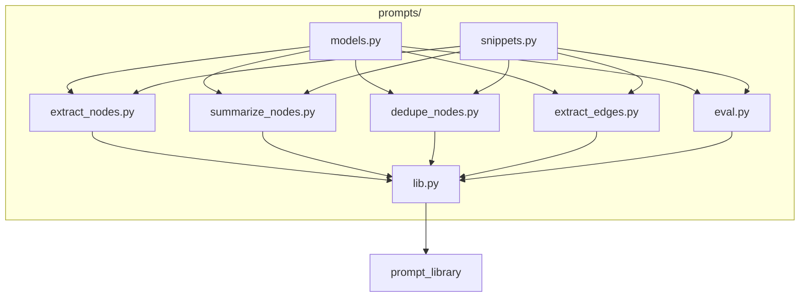
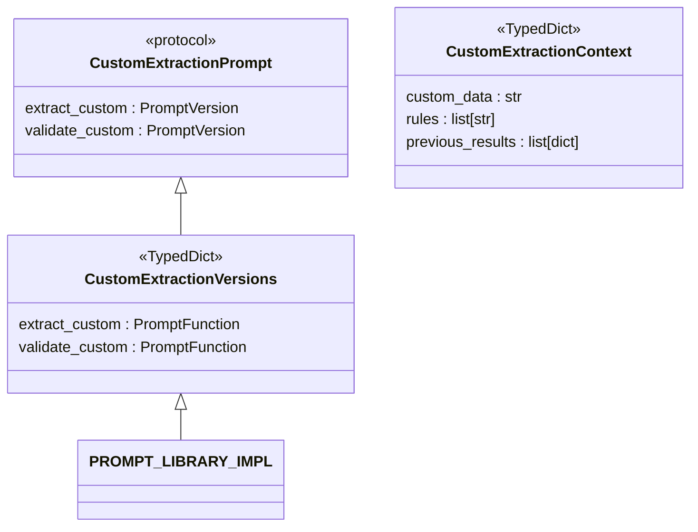
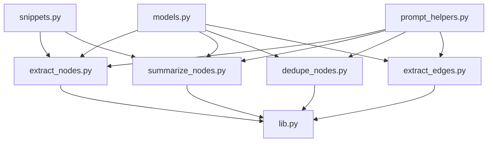

# 自定义提示词扩展指南

<cite>
**本文档中引用的文件**  
- [custom_extraction.py](file://prompts/custom_extraction.py)
- [extract_nodes.py](file://graphiti_core/prompts/extract_nodes.py)
- [summarize_nodes.py](file://graphiti_core/prompts/summarize_nodes.py)
- [snippets.py](file://graphiti_core/prompts/snippets.py)
- [models.py](file://graphiti_core/prompts/models.py)
- [lib.py](file://graphiti_core/prompts/lib.py)
- [prompt_helpers.py](file://graphiti_core/prompts/prompt_helpers.py)
</cite>

## 目录
1. [简介](#简介)
2. [项目结构](#项目结构)
3. [核心组件](#核心组件)
4. [架构概述](#架构概述)
5. [详细组件分析](#详细组件分析)
6. [依赖分析](#依赖分析)
7. [性能考虑](#性能考虑)
8. [故障排除指南](#故障排除指南)
9. [结论](#结论)
10. [附录](#附录)（如有必要）

## 简介
本文档为开发者提供在`prompts/`目录下创建和扩展自定义提示词的完整指南。文档详细说明了如何定义新的提示类型，包括其Prompt和Versions类型结构，并实现具体的提示模板字符串与函数逻辑。指导开发者将新提示注册到PROMPT_LIBRARY_IMPL字典中，确保其可通过标准接口访问。以extract_nodes和summarize_nodes为例，演示上下文（context）对象的设计规范，包括必选与可选字段的使用约定。介绍如何复用snippets.py中的通用片段和summarize_pair等现有提示进行组合式提示工程。提供版本迭代实践建议，如v1到v2的平滑过渡策略、向后兼容性测试方法，以及利用py.typed实现类型检查的最佳实践。

## 项目结构
`prompts/`目录是系统提示词的核心所在，包含了所有用于实体提取、去重、总结等任务的提示模板。该目录采用模块化设计，每个功能（如提取节点、提取边、总结节点）都有独立的Python文件。核心的类型定义（如Message、PromptFunction）位于`models.py`中，而通用的提示辅助函数（如to_prompt_json）和常量（如DO_NOT_ESCAPE_UNICODE）则位于`prompt_helpers.py`和`snippets.py`中。`lib.py`文件负责将所有独立的提示模块聚合到一个统一的`prompt_library`接口中，通过`PROMPT_LIBRARY_IMPL`字典进行注册和管理。



**图示来源**
- [extract_nodes.py](file://graphiti_core/prompts/extract_nodes.py)
- [summarize_nodes.py](file://graphiti_core/prompts/summarize_nodes.py)
- [lib.py](file://graphiti_core/prompts/lib.py)
- [models.py](file://graphiti_core/prompts/models.py)
- [prompt_helpers.py](file://graphiti_core/prompts/prompt_helpers.py)
- [snippets.py](file://graphiti_core/prompts/snippets.py)

**本节来源**
- [graphiti_core/prompts/](file://graphiti_core/prompts/)

## 核心组件
`prompts/`目录下的核心组件是`Prompt`协议和`Versions`类型字典。`Prompt`协议定义了一个提示类型所支持的所有版本化函数的接口，例如`extract_nodes.Prompt`定义了`extract_message`、`extract_json`等方法。`Versions`类型字典则将这些函数名映射到具体的实现函数（`PromptFunction`）。每个提示文件（如`extract_nodes.py`）都必须定义这两个类型，并导出一个名为`versions`的字典实例，该实例包含了所有版本函数的具体实现。最终，这些`versions`字典在`lib.py`中被注册到`PROMPT_LIBRARY_IMPL`中，形成一个全局可访问的提示库。

**本节来源**
- [models.py](file://graphiti_core/prompts/models.py)
- [lib.py](file://graphiti_core/prompts/lib.py)
- [extract_nodes.py](file://graphiti_core/prompts/extract_nodes.py)

## 架构概述
系统的提示词架构采用分层设计。最底层是`models.py`中定义的`Message`模型和`PromptFunction`类型，它们是所有提示函数的基础。中间层是各个功能模块（如`extract_nodes.py`），它们基于基础模型定义具体的`Prompt`协议和`Versions`字典，并实现具体的提示逻辑。最上层是`lib.py`，它通过`PromptLibraryWrapper`和`PromptTypeWrapper`等包装器，将所有底层模块聚合到一个统一、类型安全的`prompt_library`单例中。这种设计实现了高内聚、低耦合，使得添加新提示类型变得简单且类型安全。

```mermaid
classDiagram
class Message {
+role : str
+content : str
}
class PromptFunction {
<<type>>
(dict[str, Any]) -> list[Message]
}
class PromptLibrary {
<<protocol>>
extract_nodes : ExtractNodesPrompt
summarize_nodes : SummarizeNodesPrompt
}
class PromptLibraryImpl {
<<TypedDict>>
extract_nodes : ExtractNodesVersions
summarize_nodes : SummarizeNodesVersions
}
class PromptLibraryWrapper {
-library : PromptLibraryImpl
+__init__(library)
}
class PromptTypeWrapper {
-versions : dict[str, PromptFunction]
+__init__(versions)
}
class VersionWrapper {
-func : PromptFunction
+__call__(context)
}
class ExtractNodesPrompt {
<<protocol>>
extract_message : PromptVersion
extract_json : PromptVersion
}
class ExtractNodesVersions {
<<TypedDict>>
extract_message : PromptFunction
extract_json : PromptFunction
}
Message <|-- PromptFunction
PromptFunction <|-- ExtractNodesVersions
ExtractNodesVersions <|-- PromptLibraryImpl
PromptLibraryImpl <|-- PromptLibraryWrapper
PromptLibraryWrapper <|-- PromptLibrary
PromptTypeWrapper <|-- PromptLibraryWrapper
VersionWrapper <|-- PromptTypeWrapper
```

**图示来源**
- [models.py](file://graphiti_core/prompts/models.py)
- [lib.py](file://graphiti_core/prompts/lib.py)
- [extract_nodes.py](file://graphiti_core/prompts/extract_nodes.py)

## 详细组件分析
### 自定义提示词创建分析
开发者可以在`prompts/`目录下创建新的提示类型文件，例如`custom_extraction.py`。该文件需要遵循标准的结构：首先从`models.py`导入`Message`和`PromptFunction`，然后定义自己的`Prompt`协议和`Versions`类型字典。接着，实现具体的提示函数，这些函数接收一个`context`字典作为输入，并返回一个`Message`对象列表。最后，创建一个`versions`字典，将函数名映射到函数实现。

#### 对象导向组件：


**图示来源**
- [models.py](file://graphiti_core/prompts/models.py)
- [lib.py](file://graphiti_core/prompts/lib.py)

**本节来源**
- [models.py](file://graphiti_core/prompts/models.py)
- [lib.py](file://graphiti_core/prompts/lib.py)

### 上下文对象设计规范
上下文（context）对象是提示函数与外部世界通信的桥梁。以`extract_nodes`和`summarize_nodes`为例，它们的`context`对象设计遵循明确的规范。必选字段是函数执行所必需的，例如`extract_nodes.extract_message`需要`episode_content`和`entity_types`。可选字段则用于提供额外的上下文信息，例如`custom_prompt`允许在标准指令后追加自定义指令。`summarize_nodes.summarize_context`的`context`对象包含了`previous_episodes`、`episode_content`、`node_name`和`node_summary`等字段，这些字段共同构成了生成节点摘要所需的所有信息。

**本节来源**
- [extract_nodes.py](file://graphiti_core/prompts/extract_nodes.py#L86-L320)
- [summarize_nodes.py](file://graphiti_core/prompts/summarize_nodes.py#L49-L132)

### 组合式提示工程
系统鼓励通过复用现有组件进行组合式提示工程。`snippets.py`文件提供了可复用的通用提示片段，如`summary_instructions`，该片段定义了生成摘要的通用准则，被`extract_nodes`和`summarize_nodes`等多个提示函数所复用。此外，开发者可以直接调用其他提示函数来构建更复杂的逻辑。例如，在构建社区摘要时，`community_operations.py`会调用`prompt_library.summarize_nodes.summarize_pair`来合并两个节点的摘要。

**本节来源**
- [snippets.py](file://graphiti_core/prompts/snippets.py)
- [summarize_nodes.py](file://graphiti_core/prompts/summarize_nodes.py)
- [community_operations.py](file://graphiti_core/utils/maintenance/community_operations.py#L140)

## 依赖分析
`prompts/`目录下的模块之间存在清晰的依赖关系。所有提示模块都依赖于`models.py`和`prompt_helpers.py`。`lib.py`依赖于所有具体的提示模块（如`extract_nodes`、`summarize_nodes`），以将它们聚合到`PROMPT_LIBRARY_IMPL`中。`snippets.py`被多个提示模块所依赖，用于提供共享的提示文本。这种依赖关系确保了代码的模块化和可维护性。



**图示来源**
- [models.py](file://graphiti_core/prompts/models.py)
- [prompt_helpers.py](file://graphiti_core/prompts/prompt_helpers.py)
- [snippets.py](file://graphiti_core/prompts/snippets.py)
- [lib.py](file://graphiti_core/prompts/lib.py)
- [extract_nodes.py](file://graphiti_core/prompts/extract_nodes.py)
- [summarize_nodes.py](file://graphiti_core/prompts/summarize_nodes.py)

**本节来源**
- [graphiti_core/prompts/](file://graphiti_core/prompts/)

## 性能考虑
提示函数的性能主要受LLM调用次数和上下文长度的影响。通过在`prompt_helpers.py`中使用`to_prompt_json`函数并设置`ensure_ascii=False`，可以避免对非ASCII字符进行转义，从而减小提示文本的大小，提高传输效率。此外，设计提示时应尽量精简`context`对象，只传递必要的信息，以减少发送给LLM的上下文长度，从而降低延迟和成本。

## 故障排除指南
当新创建的提示词无法正常工作时，首先应检查其是否已正确注册到`PROMPT_LIBRARY_IMPL`字典中。其次，验证`context`对象是否包含了所有必需的字段。可以使用`py.typed`文件和类型检查工具（如mypy）来捕获类型错误。对于LLM返回格式错误的问题，应检查提示模板中的JSON格式说明是否清晰明确。

**本节来源**
- [lib.py](file://graphiti_core/prompts/lib.py#L92-L102)
- [models.py](file://graphiti_core/prompts/models.py)
- [py.typed](file://graphiti_core/py.typed)

## 结论
通过遵循本文档的指南，开发者可以轻松地在`prompts/`目录下创建新的提示类型，并将其无缝集成到现有的系统中。关键在于理解`Prompt`协议、`Versions`字典和`context`对象的设计模式，并利用`snippets.py`和现有提示函数进行组合式开发。通过合理的版本管理和类型检查，可以确保提示系统的稳定性和可扩展性。

## 附录
### 版本迭代实践
当需要对提示词进行迭代时（如从v1到v2），建议保留旧版本函数，并创建一个新版本函数。例如，`invalidate_edges.py`中可能同时存在`v1`和`v2`函数。然后在`versions`字典中同时注册两个版本。这允许系统逐步迁移，确保向后兼容性。在完全验证新版本的稳定性后，可以将默认版本指向v2，并在未来版本中移除v1。

**本节来源**
- [invalidate_edges.py](file://graphiti_core/prompts/invalidate_edges.py)