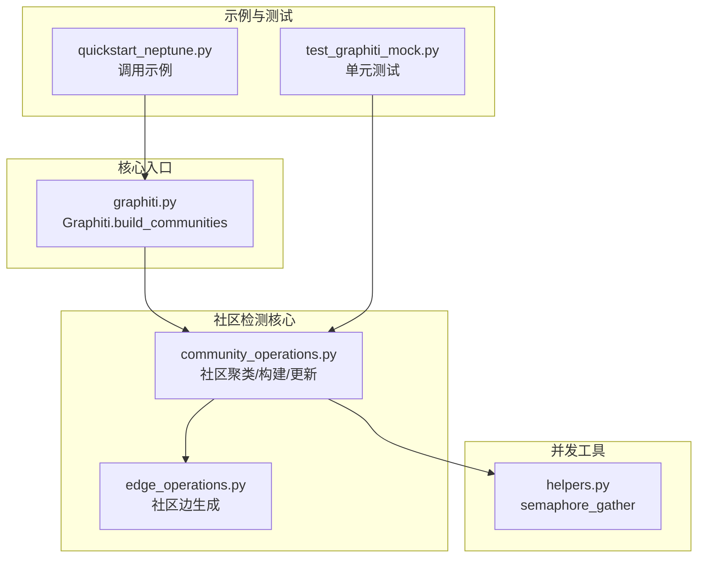
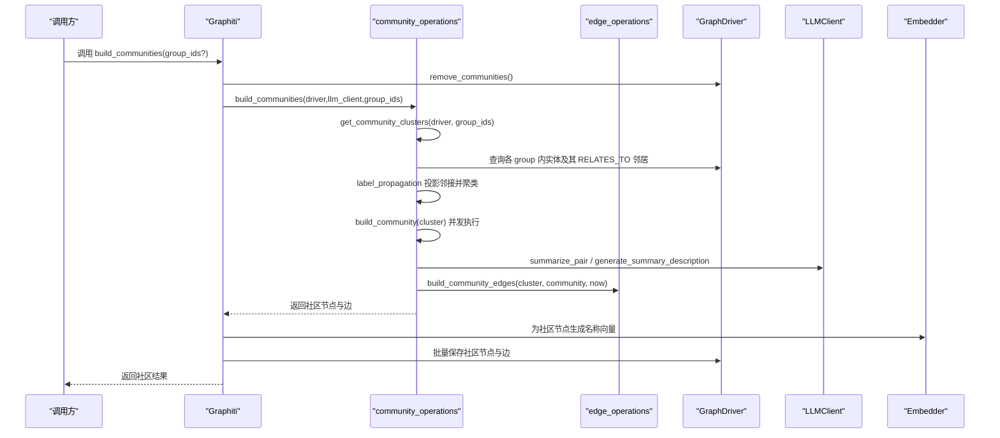
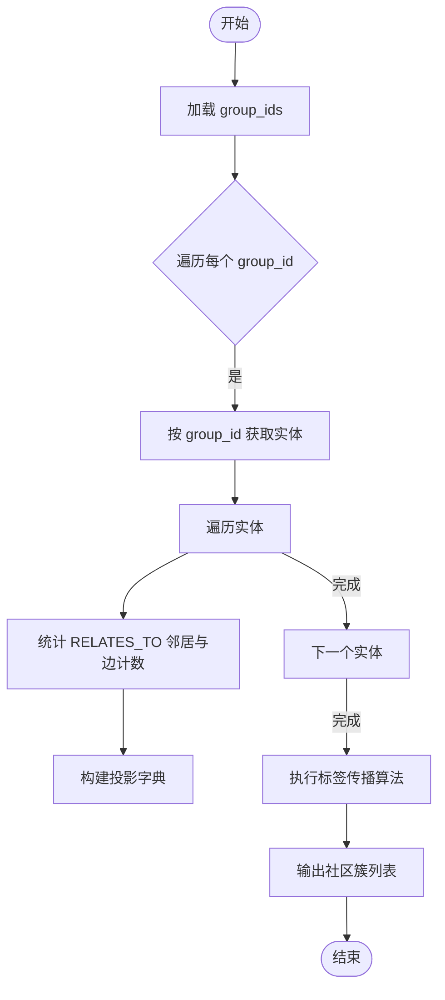
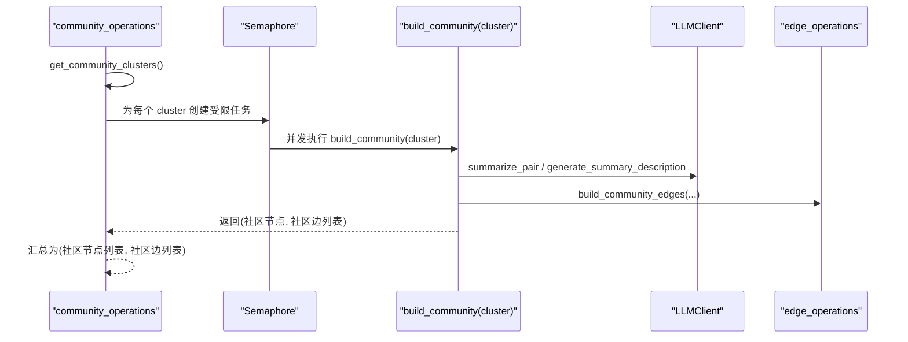
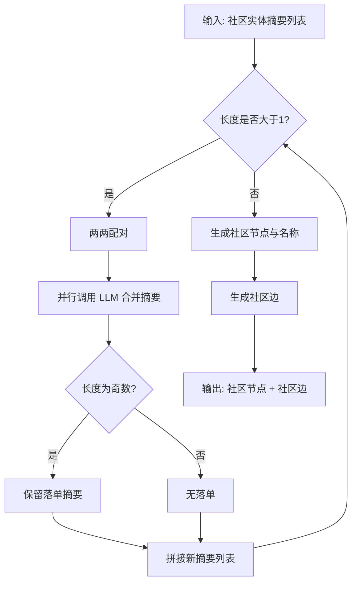
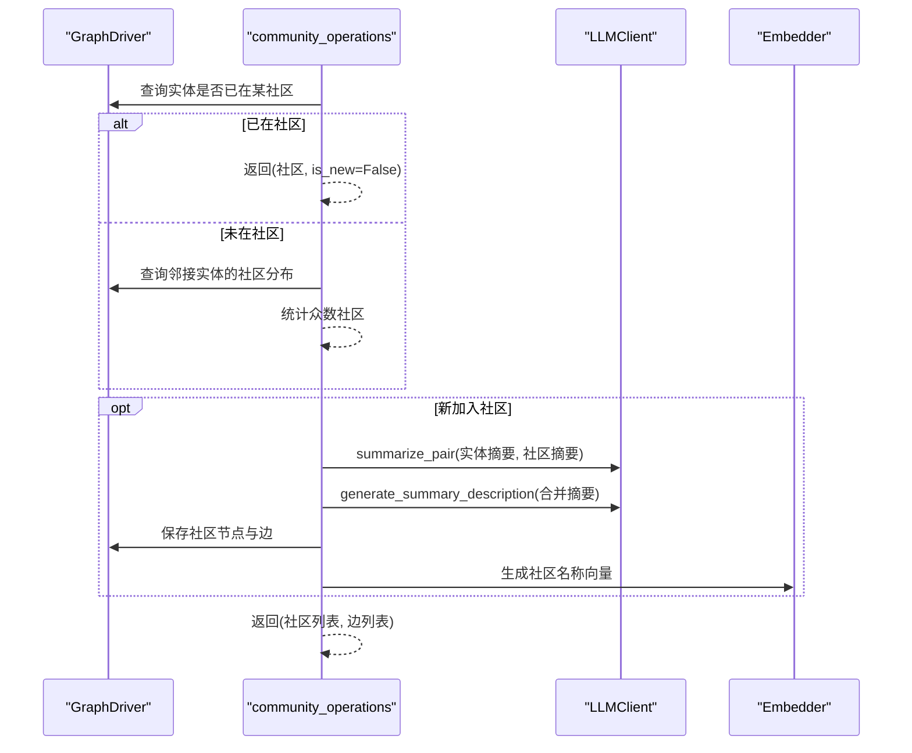
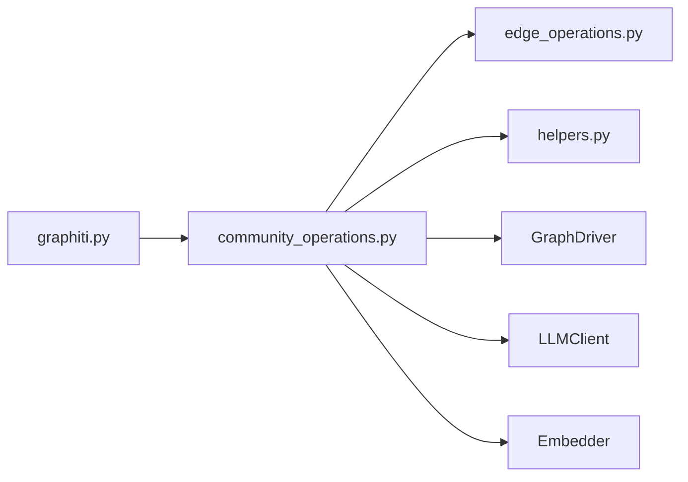

# 社区检测

<cite>
**本文引用的文件列表**
- [graphiti_core/utils/maintenance/community_operations.py](file://graphiti_core/utils/maintenance/community_operations.py)
- [graphiti_core/utils/maintenance/edge_operations.py](file://graphiti_core/utils/maintenance/edge_operations.py)
- [graphiti_core/graphiti.py](file://graphiti_core/graphiti.py)
- [graphiti_core/helpers.py](file://graphiti_core/helpers.py)
- [examples/quickstart/quickstart_neptune.py](file://examples/quickstart/quickstart_neptune.py)
- [tests/test_graphiti_mock.py](file://tests/test_graphiti_mock.py)
</cite>

## 目录
1. [简介](#简介)
2. [项目结构](#项目结构)
3. [核心组件](#核心组件)
4. [架构总览](#架构总览)
5. [组件详解](#组件详解)
6. [依赖关系分析](#依赖关系分析)
7. [性能考量](#性能考量)
8. [故障排查指南](#故障排查指南)
9. [结论](#结论)
10. [附录：调用示例与最佳实践](#附录调用示例与最佳实践)

## 简介
本文件面向有经验的开发者，系统性阐述基于标签传播算法（label propagation）的社区发现机制，以及围绕该机制的一整套社区构建、维护与更新流程。重点覆盖以下能力：
- 如何通过实体间的 RELATES_TO 关系构建社区聚类；
- get_community_clusters 函数如何按 group_id 对实体进行分组并生成社区簇；
- build_communities 的异步并发处理逻辑，包括 MAX_COMMUNITY_BUILD_CONCURRENCY 并发控制与 semaphore_gather 的使用；
- build_community 如何通过 LLM 逐步合并节点摘要，生成社区摘要与名称；
- determine_entity_community 与 update_community 在实体归属社区决策与动态更新中的作用；
- 性能调优建议与实际调用示例。

## 项目结构
社区检测相关代码主要分布在以下模块：
- 维护工具：社区聚类与社区构建、社区更新
- 边操作：社区边的生成与管理
- 核心入口：Graphiti 类对外暴露的 build_communities 接口
- 并发工具：semaphore_gather 并发控制
- 示例与测试：快速开始示例与单元测试验证

图表来源
- [graphiti_core/utils/maintenance/community_operations.py](file://graphiti_core/utils/maintenance/community_operations.py#L1-L332)
- [graphiti_core/utils/maintenance/edge_operations.py](file://graphiti_core/utils/maintenance/edge_operations.py#L70-L87)
- [graphiti_core/graphiti.py](file://graphiti_core/graphiti.py#L1013-L1048)
- [graphiti_core/helpers.py](file://graphiti_core/helpers.py#L105-L117)
- [examples/quickstart/quickstart_neptune.py](file://examples/quickstart/quickstart_neptune.py#L130-L141)
- [tests/test_graphiti_mock.py](file://tests/test_graphiti_mock.py#L590-L751)

章节来源
- [graphiti_core/utils/maintenance/community_operations.py](file://graphiti_core/utils/maintenance/community_operations.py#L1-L332)
- [graphiti_core/utils/maintenance/edge_operations.py](file://graphiti_core/utils/maintenance/edge_operations.py#L70-L87)
- [graphiti_core/graphiti.py](file://graphiti_core/graphiti.py#L1013-L1048)
- [graphiti_core/helpers.py](file://graphiti_core/helpers.py#L105-L117)
- [examples/quickstart/quickstart_neptune.py](file://examples/quickstart/quickstart_neptune.py#L130-L141)
- [tests/test_graphiti_mock.py](file://tests/test_graphiti_mock.py#L590-L751)

## 核心组件
- get_community_clusters：按 group_id 聚合实体，统计每实体的邻居边权重，执行标签传播算法，返回社区簇列表。
- label_propagation：实现基于邻居边权重的标签传播，支持 tie-breaking 与收敛判断。
- build_community：对单个社区簇内的实体摘要进行两两合并，最终生成社区节点与社区边。
- build_communities：批量获取社区簇并并发构建社区，使用信号量控制最大并发度。
- determine_entity_community：判定新实体应归属哪个社区，优先已存在成员，否则依据邻接实体的社区众数。
- update_community：当新实体加入已有社区时，融合摘要并更新社区节点与边。
- build_community_edges：将社区与成员实体建立 HAS_MEMBER 边。

章节来源
- [graphiti_core/utils/maintenance/community_operations.py](file://graphiti_core/utils/maintenance/community_operations.py#L29-L206)
- [graphiti_core/utils/maintenance/edge_operations.py](file://graphiti_core/utils/maintenance/edge_operations.py#L70-L87)

## 架构总览
下图展示了从 Graphiti 入口到社区构建与更新的端到端流程，以及与驱动层、LLM 客户端、嵌入器的交互。

图表来源
- [graphiti_core/graphiti.py](file://graphiti_core/graphiti.py#L1013-L1048)
- [graphiti_core/utils/maintenance/community_operations.py](file://graphiti_core/utils/maintenance/community_operations.py#L209-L234)
- [graphiti_core/utils/maintenance/edge_operations.py](file://graphiti_core/utils/maintenance/edge_operations.py#L70-L87)

## 组件详解

### 基于标签传播的社区聚类：get_community_clusters 与 label_propagation
- 数据准备
  - 若未指定 group_ids，则查询所有非空 group_id。
  - 对每个 group_id，遍历实体，统计其 RELATES_TO 邻居集合及边计数（权重），形成投影字典。
  - 针对不同图驱动（如 KUZU）适配不同的 RELATES_TO 路径写法。
- 聚类算法
  - label_propagation 将每个节点初始分配到独立社区，迭代地根据邻居权重投票决定标签，tie-breaking 使用较大社区，直到不再变化。
  - 输出为按 UUID 分组的社区簇列表。
- 结果
  - get_community_clusters 对每个簇按 UUID 拉取实体对象，返回社区簇列表。

图表来源
- [graphiti_core/utils/maintenance/community_operations.py](file://graphiti_core/utils/maintenance/community_operations.py#L29-L131)

章节来源
- [graphiti_core/utils/maintenance/community_operations.py](file://graphiti_core/utils/maintenance/community_operations.py#L29-L131)

### 异步并发构建：build_communities 的并发控制与调度
- 并发策略
  - 使用 asyncio.Semaphore 控制最大并发度，常量 MAX_COMMUNITY_BUILD_CONCURRENCY 默认值为 10。
  - 通过 semaphore_gather 包装每个 build_community 调用，统一并发上限。
- 流程
  - 先获取社区簇，再为每个簇创建受限协程任务，收集结果后拆分为社区节点与边列表。
  - Graphiti 层随后为社区节点生成名称向量并批量保存，同时保存社区边。

图表来源
- [graphiti_core/utils/maintenance/community_operations.py](file://graphiti_core/utils/maintenance/community_operations.py#L209-L234)
- [graphiti_core/helpers.py](file://graphiti_core/helpers.py#L105-L117)

章节来源
- [graphiti_core/utils/maintenance/community_operations.py](file://graphiti_core/utils/maintenance/community_operations.py#L209-L234)
- [graphiti_core/helpers.py](file://graphiti_core/helpers.py#L105-L117)

### 社区摘要与命名：build_community 的 LLM 合并过程
- 两两合并
  - 对社区内实体摘要进行两两合并，奇偶配对，若长度为奇数则保留一个“落单”摘要。
  - 使用 semaphore_gather 并行调用 LLM 的摘要合并接口，得到新的摘要列表，重复直至仅剩一个摘要。
- 命名与描述
  - 使用 LLM 对最终摘要生成社区描述，作为社区名称。
- 产物
  - 生成 CommunityNode（包含名称、摘要、group_id、时间戳等）与一组 CommunityEdge（指向成员实体）。

图表来源
- [graphiti_core/utils/maintenance/community_operations.py](file://graphiti_core/utils/maintenance/community_operations.py#L167-L206)
- [graphiti_core/utils/maintenance/edge_operations.py](file://graphiti_core/utils/maintenance/edge_operations.py#L70-L87)

章节来源
- [graphiti_core/utils/maintenance/community_operations.py](file://graphiti_core/utils/maintenance/community_operations.py#L167-L206)
- [graphiti_core/utils/maintenance/edge_operations.py](file://graphiti_core/utils/maintenance/edge_operations.py#L70-L87)

### 实体归属与动态更新：determine_entity_community 与 update_community
- determine_entity_community
  - 若实体已是某社区成员，直接返回该社区与 is_new=False。
  - 否则统计邻接实体所属社区的出现频次，选择众数社区；若无邻接社区则返回 None。
- update_community
  - 若实体归属社区为空，返回空结果。
  - 否则将实体摘要与社区摘要合并，生成新的社区名称与摘要，必要时新增 HAS_MEMBER 边，并更新社区节点与名称向量。

图表来源
- [graphiti_core/utils/maintenance/community_operations.py](file://graphiti_core/utils/maintenance/community_operations.py#L246-L332)

章节来源
- [graphiti_core/utils/maintenance/community_operations.py](file://graphiti_core/utils/maintenance/community_operations.py#L246-L332)

## 依赖关系分析
- 模块耦合
  - community_operations 依赖 GraphDriver 进行图查询与保存，依赖 LLMClient 与 Embedder 进行摘要与向量生成，依赖 edge_operations 生成社区边。
  - Graphiti 的 build_communities 方法封装了社区构建的生命周期，负责清理旧社区、并发构建、批量保存。
  - helpers.semaphore_gather 提供统一的并发控制，避免全局 gather 导致资源耗尽。
- 外部依赖
  - 不同图驱动（Neo4j/KuZu/Neptune/FalkorDB）在查询语法上略有差异，代码中通过 provider 判断进行适配。

图表来源
- [graphiti_core/graphiti.py](file://graphiti_core/graphiti.py#L1013-L1048)
- [graphiti_core/utils/maintenance/community_operations.py](file://graphiti_core/utils/maintenance/community_operations.py#L1-L332)
- [graphiti_core/utils/maintenance/edge_operations.py](file://graphiti_core/utils/maintenance/edge_operations.py#L70-L87)
- [graphiti_core/helpers.py](file://graphiti_core/helpers.py#L105-L117)

章节来源
- [graphiti_core/graphiti.py](file://graphiti_core/graphiti.py#L1013-L1048)
- [graphiti_core/utils/maintenance/community_operations.py](file://graphiti_core/utils/maintenance/community_operations.py#L1-L332)
- [graphiti_core/utils/maintenance/edge_operations.py](file://graphiti_core/utils/maintenance/edge_operations.py#L70-L87)
- [graphiti_core/helpers.py](file://graphiti_core/helpers.py#L105-L117)

## 性能考量
- 并发度控制
  - MAX_COMMUNITY_BUILD_CONCURRENCY 默认 10，适合大多数场景；可根据 LLM 与数据库吞吐调整。
  - semaphore_gather 的并发上限可通过环境变量 SEMAPHORE_LIMIT 全局调节，或在调用处传入 max_coroutines。
- I/O 与 LLM 成本
  - build_community 中的摘要两两合并会多次调用 LLM，建议控制单簇大小或分批处理。
  - 批量保存社区节点与边时，可复用 semaphore_gather 的 max_coroutines 参数以平衡吞吐与资源。
- 图查询优化
  - RELATES_TO 邻居统计在大图上可能成为瓶颈，建议确保 group_id 与实体索引合理，减少无关扫描。
- 资源监控
  - 建议在生产环境中开启日志与指标，观察 LLM 调用耗时、并发队列长度与数据库响应延迟。

[本节为通用性能建议，不直接分析具体文件，故无章节来源]

## 故障排查指南
- 社区未生成或为空
  - 检查是否存在 group_id 且实体间存在 RELATES_TO 边；确认 get_community_clusters 是否返回空簇。
  - 参考测试用例中对 get_community_clusters 的断言与数据构造。
- 并发超限或 LLM 调用失败
  - 调整 MAX_COMMUNITY_BUILD_CONCURRENCY 或 SEMAPHORE_LIMIT；检查 LLM 客户端配置与可用性。
- 实体归属错误
  - 使用 determine_entity_community 的测试用例对照邻接社区分布与众数计算逻辑。
- 更新后社区未刷新
  - 确认 update_community 是否成功保存社区节点与边，以及是否重新生成了名称向量。

章节来源
- [tests/test_graphiti_mock.py](file://tests/test_graphiti_mock.py#L590-L751)
- [tests/test_graphiti_mock.py](file://tests/test_graphiti_mock.py#L752-L835)

## 结论
本方案以 RELATES_TO 关系为纽带，通过标签传播算法实现社区聚类，并借助 LLM 的摘要合并能力生成高质量的社区节点与名称。配合严格的并发控制与批量持久化，可在大规模知识图谱中高效构建与维护社区结构。determine_entity_community 与 update_community 保证了新实体的动态归属与社区内容的持续更新。

[本节为总结性内容，不直接分析具体文件，故无章节来源]

## 附录：调用示例与最佳实践
- 快速开始示例
  - 在示例脚本中，直接调用 build_communities 即可完成社区构建与保存。
  - 参考路径：[examples/quickstart/quickstart_neptune.py](file://examples/quickstart/quickstart_neptune.py#L130-L141)
- 单元测试参考
  - get_community_clusters 与 determine_entity_community 的测试用例展示了数据构造与断言方式。
  - 参考路径：
    - [tests/test_graphiti_mock.py](file://tests/test_graphiti_mock.py#L590-L751)
    - [tests/test_graphiti_mock.py](file://tests/test_graphiti_mock.py#L752-L835)
- 最佳实践
  - 明确 group_id 划分，确保同一 group 内实体具备强关联；
  - 控制单簇规模，避免 LLM 合并层级过深导致成本过高；
  - 合理设置并发度，结合资源监控动态调优；
  - 在增量更新场景中，优先使用 determine_entity_community 与 update_community，避免全量重建。

章节来源
- [examples/quickstart/quickstart_neptune.py](file://examples/quickstart/quickstart_neptune.py#L130-L141)
- [tests/test_graphiti_mock.py](file://tests/test_graphiti_mock.py#L590-L751)
- [tests/test_graphiti_mock.py](file://tests/test_graphiti_mock.py#L752-L835)