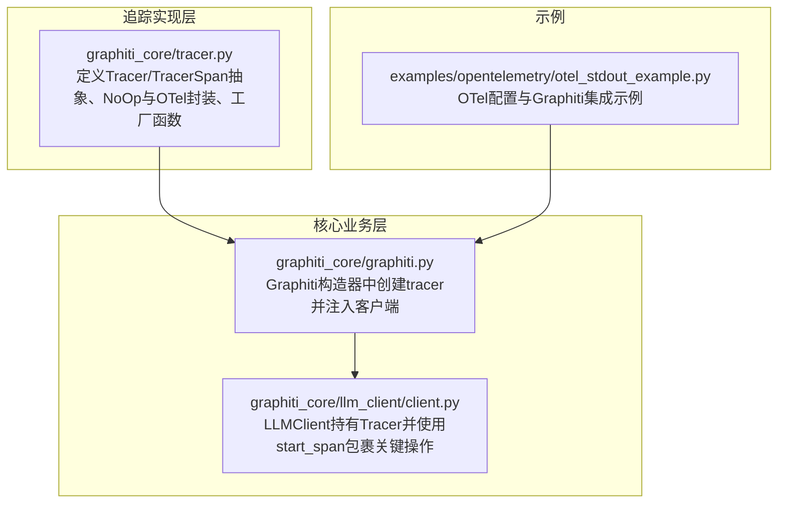
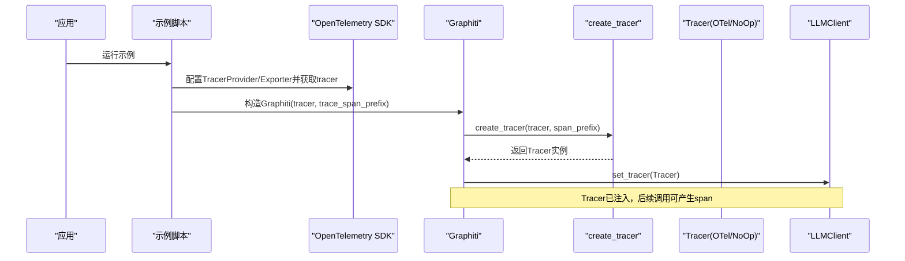
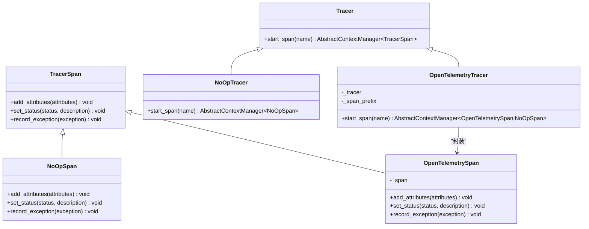
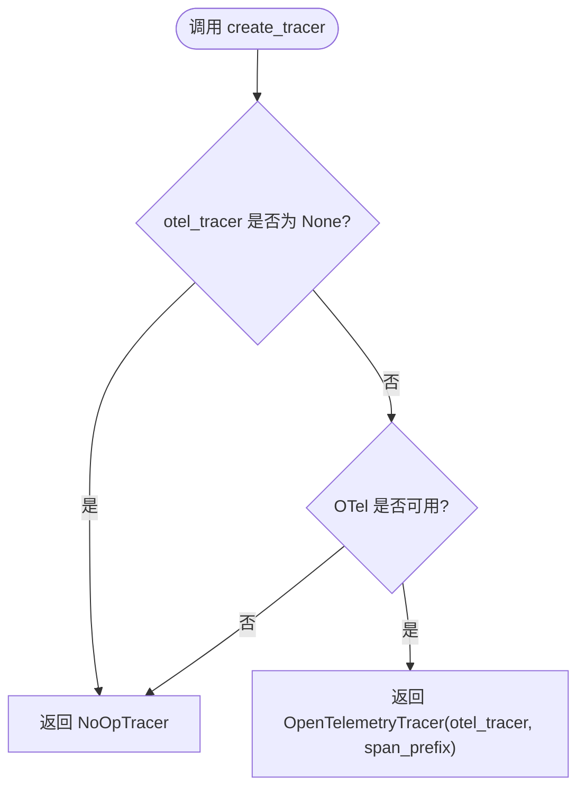
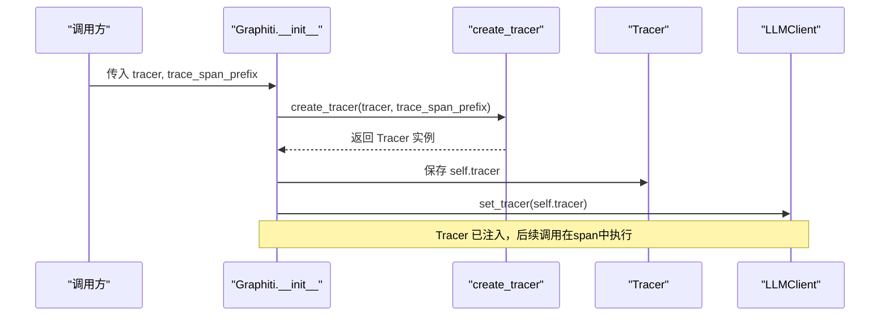
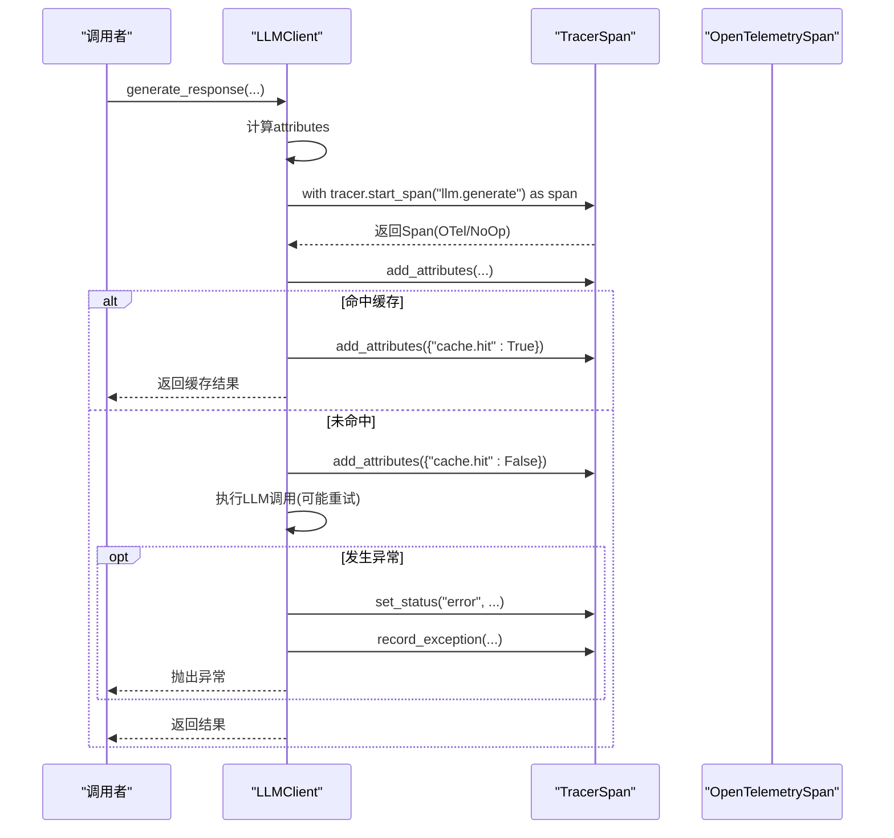
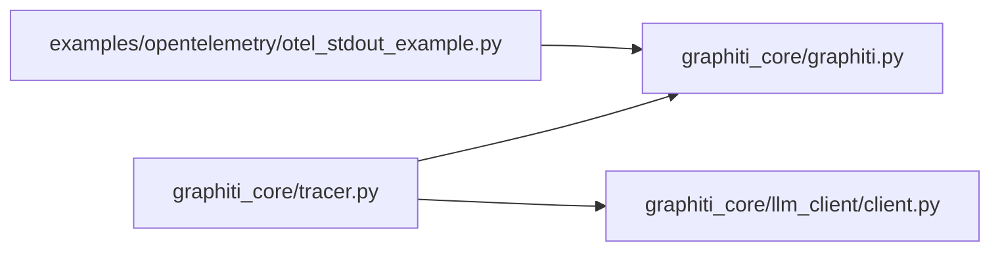

# 分布式追踪实现

<cite>
**本文引用的文件列表**
- [graphiti_core/tracer.py](file://graphiti_core/tracer.py)
- [OTEL_TRACING.md](file://OTEL_TRACING.md)
- [graphiti_core/graphiti.py](file://graphiti_core/graphiti.py)
- [graphiti_core/llm_client/client.py](file://graphiti_core/llm_client/client.py)
- [examples/opentelemetry/otel_stdout_example.py](file://examples/opentelemetry/otel_stdout_example.py)
</cite>

## 目录
1. [引言](#引言)
2. [项目结构与追踪相关模块](#项目结构与追踪相关模块)
3. [核心组件](#核心组件)
4. [架构总览](#架构总览)
5. [详细组件分析](#详细组件分析)
6. [依赖关系分析](#依赖关系分析)
7. [性能考量](#性能考量)
8. [故障排查指南](#故障排查指南)
9. [结论](#结论)
10. [附录](#附录)

## 引言
本文件系统性阐述Graphiti中基于OpenTelemetry的分布式追踪实现，重点围绕以下目标：
- 解释Tracer与TracerSpan抽象基类的设计目的及其如何提供统一的追踪接口；
- 深入分析OpenTelemetryTracer如何封装原生OTel Tracer实例、_span_prefix参数对span命名的影响（例如“graphiti.llm_call”）；
- 说明start_span方法中的异常捕获与降级到NoOpSpan的容错设计；
- 结合OTEL_TRACING.md示例，解释create_tracer工厂函数在不同场景下的行为：传入OTel tracer时返回OpenTelemetryTracer；OTel未安装或tracer为None时返回NoOpTracer；
- 描述Graphiti核心组件（如LLMClient）如何通过set_tracer接收tracer实例，并在整个调用链中传播追踪上下文，确保端到端可观测性。

## 项目结构与追踪相关模块
与分布式追踪直接相关的代码主要集中在graphiti_core/tracer.py，以及Graphiti初始化流程中对tracer的创建与传播。示例工程examples/opentelemetry展示了如何启用OTel并将其tracer注入Graphiti。

图表来源
- [graphiti_core/tracer.py](file://graphiti_core/tracer.py#L1-L194)
- [graphiti_core/graphiti.py](file://graphiti_core/graphiti.py#L200-L236)
- [graphiti_core/llm_client/client.py](file://graphiti_core/llm_client/client.py#L65-L90)
- [examples/opentelemetry/otel_stdout_example.py](file://examples/opentelemetry/otel_stdout_example.py#L40-L60)

章节来源
- [graphiti_core/tracer.py](file://graphiti_core/tracer.py#L1-L194)
- [graphiti_core/graphiti.py](file://graphiti_core/graphiti.py#L200-L236)
- [examples/opentelemetry/otel_stdout_example.py](file://examples/opentelemetry/otel_stdout_example.py#L40-L60)

## 核心组件
- 抽象基类
  - Tracer：定义start_span(name)上下文管理器接口，用于启动span。
  - TracerSpan：定义add_attributes、set_status、record_exception等通用能力，屏蔽底层实现差异。
- NoOp实现
  - NoOpTracer：无操作Tracer，start_span始终返回NoOpSpan，零开销。
  - NoOpSpan：无操作Span，所有操作均为空实现，保证在无OTel环境下的稳定性。
- OTel封装
  - OpenTelemetryTracer：封装原生OTel Tracer，支持span前缀配置，start_span失败时降级为NoOpSpan。
  - OpenTelemetrySpan：封装原生OTel Span，负责属性过滤、状态设置与异常记录。
- 工厂函数
  - create_tracer：根据传入的OTel tracer与span前缀返回具体Tracer实例；OTel不可用或tracer为None时返回NoOpTracer。

章节来源
- [graphiti_core/tracer.py](file://graphiti_core/tracer.py#L33-L194)

## 架构总览
下图展示Graphiti初始化、tracer创建与客户端注入的整体流程，以及LLMClient在关键路径上使用Tracer进行span包装的调用序列。

图表来源
- [graphiti_core/graphiti.py](file://graphiti_core/graphiti.py#L200-L236)
- [graphiti_core/tracer.py](file://graphiti_core/tracer.py#L159-L194)
- [examples/opentelemetry/otel_stdout_example.py](file://examples/opentelemetry/otel_stdout_example.py#L40-L60)

## 详细组件分析

### 抽象基类与NoOp实现
- 设计目的
  - 统一Tracer与TracerSpan接口，使上层业务无需关心底层是否启用OTel。
  - NoOp实现确保在无OTel或禁用追踪时，不会引入额外开销与复杂度。
- 关键点
  - Tracer.start_span返回上下文管理器，便于with语义包裹业务逻辑。
  - NoOpTracer.start_span始终返回NoOpSpan，内部不执行任何操作。
  - NoOpSpan的三个方法均为空实现，保证零成本。

章节来源
- [graphiti_core/tracer.py](file://graphiti_core/tracer.py#L33-L81)

### OpenTelemetryTracer与OpenTelemetrySpan
- OpenTelemetryTracer
  - 责任：封装原生OTel Tracer，提供统一的start_span接口；支持span前缀配置。
  - span命名策略：_span_prefix与name拼接为full_name，避免重复与歧义。
  - 容错设计：start_span内部捕获异常并降级为NoOpSpan，确保业务不受追踪异常影响。
  - 导入检查：若OTel不可用则抛出ImportError，提示用户安装依赖。
- OpenTelemetrySpan
  - 属性处理：过滤None值并对非基础类型进行字符串化，再调用底层Span.set_attributes。
  - 状态设置：根据status映射到OTel的OK/ERROR状态码，异常静默忽略。
  - 异常记录：使用suppress包装record_exception，避免追踪错误影响主流程。

图表来源
- [graphiti_core/tracer.py](file://graphiti_core/tracer.py#L33-L158)

章节来源
- [graphiti_core/tracer.py](file://graphiti_core/tracer.py#L83-L158)

### 工厂函数create_tracer的行为
- 参数与返回
  - otel_tracer: 可选的OTel Tracer实例；None时返回NoOpTracer。
  - span_prefix: 默认“graphiti”，用于拼接span名称。
- 行为分支
  - otel_tracer为None：返回NoOpTracer。
  - OTEL不可用：返回NoOpTracer。
  - 否则：返回OpenTelemetryTracer(otel_tracer, span_prefix)。
- 示例参考
  - OTEL_TRACING.md展示了如何创建OTel tracer并传入Graphiti构造器，同时设置trace_span_prefix。

图表来源
- [graphiti_core/tracer.py](file://graphiti_core/tracer.py#L159-L194)
- [OTEL_TRACING.md](file://OTEL_TRACING.md#L12-L33)

章节来源
- [graphiti_core/tracer.py](file://graphiti_core/tracer.py#L159-L194)
- [OTEL_TRACING.md](file://OTEL_TRACING.md#L12-L33)

### Graphiti初始化与Tracer传播
- 初始化流程要点
  - Graphiti构造器接收tracer与trace_span_prefix参数。
  - 通过create_tracer(tracer, trace_span_prefix)创建Tracer实例。
  - 将Tracer注入LLMClient：self.llm_client.set_tracer(self.tracer)。
- 调用链传播
  - 一旦Tracer注入，后续LLMClient的关键操作（如生成响应）会在span上下文中执行，确保端到端可观测性。

图表来源
- [graphiti_core/graphiti.py](file://graphiti_core/graphiti.py#L200-L236)
- [graphiti_core/tracer.py](file://graphiti_core/tracer.py#L159-L194)

章节来源
- [graphiti_core/graphiti.py](file://graphiti_core/graphiti.py#L200-L236)

### LLMClient中的Tracer使用
- 注入与默认值
  - LLMClient在初始化时默认持有NoOpTracer，可通过set_tracer接收外部Tracer。
- span包装与属性标注
  - 在关键异步方法中使用with self.tracer.start_span(...)包裹整个流程。
  - 添加attributes（如模型大小、缓存开关、提示词名等）。
  - 发生异常时设置状态为error并记录异常，随后重新抛出。
- 缓存与重试
  - 在缓存命中与未命中路径分别添加属性标记，便于观测性能与命中率。

图表来源
- [graphiti_core/llm_client/client.py](file://graphiti_core/llm_client/client.py#L65-L90)
- [graphiti_core/llm_client/client.py](file://graphiti_core/llm_client/client.py#L148-L213)
- [graphiti_core/tracer.py](file://graphiti_core/tracer.py#L126-L158)

章节来源
- [graphiti_core/llm_client/client.py](file://graphiti_core/llm_client/client.py#L65-L90)
- [graphiti_core/llm_client/client.py](file://graphiti_core/llm_client/client.py#L148-L213)

## 依赖关系分析
- 组件耦合
  - Graphiti与Tracer解耦：通过工厂函数create_tracer创建Tracer，避免直接依赖具体实现。
  - LLMClient与Tracer解耦：通过set_tracer注入Tracer，支持替换与测试。
- 外部依赖
  - OpenTelemetry：OTEL_AVAILABLE标志控制导入；OTel不可用时自动降级为NoOp。
- 循环依赖
  - 未发现循环依赖迹象：Tracer定义在独立模块，Graphiti与LLMClient仅通过接口交互。

图表来源
- [graphiti_core/tracer.py](file://graphiti_core/tracer.py#L1-L194)
- [graphiti_core/graphiti.py](file://graphiti_core/graphiti.py#L200-L236)
- [graphiti_core/llm_client/client.py](file://graphiti_core/llm_client/client.py#L65-L90)
- [examples/opentelemetry/otel_stdout_example.py](file://examples/opentelemetry/otel_stdout_example.py#L40-L60)

章节来源
- [graphiti_core/tracer.py](file://graphiti_core/tracer.py#L1-L194)
- [graphiti_core/graphiti.py](file://graphiti_core/graphiti.py#L200-L236)
- [graphiti_core/llm_client/client.py](file://graphiti_core/llm_client/client.py#L65-L90)
- [examples/opentelemetry/otel_stdout_example.py](file://examples/opentelemetry/otel_stdout_example.py#L40-L60)

## 性能考量
- 零开销降级：在OTel不可用或tracer为None时，返回NoOpTracer/NoOpSpan，避免任何追踪相关开销。
- 异常静默：OpenTelemetrySpan在属性设置、状态设置与异常记录过程中均采用异常抑制，防止追踪错误影响主流程性能与可靠性。
- 属性过滤：在OpenTelemetrySpan中对属性进行None过滤与类型转换，减少无效数据与潜在报错。
- 上下文管理：通过with语义包裹span，确保资源正确释放，避免泄漏。

章节来源
- [graphiti_core/tracer.py](file://graphiti_core/tracer.py#L83-L158)

## 故障排查指南
- 未安装OpenTelemetry
  - 现象：创建OpenTelemetryTracer时抛出ImportError。
  - 处理：按OTEL_TRACING.md安装opentelemetry-sdk，并确保TracerProvider已配置。
- OTel未配置或未导出
  - 现象：看不到span输出。
  - 处理：参考OTEL_TRACING.md与示例脚本，配置TracerProvider与Exporter（如ConsoleSpanExporter）。
- Tracer未生效
  - 现象：Graphiti未产生span。
  - 排查：确认Graphiti构造时传入了tracer且trace_span_prefix正确；确认LLMClient已set_tracer。
- span名称不符合预期
  - 现象：span名称不是期望的“graphiti.xxx”。
  - 排查：检查trace_span_prefix是否包含多余点号或被截断；OpenTelemetryTracer会去除尾部点号。
- 异常未记录
  - 现象：发生错误但span未标记为error或未记录异常。
  - 排查：确认LLMClient在异常路径调用了set_status与record_exception；OpenTelemetrySpan对record_exception使用了异常抑制。

章节来源
- [graphiti_core/tracer.py](file://graphiti_core/tracer.py#L126-L158)
- [graphiti_core/graphiti.py](file://graphiti_core/graphiti.py#L200-L236)
- [graphiti_core/llm_client/client.py](file://graphiti_core/llm_client/client.py#L148-L213)
- [OTEL_TRACING.md](file://OTEL_TRACING.md#L12-L33)
- [examples/opentelemetry/otel_stdout_example.py](file://examples/opentelemetry/otel_stdout_example.py#L40-L60)

## 结论
Graphiti的分布式追踪通过抽象基类与NoOp实现实现了对OTel的可插拔支持，既能在生产环境中提供丰富的端到端可观测性，又能在开发或无OTel环境下保持零开销与高可靠性。OpenTelemetryTracer以span前缀统一命名、以异常降级保障稳定性，并通过工厂函数create_tracer与Graphiti初始化流程无缝集成。LLMClient通过set_tracer接收Tracer并在关键路径中使用span包装，形成从入口到核心业务的完整追踪链路。

## 附录
- 快速参考
  - 创建Tracer：create_tracer(otel_tracer, span_prefix)
  - Graphiti构造：传入tracer与trace_span_prefix，内部自动注入LLMClient
  - LLMClient使用：在关键异步方法中with self.tracer.start_span(...)包裹，并添加attributes、设置状态与记录异常
- 示例参考
  - OTEL_TRACING.md与examples/opentelemetry/otel_stdout_example.py展示了完整的OTel配置与Graphiti集成方式

章节来源
- [graphiti_core/tracer.py](file://graphiti_core/tracer.py#L159-L194)
- [graphiti_core/graphiti.py](file://graphiti_core/graphiti.py#L200-L236)
- [graphiti_core/llm_client/client.py](file://graphiti_core/llm_client/client.py#L148-L213)
- [OTEL_TRACING.md](file://OTEL_TRACING.md#L12-L33)
- [examples/opentelemetry/otel_stdout_example.py](file://examples/opentelemetry/otel_stdout_example.py#L40-L60)