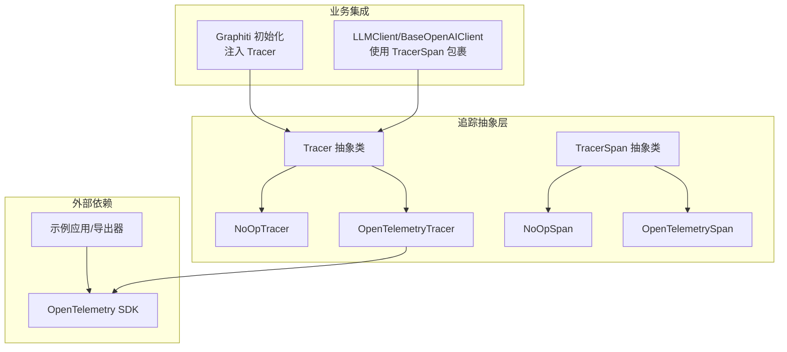
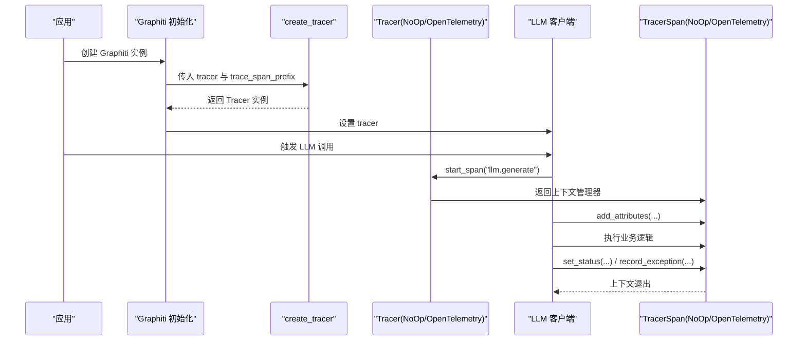
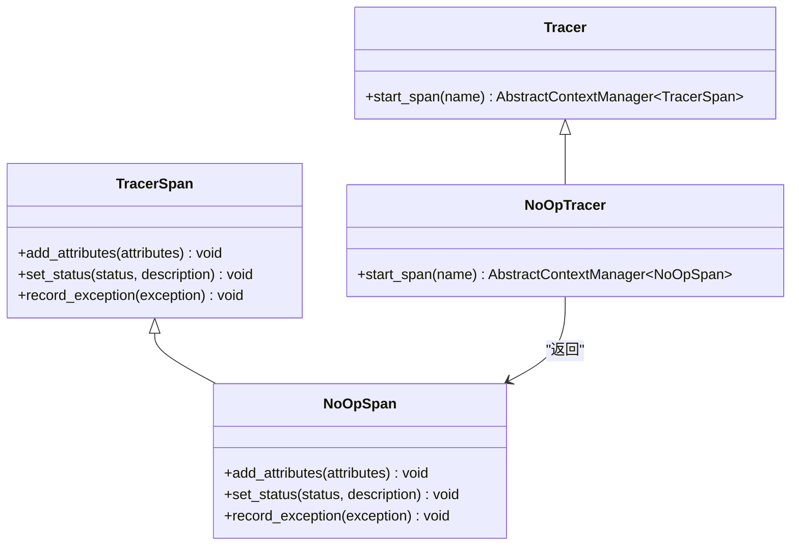
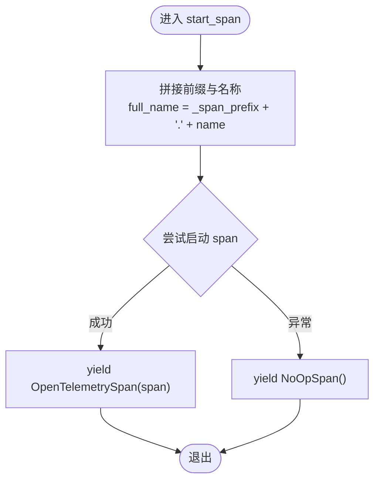
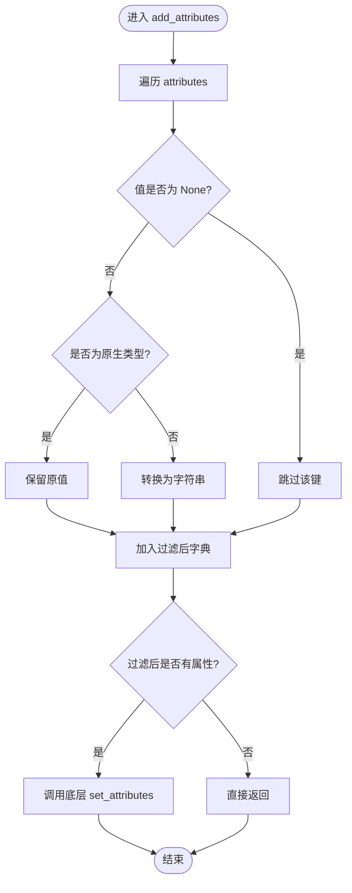
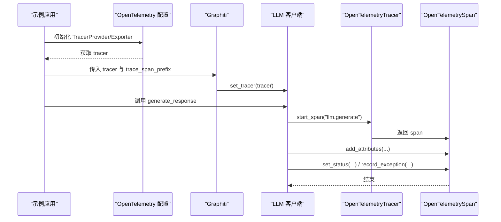
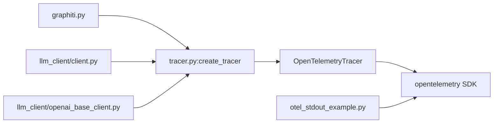

# 追踪核心机制

<cite>
**本文引用的文件**
- [graphiti_core/tracer.py](file://graphiti_core/tracer.py)
- [graphiti_core/graphiti.py](file://graphiti_core/graphiti.py)
- [graphiti_core/llm_client/client.py](file://graphiti_core/llm_client/client.py)
- [graphiti_core/llm_client/openai_base_client.py](file://graphiti_core/llm_client/openai_base_client.py)
- [examples/opentelemetry/otel_stdout_example.py](file://examples/opentelemetry/otel_stdout_example.py)
- [OTEL_TRACING.md](file://OTEL_TRACING.md)
- [graphiti_core/telemetry/telemetry.py](file://graphiti_core/telemetry/telemetry.py)
</cite>

## 目录
1. [引言](#引言)
2. [项目结构](#项目结构)
3. [核心组件](#核心组件)
4. [架构总览](#架构总览)
5. [详细组件分析](#详细组件分析)
6. [依赖关系分析](#依赖关系分析)
7. [性能考量](#性能考量)
8. [故障排查指南](#故障排查指南)
9. [结论](#结论)
10. [附录](#附录)

## 引言
本文件围绕 graphiti_core/tracer.py 中定义的抽象基类 Tracer 与 TracerSpan，系统解析 NoOpTracer 与 NoOpSpan 的零开销实现原理，并深入剖析 OpenTelemetryTracer 如何通过内部_wrapped tracer 实例与_span_prefix 前缀机制实现 span 命名标准化（例如“graphiti.llm_call”）。同时，重点阐述 start_span 方法中的异常捕获与降级逻辑：当 OpenTelemetry 不可用或追踪失败时，自动切换到 NoOpSpan 以确保主流程不受影响。结合使用示例，说明 OpenTelemetrySpan 中 add_attributes、set_status 与 record_exception 的实现细节，包括属性过滤（剔除 None 值）、状态码映射（StatusCode.ERROR/OK）以及异常记录的静默处理策略。

## 项目结构
本节聚焦与追踪相关的核心文件及其职责：
- graphiti_core/tracer.py：定义追踪抽象层与具体实现（NoOp 与 OpenTelemetry），并提供工厂函数 create_tracer。
- graphiti_core/graphiti.py：Graphiti 初始化时调用 create_tracer 并将 Tracer 注入各子系统（如 LLM 客户端）。
- graphiti_core/llm_client/client.py 与 openai_base_client.py：在关键业务流程中使用 TracerSpan 包裹操作，记录属性、状态与异常。
- examples/opentelemetry/otel_stdout_example.py：演示如何配置 OpenTelemetry 并传入 Graphiti。
- OTEL_TRACING.md：官方追踪使用说明与安装指引。
- graphiti_core/telemetry/telemetry.py：遥测事件记录，展示与追踪类似的“静默处理”策略。

图表来源
- [graphiti_core/tracer.py](file://graphiti_core/tracer.py#L33-L194)
- [graphiti_core/graphiti.py](file://graphiti_core/graphiti.py#L220-L232)
- [graphiti_core/llm_client/client.py](file://graphiti_core/llm_client/client.py#L170-L214)
- [graphiti_core/llm_client/openai_base_client.py](file://graphiti_core/llm_client/openai_base_client.py#L190-L262)
- [examples/opentelemetry/otel_stdout_example.py](file://examples/opentelemetry/otel_stdout_example.py#L40-L60)

章节来源
- [graphiti_core/tracer.py](file://graphiti_core/tracer.py#L1-L194)
- [graphiti_core/graphiti.py](file://graphiti_core/graphiti.py#L220-L232)

## 核心组件
- 抽象基类 Tracer 与 TracerSpan：定义统一的追踪接口，屏蔽底层实现差异。
- NoOpTracer/NoOpSpan：无副作用的空操作实现，保证在未启用追踪时零开销。
- OpenTelemetryTracer/OpenTelemetrySpan：封装 OpenTelemetry 的 tracer 与 span，提供属性过滤、状态映射与异常记录的静默处理。
- 工厂函数 create_tracer：根据传入参数返回 NoOpTracer 或 OpenTelemetryTracer，确保兼容性与降级能力。

章节来源
- [graphiti_core/tracer.py](file://graphiti_core/tracer.py#L33-L194)

## 架构总览
下图展示了从 Graphiti 初始化到 LLM 调用期间的追踪调用链，以及 OpenTelemetryTracer 的命名前缀与异常降级机制。

图表来源
- [graphiti_core/graphiti.py](file://graphiti_core/graphiti.py#L220-L232)
- [graphiti_core/llm_client/client.py](file://graphiti_core/llm_client/client.py#L170-L214)
- [graphiti_core/llm_client/openai_base_client.py](file://graphiti_core/llm_client/openai_base_client.py#L190-L262)
- [graphiti_core/tracer.py](file://graphiti_core/tracer.py#L147-L194)

## 详细组件分析

### 抽象层：Tracer 与 TracerSpan
- Tracer：定义 start_span(name) -> AbstractContextManager[TracerSpan]，用于创建可上下文管理的 span。
- TracerSpan：定义 add_attributes、set_status、record_exception 三个核心方法，统一不同实现的追踪语义。

章节来源
- [graphiti_core/tracer.py](file://graphiti_core/tracer.py#L33-L59)

### NoOp 实现：零开销的降级保障
- NoOpTracer.start_span：始终返回 NoOpSpan，不产生任何外部依赖或副作用。
- NoOpSpan.add_attributes/set_status/record_exception：均为空实现，确保在未启用 OpenTelemetry 时，业务逻辑不受追踪影响。

图表来源
- [graphiti_core/tracer.py](file://graphiti_core/tracer.py#L61-L81)

章节来源
- [graphiti_core/tracer.py](file://graphiti_core/tracer.py#L61-L81)

### OpenTelemetryTracer：命名前缀与异常降级
- 构造参数：
  - _tracer：底层 OpenTelemetry tracer 实例。
  - _span_prefix：默认“graphiti”，最终生成的 span 名称为“prefix.name”。
- start_span 流程：
  - 尝试以 full_name = f"{_span_prefix}.{name}" 启动 span。
  - 若成功，返回 OpenTelemetrySpan；若抛出异常，则降级为 NoOpSpan，保证业务不中断。
- create_tracer 策略：
  - 当传入 None 或 OpenTelemetry 不可用时，返回 NoOpTracer。
  - 否则返回 OpenTelemetryTracer。

图表来源
- [graphiti_core/tracer.py](file://graphiti_core/tracer.py#L126-L194)

章节来源
- [graphiti_core/tracer.py](file://graphiti_core/tracer.py#L126-L194)

### OpenTelemetrySpan：属性过滤、状态映射与异常记录
- add_attributes：
  - 过滤 None 值；对非原生类型（str|int|float|bool）进行字符串化；仅在存在有效属性时调用底层 set_attributes。
  - 异常静默处理，避免追踪错误影响业务。
- set_status：
  - 仅在 OTEL 可用时生效；将字符串状态映射为 StatusCode.OK 或 StatusCode.ERROR，并可附带描述。
  - 异常静默处理。
- record_exception：
  - 使用 suppress 包装底层 record_exception，确保异常不会传播至业务代码。

图表来源
- [graphiti_core/tracer.py](file://graphiti_core/tracer.py#L83-L125)

章节来源
- [graphiti_core/tracer.py](file://graphiti_core/tracer.py#L83-L125)

### 使用示例与集成点
- Graphiti 初始化时通过 create_tracer 注入 Tracer，并设置到 LLM 客户端。
- LLM 客户端在关键流程中使用 with tracer.start_span(...) 包裹，添加属性、设置状态、记录异常。
- 示例应用演示了如何配置 OpenTelemetry 并将 tracer 传入 Graphiti，同时设置 trace_span_prefix。

图表来源
- [examples/opentelemetry/otel_stdout_example.py](file://examples/opentelemetry/otel_stdout_example.py#L40-L60)
- [graphiti_core/graphiti.py](file://graphiti_core/graphiti.py#L220-L232)
- [graphiti_core/llm_client/client.py](file://graphiti_core/llm_client/client.py#L170-L214)
- [graphiti_core/llm_client/openai_base_client.py](file://graphiti_core/llm_client/openai_base_client.py#L190-L262)
- [graphiti_core/tracer.py](file://graphiti_core/tracer.py#L147-L194)

章节来源
- [examples/opentelemetry/otel_stdout_example.py](file://examples/opentelemetry/otel_stdout_example.py#L40-L60)
- [graphiti_core/graphiti.py](file://graphiti_core/graphiti.py#L220-L232)
- [graphiti_core/llm_client/client.py](file://graphiti_core/llm_client/client.py#L170-L214)
- [graphiti_core/llm_client/openai_base_client.py](file://graphiti_core/llm_client/openai_base_client.py#L190-L262)

## 依赖关系分析
- 组件耦合：
  - Graphiti 通过 create_tracer 与 Tracer 解耦，LLM 客户端同样通过 Tracer 接口解耦。
  - OpenTelemetryTracer 仅在 OTEL 可用时才引入 OpenTelemetry 依赖，否则退化为 NoOp。
- 外部依赖：
  - OpenTelemetry SDK：由 OpenTelemetryTracer 使用；OTEL 可用性通过导入检测控制。
  - 示例应用：演示如何配置 TracerProvider 与 ConsoleSpanExporter。
- 潜在循环依赖：
  - 无直接循环依赖；Tracer 抽象层位于独立模块，业务模块仅依赖抽象接口。

图表来源
- [graphiti_core/graphiti.py](file://graphiti_core/graphiti.py#L220-L232)
- [graphiti_core/llm_client/client.py](file://graphiti_core/llm_client/client.py#L170-L214)
- [graphiti_core/llm_client/openai_base_client.py](file://graphiti_core/llm_client/openai_base_client.py#L190-L262)
- [graphiti_core/tracer.py](file://graphiti_core/tracer.py#L147-L194)
- [examples/opentelemetry/otel_stdout_example.py](file://examples/opentelemetry/otel_stdout_example.py#L40-L60)

章节来源
- [graphiti_core/graphiti.py](file://graphiti_core/graphiti.py#L220-L232)
- [graphiti_core/llm_client/client.py](file://graphiti_core/llm_client/client.py#L170-L214)
- [graphiti_core/llm_client/openai_base_client.py](file://graphiti_core/llm_client/openai_base_client.py#L190-L262)
- [graphiti_core/tracer.py](file://graphiti_core/tracer.py#L147-L194)
- [examples/opentelemetry/otel_stdout_example.py](file://examples/opentelemetry/otel_stdout_example.py#L40-L60)

## 性能考量
- 零开销降级：NoOpTracer/NoOpSpan 的空实现确保在未启用追踪时无额外内存与 CPU 开销。
- 属性过滤：OpenTelemetrySpan 在 add_attributes 中剔除 None 值并进行类型转换，减少无效属性写入，降低 SDK 负担。
- 异常静默：所有追踪相关异常均被吞掉，避免追踪失败导致业务中断，但可能掩盖底层问题，建议配合日志与监控。
- 前缀命名：统一的 span 命名前缀便于检索与聚合，减少跨服务追踪的歧义。

[本节为通用性能讨论，无需特定文件引用]

## 故障排查指南
- OpenTelemetry 未安装或导入失败：
  - create_tracer 将返回 NoOpTracer；可通过检查 OTEL 可用性与导入异常来定位。
- 追踪启动失败：
  - OpenTelemetryTracer.start_span 在异常时会降级为 NoOpSpan；可在业务侧观察是否出现追踪数据缺失。
- 属性未生效：
  - 检查 add_attributes 是否包含 None 值或非原生类型；None 值会被过滤，非原生类型会被字符串化。
- 状态未正确设置：
  - set_status 仅在 OTEL 可用且状态字符串为“error”或“ok”时生效；确认 OTEL 可用性与状态字符串。
- 异常未记录：
  - record_exception 使用 suppress 包装，异常会被静默处理；如需调试，可在业务侧增加日志。

章节来源
- [graphiti_core/tracer.py](file://graphiti_core/tracer.py#L140-L156)
- [graphiti_core/tracer.py](file://graphiti_core/tracer.py#L89-L124)
- [graphiti_core/llm_client/client.py](file://graphiti_core/llm_client/client.py#L200-L206)
- [graphiti_core/llm_client/openai_base_client.py](file://graphiti_core/llm_client/openai_base_client.py#L220-L240)

## 结论
graphiti_core/tracer.py 通过抽象层与 NoOp 实现，提供了对 OpenTelemetry 的零侵入式支持。OpenTelemetryTracer 以“前缀+名称”的命名规范统一了 span 命名，并在异常时自动降级为 NoOpSpan，确保主流程稳定运行。OpenTelemetrySpan 则在属性过滤、状态映射与异常记录方面实现了稳健的静默处理策略，兼顾可观测性与可靠性。结合示例应用与 Graphiti 初始化流程，可快速完成 OpenTelemetry 的集成与落地。

[本节为总结性内容，无需特定文件引用]

## 附录
- 安装与使用参考：OTEL_TRACING.md 提供了安装与基本用法说明，示例应用展示了如何配置 TracerProvider 与 ConsoleSpanExporter，并将 tracer 传入 Graphiti。
- 遥测事件：graphiti_core/telemetry/telemetry.py 展示了与追踪类似的“静默处理”策略，强调在不影响主流程的前提下收集匿名统计信息。

章节来源
- [OTEL_TRACING.md](file://OTEL_TRACING.md#L1-L48)
- [examples/opentelemetry/otel_stdout_example.py](file://examples/opentelemetry/otel_stdout_example.py#L40-L60)
- [graphiti_core/telemetry/telemetry.py](file://graphiti_core/telemetry/telemetry.py#L92-L118)