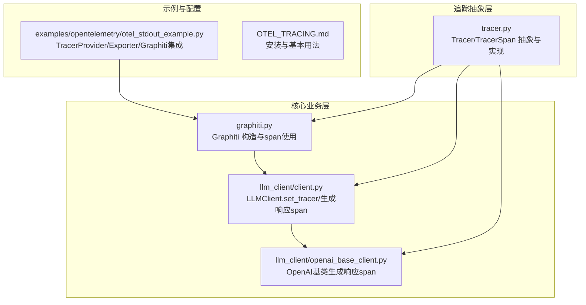
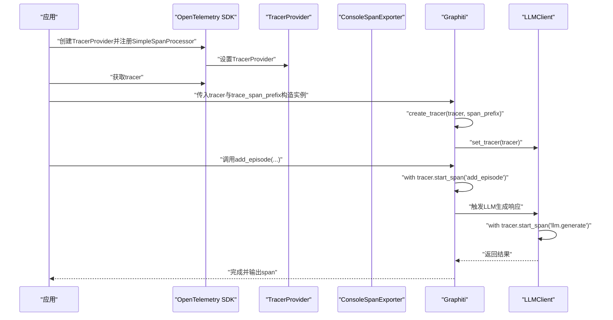
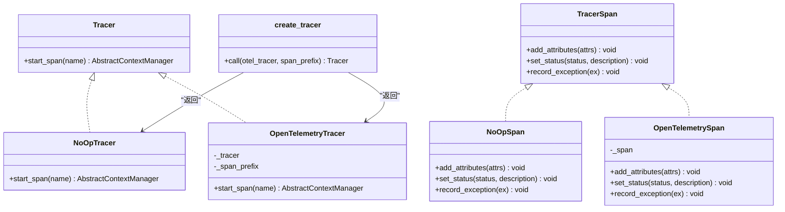
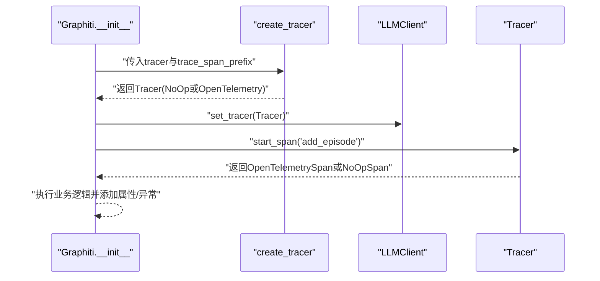
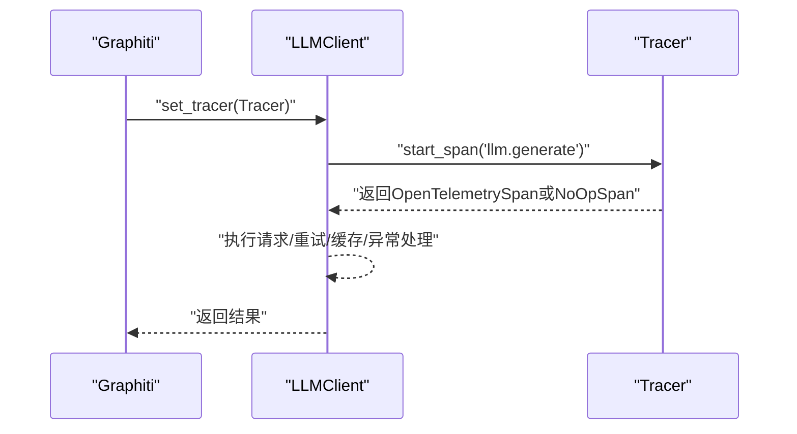
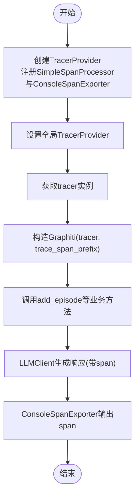
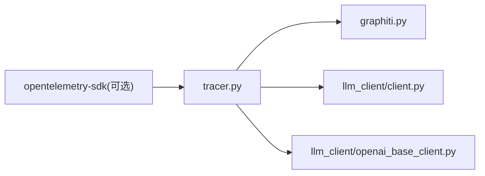

# 追踪集成模式

<cite>
**本文引用的文件列表**
- [graphiti_core/tracer.py](file://graphiti_core/tracer.py)
- [graphiti_core/graphiti.py](file://graphiti_core/graphiti.py)
- [graphiti_core/llm_client/client.py](file://graphiti_core/llm_client/client.py)
- [graphiti_core/llm_client/openai_base_client.py](file://graphiti_core/llm_client/openai_base_client.py)
- [examples/opentelemetry/otel_stdout_example.py](file://examples/opentelemetry/otel_stdout_example.py)
- [OTEL_TRACING.md](file://OTEL_TRACING.md)
</cite>

## 目录
1. [引言](#引言)
2. [项目结构与追踪相关模块](#项目结构与追踪相关模块)
3. [核心组件](#核心组件)
4. [架构总览](#架构总览)
5. [详细组件分析](#详细组件分析)
6. [依赖关系分析](#依赖关系分析)
7. [性能考量](#性能考量)
8. [故障排查指南](#故障排查指南)
9. [结论](#结论)
10. [附录](#附录)

## 引言
本文件系统化阐述Graphiti在OpenTelemetry中的集成应用模式，重点围绕以下目标展开：
- 解析create_tracer工厂函数的决策逻辑，说明在OTEL_AVAILABLE为True且传入有效OTel tracer实例时返回OpenTelemetryTracer，在tracer为None或OTel未安装时返回NoOpTracer，从而保证功能降级的平滑性。
- 结合OTEL_TRACING.md中的配置示例，说明如何通过Graphiti构造函数注入tracer实例，并利用trace_span_prefix参数自定义span名称前缀。
- 分析examples/opentelemetry/中的实际用例，展示从TracerProvider初始化、ConsoleSpanExporter配置到端到端追踪链路生成的完整流程。
- 描述LLMClient等核心组件如何通过set_tracer方法接收tracer并在线程上下文中传播追踪信息，实现跨组件的分布式追踪。

## 项目结构与追踪相关模块
与OpenTelemetry追踪直接相关的代码集中在以下位置：
- 追踪抽象与实现：graphiti_core/tracer.py
- Graphiti主类与span命名前缀：graphiti_core/graphiti.py
- LLM客户端追踪传播：graphiti_core/llm_client/client.py、graphiti_core/llm_client/openai_base_client.py
- 示例与配置文档：examples/opentelemetry/otel_stdout_example.py、OTEL_TRACING.md

图表来源
- [graphiti_core/tracer.py](file://graphiti_core/tracer.py#L1-L194)
- [graphiti_core/graphiti.py](file://graphiti_core/graphiti.py#L128-L236)
- [graphiti_core/llm_client/client.py](file://graphiti_core/llm_client/client.py#L66-L214)
- [graphiti_core/llm_client/openai_base_client.py](file://graphiti_core/llm_client/openai_base_client.py#L190-L262)
- [examples/opentelemetry/otel_stdout_example.py](file://examples/opentelemetry/otel_stdout_example.py#L40-L126)
- [OTEL_TRACING.md](file://OTEL_TRACING.md#L1-L48)

章节来源
- [graphiti_core/tracer.py](file://graphiti_core/tracer.py#L1-L194)
- [graphiti_core/graphiti.py](file://graphiti_core/graphiti.py#L128-L236)
- [graphiti_core/llm_client/client.py](file://graphiti_core/llm_client/client.py#L66-L214)
- [graphiti_core/llm_client/openai_base_client.py](file://graphiti_core/llm_client/openai_base_client.py#L190-L262)
- [examples/opentelemetry/otel_stdout_example.py](file://examples/opentelemetry/otel_stdout_example.py#L40-L126)
- [OTEL_TRACING.md](file://OTEL_TRACING.md#L1-L48)

## 核心组件
- Tracer/TracerSpan抽象与实现
  - 定义统一的TracerSpan与Tracer接口，支持NoOp与OpenTelemetry两种实现，确保在OTel不可用时仍可正常运行。
- create_tracer工厂函数
  - 决策逻辑：当传入有效的OTel tracer实例且OTEL_AVAILABLE为True时返回OpenTelemetryTracer；否则返回NoOpTracer。
- Graphiti构造与span命名
  - 在构造函数中调用create_tracer并设置trace_span_prefix，随后将Tracer注入到LLMClient等子组件。
  - 在关键业务流程（如add_episode、add_episode_bulk）中使用with self.tracer.start_span(...)包裹，自动添加属性与异常记录。
- LLMClient追踪传播
  - LLMClient默认持有NoOpTracer，通过set_tracer注入Tracer后，在generate_response等关键路径上开启span，记录属性与异常状态。

章节来源
- [graphiti_core/tracer.py](file://graphiti_core/tracer.py#L1-L194)
- [graphiti_core/graphiti.py](file://graphiti_core/graphiti.py#L128-L236)
- [graphiti_core/llm_client/client.py](file://graphiti_core/llm_client/client.py#L66-L214)

## 架构总览
下图展示了从TracerProvider到Graphiti再到LLMClient的追踪链路传播路径，以及span命名前缀策略。

图表来源
- [examples/opentelemetry/otel_stdout_example.py](file://examples/opentelemetry/otel_stdout_example.py#L40-L126)
- [graphiti_core/graphiti.py](file://graphiti_core/graphiti.py#L128-L236)
- [graphiti_core/llm_client/client.py](file://graphiti_core/llm_client/client.py#L66-L214)

## 详细组件分析

### create_tracer工厂函数与Tracer实现
- 决策逻辑
  - 当传入的tracer为None或OTEL_AVAILABLE为False时，返回NoOpTracer，确保无OTel依赖时零开销。
  - 否则返回OpenTelemetryTracer，内部封装OTel Span并提供统一的start_span接口。
- OpenTelemetryTracer行为
  - 使用span_prefix对所有span名称进行前缀拼接，避免命名冲突。
  - 在start_span失败时回退为NoOpSpan，保证业务不中断。
- NoOpTracer/NoOpSpan
  - 所有操作为空实现，不影响性能与行为。

图表来源
- [graphiti_core/tracer.py](file://graphiti_core/tracer.py#L1-L194)

章节来源
- [graphiti_core/tracer.py](file://graphiti_core/tracer.py#L1-L194)

### Graphiti构造与span命名前缀
- 构造函数参数
  - tracer：可选的OpenTelemetry Tracer实例。
  - trace_span_prefix：默认“graphiti”，用于统一前缀化所有span名称。
- 初始化流程
  - 调用create_tracer(tracer, trace_span_prefix)得到Tracer实例。
  - 将Tracer注入到llm_client等子组件，确保后续调用链共享当前span上下文。
- 关键业务span
  - add_episode：以“add_episode”为名称启动span，记录episode与图数据统计。
  - add_episode_bulk：以“add_episode_bulk”为名称启动span，记录批量处理统计。

图表来源
- [graphiti_core/graphiti.py](file://graphiti_core/graphiti.py#L128-L236)
- [graphiti_core/tracer.py](file://graphiti_core/tracer.py#L159-L194)

章节来源
- [graphiti_core/graphiti.py](file://graphiti_core/graphiti.py#L128-L236)
- [graphiti_core/tracer.py](file://graphiti_core/tracer.py#L159-L194)

### LLMClient追踪传播与线程上下文
- 注入Tracer
  - LLMClient在初始化时默认持有NoOpTracer，通过set_tracer接收来自Graphiti的Tracer实例。
- 生成响应span
  - 在generate_response中以“llm.generate”为名称启动span，记录模型、缓存、提示词等属性。
  - 对异常进行状态标记与异常记录，便于追踪定位。
- OpenAI基类扩展
  - OpenAI基类同样采用相同的span模式，确保不同LLM提供商的一致追踪体验。

图表来源
- [graphiti_core/llm_client/client.py](file://graphiti_core/llm_client/client.py#L66-L214)
- [graphiti_core/llm_client/openai_base_client.py](file://graphiti_core/llm_client/openai_base_client.py#L190-L262)

章节来源
- [graphiti_core/llm_client/client.py](file://graphiti_core/llm_client/client.py#L66-L214)
- [graphiti_core/llm_client/openai_base_client.py](file://graphiti_core/llm_client/openai_base_client.py#L190-L262)

### 端到端追踪链路：从TracerProvider到ConsoleSpanExporter
- 配置步骤
  - 创建Resource与TracerProvider，注册SimpleSpanProcessor与ConsoleSpanExporter，设置全局TracerProvider。
  - 获取tracer并传入Graphiti构造函数，同时设置trace_span_prefix。
- 运行流程
  - Graphiti在add_episode等关键路径创建span，LLMClient在其生成响应路径创建span。
  - ConsoleSpanExporter将span输出至stdout，形成完整的分布式追踪链路。

图表来源
- [examples/opentelemetry/otel_stdout_example.py](file://examples/opentelemetry/otel_stdout_example.py#L40-L126)
- [OTEL_TRACING.md](file://OTEL_TRACING.md#L1-L48)

章节来源
- [examples/opentelemetry/otel_stdout_example.py](file://examples/opentelemetry/otel_stdout_example.py#L40-L126)
- [OTEL_TRACING.md](file://OTEL_TRACING.md#L1-L48)

## 依赖关系分析
- 组件耦合
  - Graphiti依赖Tracer抽象，通过create_tracer屏蔽OTel可用性差异。
  - LLMClient依赖Tracer抽象，通过set_tracer实现跨组件传播。
- 外部依赖
  - OpenTelemetry SDK为可选依赖，OTEL_AVAILABLE控制分支。
- 潜在循环依赖
  - 无直接循环依赖，Tracer抽象位于独立模块，被Graphiti与LLMClient共同依赖。

图表来源
- [graphiti_core/tracer.py](file://graphiti_core/tracer.py#L1-L194)
- [graphiti_core/graphiti.py](file://graphiti_core/graphiti.py#L128-L236)
- [graphiti_core/llm_client/client.py](file://graphiti_core/llm_client/client.py#L66-L214)
- [graphiti_core/llm_client/openai_base_client.py](file://graphiti_core/llm_client/openai_base_client.py#L190-L262)

章节来源
- [graphiti_core/tracer.py](file://graphiti_core/tracer.py#L1-L194)
- [graphiti_core/graphiti.py](file://graphiti_core/graphiti.py#L128-L236)
- [graphiti_core/llm_client/client.py](file://graphiti_core/llm_client/client.py#L66-L214)
- [graphiti_core/llm_client/openai_base_client.py](file://graphiti_core/llm_client/openai_base_client.py#L190-L262)

## 性能考量
- 无OTel时的零开销
  - NoOpTracer与NoOpSpan的空实现确保在未安装OTel时无额外性能损耗。
- span命名前缀
  - 通过trace_span_prefix统一前缀，便于在复杂系统中快速识别Graphiti相关span。
- 异常与错误处理
  - OpenTelemetrySpan与OpenTelemetryTracer在异常情况下回退为NoOp，避免追踪逻辑影响主业务。
- 建议
  - 在生产环境中建议启用OTel并配置合适的Exporter与采样策略，以平衡可观测性与性能。

## 故障排查指南
- 未安装OpenTelemetry
  - 现象：导入时报错或无法获取tracer。
  - 处理：按OTEL_TRACING.md安装opentelemetry-sdk，并正确初始化TracerProvider。
- Tracer未传入
  - 现象：Graphiti运行正常但无追踪输出。
  - 处理：在构造Graphiti时传入tracer，并设置trace_span_prefix。
- span未生成
  - 现象：业务方法未见span。
  - 处理：确认Graphiti与LLMClient均已完成set_tracer；检查业务方法是否使用with tracer.start_span包裹。
- 导出器未生效
  - 现象：stdout无输出。
  - 处理：确认已注册SimpleSpanProcessor与ConsoleSpanExporter，并设置全局TracerProvider。

章节来源
- [OTEL_TRACING.md](file://OTEL_TRACING.md#L1-L48)
- [examples/opentelemetry/otel_stdout_example.py](file://examples/opentelemetry/otel_stdout_example.py#L40-L126)
- [graphiti_core/tracer.py](file://graphiti_core/tracer.py#L159-L194)
- [graphiti_core/graphiti.py](file://graphiti_core/graphiti.py#L128-L236)
- [graphiti_core/llm_client/client.py](file://graphiti_core/llm_client/client.py#L66-L214)

## 结论
Graphiti通过抽象化的Tracer接口与工厂函数create_tracer，实现了对OpenTelemetry的无缝集成与优雅降级。借助trace_span_prefix，Graphiti在复杂系统中保持了清晰的span命名规范；通过LLMClient的set_tracer机制，追踪信息得以在跨组件间传播，最终形成从TracerProvider到业务方法的完整分布式追踪链路。示例与配置文档进一步验证了该模式的可操作性与可维护性。

## 附录
- 快速参考
  - 安装与基本用法参见OTEL_TRACING.md。
  - 端到端示例参见examples/opentelemetry/otel_stdout_example.py。
  - 关键实现参考graphiti_core/tracer.py、graphiti_core/graphiti.py、graphiti_core/llm_client/client.py、graphiti_core/llm_client/openai_base_client.py。