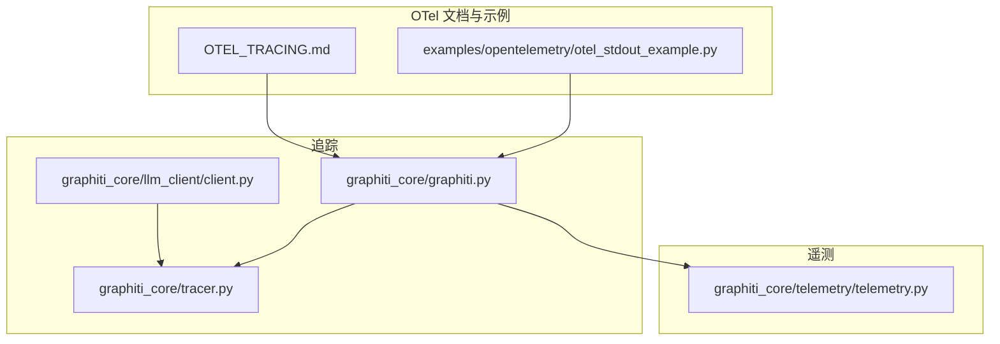
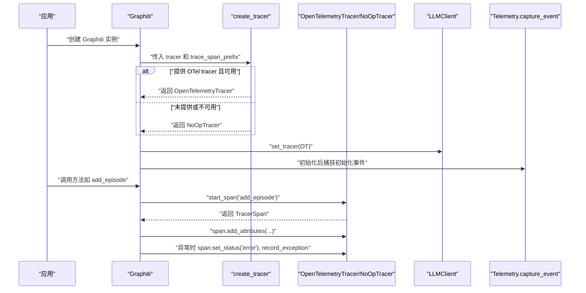
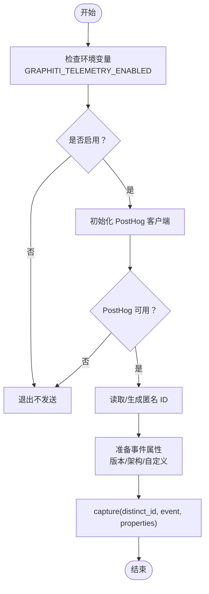
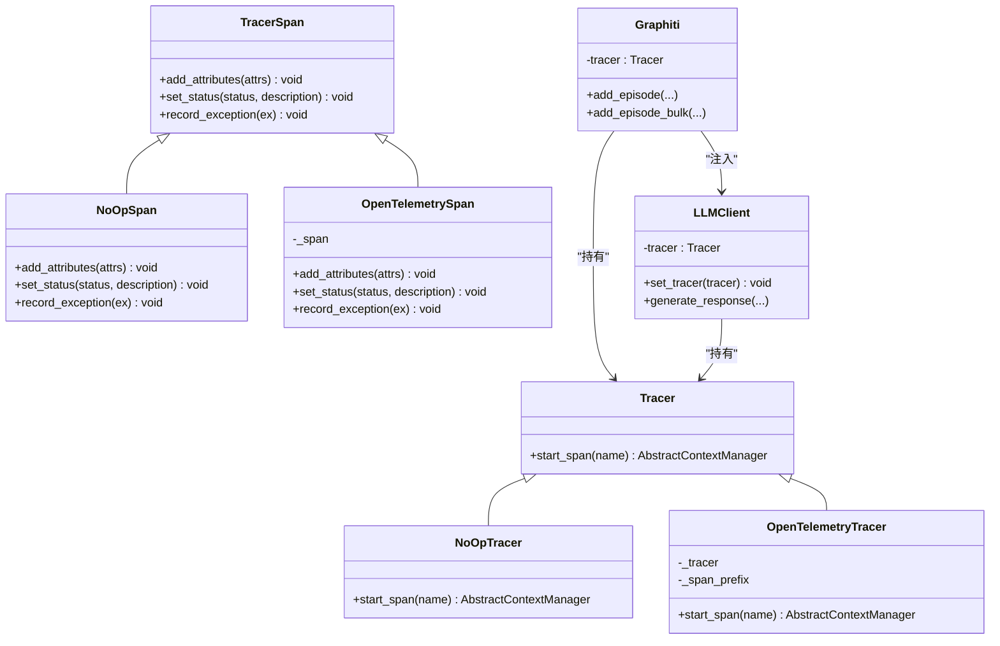
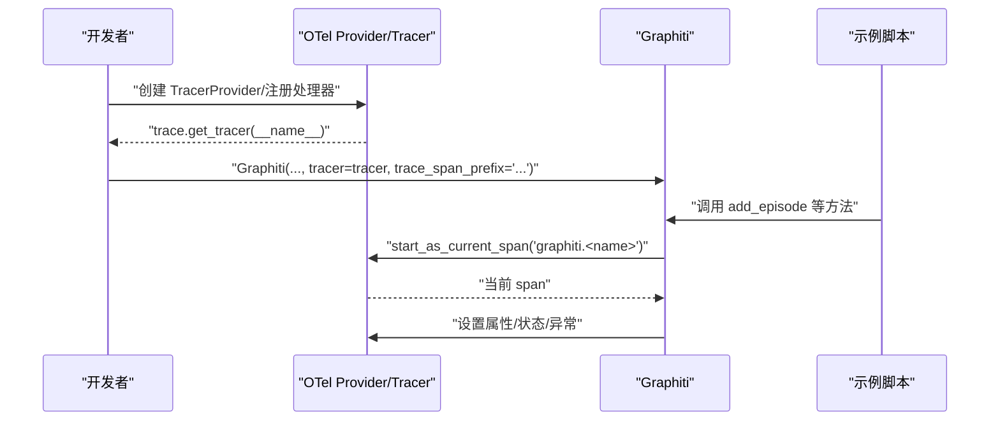
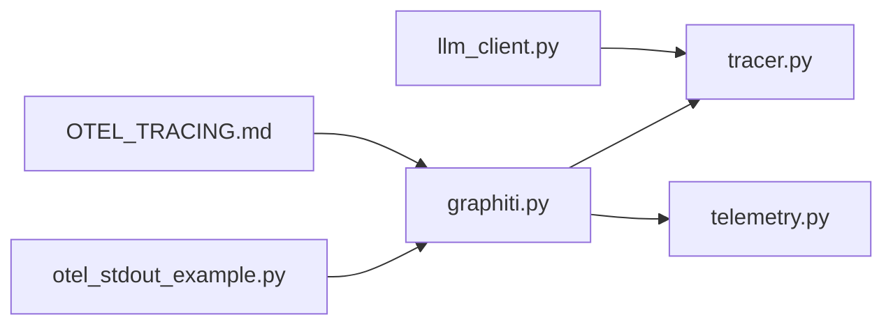

# 遥测与分布式追踪

<cite>
**本文引用的文件列表**
- [graphiti_core/telemetry/telemetry.py](file://graphiti_core/telemetry/telemetry.py)
- [graphiti_core/tracer.py](file://graphiti_core/tracer.py)
- [graphiti_core/graphiti.py](file://graphiti_core/graphiti.py)
- [graphiti_core/llm_client/client.py](file://graphiti_core/llm_client/client.py)
- [OTEL_TRACING.md](file://OTEL_TRACING.md)
- [examples/opentelemetry/otel_stdout_example.py](file://examples/opentelemetry/otel_stdout_example.py)
</cite>

## 目录
1. [引言](#引言)
2. [项目结构](#项目结构)
3. [核心组件](#核心组件)
4. [架构总览](#架构总览)
5. [详细组件分析](#详细组件分析)
6. [依赖关系分析](#依赖关系分析)
7. [性能考量](#性能考量)
8. [故障排查指南](#故障排查指南)
9. [结论](#结论)

## 引言
本文件面向需要监控与诊断系统行为的高级用户，系统性阐述 Graphiti 的遥测与分布式追踪能力：
- 遥测方面：基于 PostHog 的匿名使用统计，包含环境变量控制、匿名 ID 生成与持久化、事件捕获的无侵入式设计。
- 分布式追踪方面：基于 OpenTelemetry 的可选追踪，包含 Tracer/TracerSpan 抽象、OpenTelemetryTracer 包装器、NoOpTracer 降级策略、以及在 Graphiti 初始化时注入 tracer 的完整流程。

## 项目结构
围绕遥测与追踪的关键文件分布如下：
- 遥测：graphiti_core/telemetry/telemetry.py
- 追踪：graphiti_core/tracer.py
- Graphiti 主体：graphiti_core/graphiti.py（初始化、方法调用、事件捕获）
- LLM 客户端：graphiti_core/llm_client/client.py（set_tracer 集成、span 包裹）
- OTel 使用说明：OTEL_TRACING.md
- OTel 示例：examples/opentelemetry/otel_stdout_example.py

图表来源
- [graphiti_core/telemetry/telemetry.py](file://graphiti_core/telemetry/telemetry.py#L1-L118)
- [graphiti_core/tracer.py](file://graphiti_core/tracer.py#L1-L194)
- [graphiti_core/graphiti.py](file://graphiti_core/graphiti.py#L128-L236)
- [graphiti_core/llm_client/client.py](file://graphiti_core/llm_client/client.py#L66-L90)
- [OTEL_TRACING.md](file://OTEL_TRACING.md#L1-L48)
- [examples/opentelemetry/otel_stdout_example.py](file://examples/opentelemetry/otel_stdout_example.py#L40-L60)

章节来源
- [graphiti_core/telemetry/telemetry.py](file://graphiti_core/telemetry/telemetry.py#L1-L118)
- [graphiti_core/tracer.py](file://graphiti_core/tracer.py#L1-L194)
- [graphiti_core/graphiti.py](file://graphiti_core/graphiti.py#L128-L236)
- [graphiti_core/llm_client/client.py](file://graphiti_core/llm_client/client.py#L66-L90)
- [OTEL_TRACING.md](file://OTEL_TRACING.md#L1-L48)
- [examples/opentelemetry/otel_stdout_example.py](file://examples/opentelemetry/otel_stdout_example.py#L40-L60)

## 核心组件
- 遥测 Telemetry
  - 环境变量控制开关：GRAPHITI_TELEMETRY_ENABLED
  - 匿名 ID：~/.cache/graphiti/telemetry_anon_id
  - 事件捕获：capture_event 在失败时静默处理，不影响主流程
- 分布式追踪 Tracer
  - 抽象层：Tracer、TracerSpan
  - OTel 包装：OpenTelemetryTracer（带 span 前缀）、OpenTelemetrySpan（属性过滤、状态设置、异常记录）
  - 降级：NoOpTracer/NoOpSpan（无依赖时自动启用）
  - 工厂：create_tracer（根据是否提供 OTel tracer 决定返回类型）

章节来源
- [graphiti_core/telemetry/telemetry.py](file://graphiti_core/telemetry/telemetry.py#L21-L38)
- [graphiti_core/telemetry/telemetry.py](file://graphiti_core/telemetry/telemetry.py#L25-L27)
- [graphiti_core/telemetry/telemetry.py](file://graphiti_core/telemetry/telemetry.py#L92-L118)
- [graphiti_core/tracer.py](file://graphiti_core/tracer.py#L33-L119)
- [graphiti_core/tracer.py](file://graphiti_core/tracer.py#L126-L157)
- [graphiti_core/tracer.py](file://graphiti_core/tracer.py#L159-L194)

## 架构总览
下图展示 Graphiti 初始化与运行期间的遥测与追踪交互：

图表来源
- [graphiti_core/graphiti.py](file://graphiti_core/graphiti.py#L128-L236)
- [graphiti_core/tracer.py](file://graphiti_core/tracer.py#L159-L194)
- [graphiti_core/llm_client/client.py](file://graphiti_core/llm_client/client.py#L84-L90)
- [graphiti_core/telemetry/telemetry.py](file://graphiti_core/telemetry/telemetry.py#L235-L257)

## 详细组件分析

### 遥测：PostHog 匿名使用统计
- 开关控制
  - 环境变量：GRAPHITI_TELEMETRY_ENABLED，默认开启；测试环境下默认关闭
- 匿名 ID
  - 路径：~/.cache/graphiti/telemetry_anon_id
  - 生成：首次运行生成 UUID 并写入缓存文件
  - 读取：若文件存在则直接读取，失败时回退为 'UNKNOWN'
- 版本信息
  - 尝试从包元数据读取版本号，失败时标记为 'unknown'
- 初始化与捕获
  - initialize_posthog 动态导入 posthog，失败时返回 None（静默禁用）
  - capture_event 在失败时静默处理，保证不影响主流程
- 初始化事件
  - Graphiti 初始化完成后调用 capture_event 发送初始化事件，包含 LLM/嵌入/重排序/数据库提供商类型等属性

图表来源
- [graphiti_core/telemetry/telemetry.py](file://graphiti_core/telemetry/telemetry.py#L29-L38)
- [graphiti_core/telemetry/telemetry.py](file://graphiti_core/telemetry/telemetry.py#L40-L63)
- [graphiti_core/telemetry/telemetry.py](file://graphiti_core/telemetry/telemetry.py#L65-L74)
- [graphiti_core/telemetry/telemetry.py](file://graphiti_core/telemetry/telemetry.py#L76-L90)
- [graphiti_core/telemetry/telemetry.py](file://graphiti_core/telemetry/telemetry.py#L92-L118)
- [graphiti_core/graphiti.py](file://graphiti_core/graphiti.py#L235-L257)

章节来源
- [graphiti_core/telemetry/telemetry.py](file://graphiti_core/telemetry/telemetry.py#L21-L38)
- [graphiti_core/telemetry/telemetry.py](file://graphiti_core/telemetry/telemetry.py#L25-L27)
- [graphiti_core/telemetry/telemetry.py](file://graphiti_core/telemetry/telemetry.py#L40-L63)
- [graphiti_core/telemetry/telemetry.py](file://graphiti_core/telemetry/telemetry.py#L65-L74)
- [graphiti_core/telemetry/telemetry.py](file://graphiti_core/telemetry/telemetry.py#L76-L90)
- [graphiti_core/telemetry/telemetry.py](file://graphiti_core/telemetry/telemetry.py#L92-L118)
- [graphiti_core/graphiti.py](file://graphiti_core/graphiti.py#L235-L257)

### 分布式追踪：OpenTelemetry 实现
- 抽象与实现
  - Tracer/TracerSpan：统一追踪接口
  - NoOpTracer/NoOpSpan：无依赖时的零开销实现
  - OpenTelemetryTracer：包装原生 OTel Tracer，支持自定义 span 名称前缀
  - OpenTelemetrySpan：对属性、状态、异常进行安全封装
- 工厂函数
  - create_tracer：当传入 None 或 OTel 不可用时返回 NoOpTracer；否则返回 OpenTelemetryTracer
- Graphiti 集成
  - 初始化时调用 create_tracer，将 tracer 注入到 LLMClient
  - 关键方法（如 add_episode/add_episode_bulk）使用 with tracer.start_span(...) 包裹业务逻辑
  - 方法内部通过 span.add_attributes、span.set_status、span.record_exception 记录上下文与错误
- LLMClient 集成
  - set_tracer：接收 Tracer 实例（OpenTelemetryTracer 或 NoOpTracer）
  - generate_response：以 llm.generate 为 span 名称包裹一次完整的 LLM 调用，记录模型大小、缓存命中等属性，并在异常时设置状态与记录异常

图表来源
- [graphiti_core/tracer.py](file://graphiti_core/tracer.py#L33-L119)
- [graphiti_core/tracer.py](file://graphiti_core/tracer.py#L126-L157)
- [graphiti_core/tracer.py](file://graphiti_core/tracer.py#L159-L194)
- [graphiti_core/graphiti.py](file://graphiti_core/graphiti.py#L128-L236)
- [graphiti_core/llm_client/client.py](file://graphiti_core/llm_client/client.py#L66-L90)

章节来源
- [graphiti_core/tracer.py](file://graphiti_core/tracer.py#L33-L119)
- [graphiti_core/tracer.py](file://graphiti_core/tracer.py#L126-L157)
- [graphiti_core/tracer.py](file://graphiti_core/tracer.py#L159-L194)
- [graphiti_core/graphiti.py](file://graphiti_core/graphiti.py#L128-L236)
- [graphiti_core/llm_client/client.py](file://graphiti_core/llm_client/client.py#L66-L90)
- [graphiti_core/llm_client/client.py](file://graphiti_core/llm_client/client.py#L175-L214)

### 初始化与使用流程（OTel）
- 安装与配置
  - 按照 OTEL_TRACING.md 的说明安装 OTel SDK，并设置 TracerProvider 与 SpanProcessor
- 在 Graphiti 中启用
  - 获取 OTel tracer 并传入 Graphiti 构造函数
  - 可选参数 trace_span_prefix 用于为所有 span 名称添加统一前缀
- 示例参考
  - examples/opentelemetry/otel_stdout_example.py 展示了完整的 OTel stdout 导出与 Graphiti 集成

图表来源
- [OTEL_TRACING.md](file://OTEL_TRACING.md#L12-L33)
- [examples/opentelemetry/otel_stdout_example.py](file://examples/opentelemetry/otel_stdout_example.py#L40-L60)
- [graphiti_core/graphiti.py](file://graphiti_core/graphiti.py#L128-L236)

章节来源
- [OTEL_TRACING.md](file://OTEL_TRACING.md#L1-L48)
- [examples/opentelemetry/otel_stdout_example.py](file://examples/opentelemetry/otel_stdout_example.py#L40-L60)
- [graphiti_core/graphiti.py](file://graphiti_core/graphiti.py#L128-L236)

## 依赖关系分析
- 组件耦合
  - Graphiti 通过 create_tracer 与 Tracer 接口解耦，既可接入 OTel，也可在无依赖时使用 NoOpTracer
  - LLMClient 通过 set_tracer 接收 Tracer，从而在 LLM 调用链路中自动产生 span
  - Telemetry 与 Graphiti 解耦：Telemetry 仅在初始化阶段被调用，不影响业务主流程
- 外部依赖
  - OTel：动态导入，未安装时 create_tracer 返回 NoOpTracer
  - PostHog：动态导入，未安装时 capture_event 静默禁用
- 循环依赖
  - 未发现循环依赖：Tracer 与 Graphiti/LLMClient 之间为单向依赖

图表来源
- [graphiti_core/graphiti.py](file://graphiti_core/graphiti.py#L128-L236)
- [graphiti_core/tracer.py](file://graphiti_core/tracer.py#L159-L194)
- [graphiti_core/telemetry/telemetry.py](file://graphiti_core/telemetry/telemetry.py#L76-L90)
- [graphiti_core/llm_client/client.py](file://graphiti_core/llm_client/client.py#L84-L90)
- [examples/opentelemetry/otel_stdout_example.py](file://examples/opentelemetry/otel_stdout_example.py#L40-L60)
- [OTEL_TRACING.md](file://OTEL_TRACING.md#L1-L48)

章节来源
- [graphiti_core/graphiti.py](file://graphiti_core/graphiti.py#L128-L236)
- [graphiti_core/tracer.py](file://graphiti_core/tracer.py#L159-L194)
- [graphiti_core/telemetry/telemetry.py](file://graphiti_core/telemetry/telemetry.py#L76-L90)
- [graphiti_core/llm_client/client.py](file://graphiti_core/llm_client/client.py#L84-L90)
- [examples/opentelemetry/otel_stdout_example.py](file://examples/opentelemetry/otel_stdout_example.py#L40-L60)
- [OTEL_TRACING.md](file://OTEL_TRACING.md#L1-L48)

## 性能考量
- 零开销降级：无 OTel 依赖时使用 NoOpTracer/NoOpSpan，避免任何追踪开销
- 事件捕获静默处理：Telemetry 捕获失败不会阻塞主流程
- span 名称前缀：通过 trace_span_prefix 统一命名，便于后续检索与聚合
- 缓存与重试：LLMClient 的缓存与重试策略减少重复调用，间接降低 OTel span 数量

## 故障排查指南
- 未安装 OTel
  - 现象：create_tracer 返回 NoOpTracer，Graphiti 仍可正常工作
  - 处理：按 OTEL_TRACING.md 安装依赖并正确配置 TracerProvider
- 未安装 PostHog
  - 现象：capture_event 静默禁用，不影响业务
  - 处理：按需安装 posthog 客户端库
- 环境变量禁用遥测
  - 现象：GRAPHITI_TELEMETRY_ENABLED=false 时不会发送事件
  - 处理：调整环境变量或删除以恢复默认值
- 异常时追踪
  - 现象：Graphiti 与 LLMClient 在异常时会设置状态并记录异常
  - 处理：查看导出的 span 属性与异常信息定位问题

章节来源
- [graphiti_core/tracer.py](file://graphiti_core/tracer.py#L140-L157)
- [graphiti_core/telemetry/telemetry.py](file://graphiti_core/telemetry/telemetry.py#L92-L118)
- [graphiti_core/graphiti.py](file://graphiti_core/graphiti.py#L821-L825)
- [graphiti_core/llm_client/client.py](file://graphiti_core/llm_client/client.py#L200-L207)

## 结论
Graphiti 在遥测与分布式追踪上提供了“可选、无侵入、零开销”的设计：
- 遥测：通过环境变量与匿名 ID 实现匿名统计，事件捕获静默处理，不影响主流程
- 追踪：通过抽象接口与工厂函数实现 OTel 可插拔，无依赖时自动降级为 NoOp，确保功能完整性与性能稳定
- 集成：Graphiti 初始化时注入 tracer，关键方法与 LLM 调用均自动产生 span，便于端到端诊断与性能分析