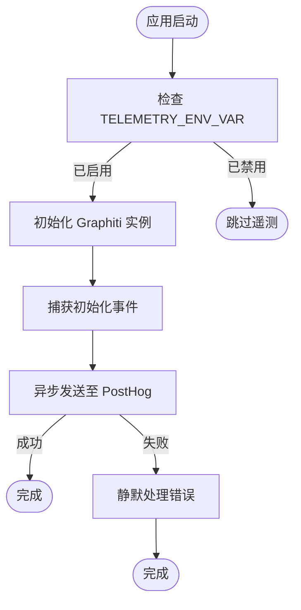
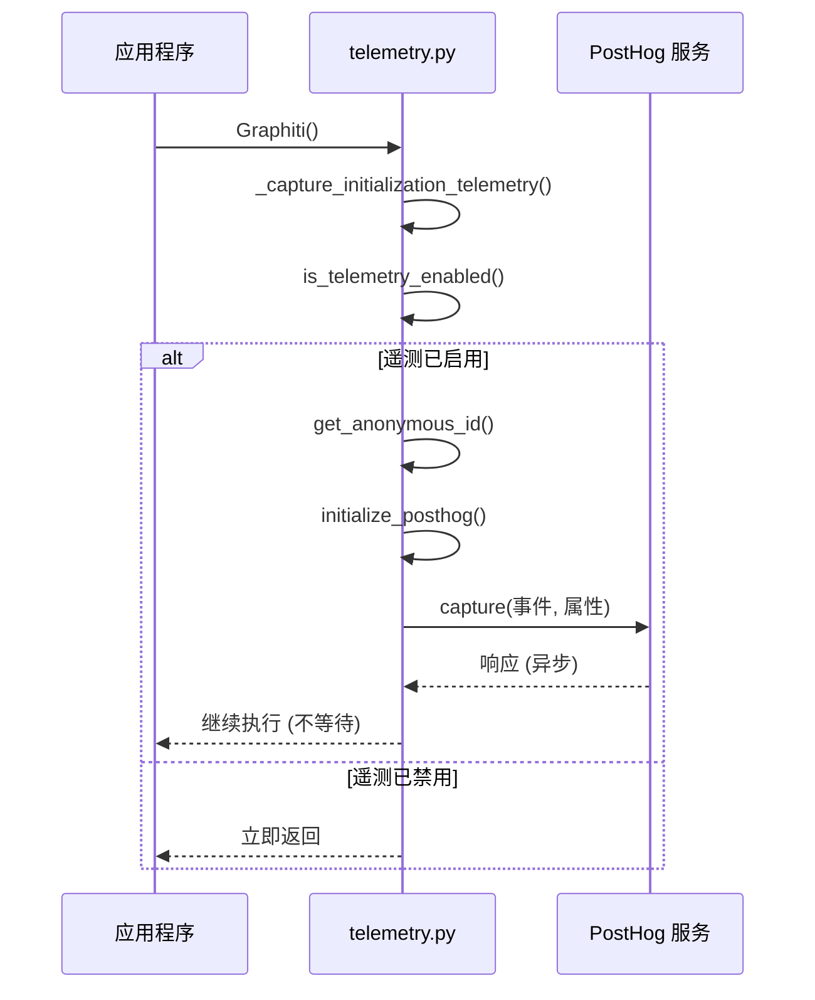

# 遥测实现

<cite>
**本文档中引用的文件**  
- [telemetry.py](file://graphiti_core/telemetry/telemetry.py)
- [graphiti.py](file://graphiti_core/graphiti.py)
- [README.md](file://README.md)
</cite>

## 目录
1. [简介](#简介)
2. [遥测功能概述](#遥测功能概述)
3. [环境变量控制](#环境变量控制)
4. [匿名ID生成与存储](#匿名id生成与存储)
5. [事件捕获机制](#事件捕获机制)
6. [代码示例与使用方法](#代码示例与使用方法)
7. [隐私合规性](#隐私合规性)
8. [总结](#总结)

## 简介
Graphiti 框架集成了匿名使用统计功能，旨在通过收集非敏感的使用数据来持续改进产品。本文档详细说明了 `telemetry.py` 模块中的遥测实现机制，包括如何通过环境变量控制功能开关、匿名ID的生成与存储路径、事件捕获的设计原理以及其对用户体验和产品迭代的价值。

**Section sources**
- [README.md](file://README.md#L553-L658)

## 遥测功能概述
Graphiti 在初始化时会自动发送一个遥测事件，记录框架的使用情况。这些数据完全匿名，仅用于了解用户配置偏好、技术栈分布及版本采用率，从而指导开发优先级和兼容性优化。

遥测功能默认启用（opt-in），但在测试环境中（检测到 `pytest` 模块）会自动禁用，以避免干扰测试流程。



**Diagram sources**
- [telemetry.py](file://graphiti_core/telemetry/telemetry.py#L29-L37)
- [graphiti.py](file://graphiti_core/graphiti.py#L234-L256)

## 环境变量控制
遥测功能的启用状态由环境变量 `GRAPHITI_TELEMETRY_ENABLED` 控制。该变量遵循标准布尔值解析规则：

- 可接受的启用值：`true`, `1`, `yes`, `on`
- 可接受的禁用值：`false`, `0`, `no`, `off`
- 默认值：`true`（即默认启用）

用户可通过以下方式禁用遥测：

**选项1：设置环境变量**
```bash
export GRAPHITI_TELEMETRY_ENABLED=false
```

**选项2：在 Python 代码中设置**
```python
import os
os.environ['GRAPHITI_TELEMETRY_ENABLED'] = 'false'

from graphiti_core import Graphiti
graphiti = Graphiti(...)
```

**Section sources**
- [telemetry.py](file://graphiti_core/telemetry/telemetry.py#L21-L37)
- [README.md](file://README.md#L596-L627)

## 匿名ID生成与存储
每个用户设备会被分配一个唯一的匿名标识符（UUID），用于去重统计，但不关联任何个人身份信息。

- **生成机制**：使用 Python 标准库 `uuid.uuid4()` 生成随机 UUID。
- **存储路径**：`~/.cache/graphiti/telemetry_anon_id`
- **持久化**：首次生成后保存到本地文件，后续调用直接读取该文件中的 ID。
- **目录创建**：若缓存目录 `~/.cache/graphiti` 不存在，则自动创建。

即使读写文件失败，系统也会返回 `'UNKNOWN'` 作为备用 ID，确保不影响主流程。

**Section sources**
- [telemetry.py](file://graphiti_core/telemetry/telemetry.py#L24-L62)

## 事件捕获机制
核心函数 `capture_event` 负责发送遥测数据，其设计具有以下关键特性：

### 异步非阻塞设计
所有遥测操作均设计为静默失败，不会阻塞主应用程序流程。异常被 `try-except` 捕获并忽略，确保即使遥测服务不可用，也不会影响 Graphiti 的正常功能。

### 数据收集范围
初始化事件 (`graphiti_initialized`) 收集以下信息：
- **Graphiti 版本号**
- **系统信息**：操作系统架构、Python 版本
- **配置选择**：
  - LLM 提供商（OpenAI, Azure, Anthropic 等）
  - 数据库后端（Neo4j, FalkorDB, Kuzu, Neptune）
  - 嵌入模型提供商（OpenAI, Voyage 等）

### 发送流程
1. 检查遥测是否启用
2. 初始化 PostHog 客户端（使用公共 API 密钥）
3. 获取或生成匿名 ID
4. 构造事件属性（包含版本、架构及配置信息）
5. 异步发送事件



**Diagram sources**
- [telemetry.py](file://graphiti_core/telemetry/telemetry.py#L92-L117)
- [graphiti.py](file://graphiti_core/graphiti.py#L237-L256)

## 代码示例与使用方法
虽然遥测主要在 `Graphiti` 初始化时自动触发，但开发者也可手动发送自定义事件（需导入内部函数）：

```python
from graphiti_core.telemetry import capture_event

# 手动发送一个自定义遥测事件
capture_event(
    event_name="custom_feature_used",
    properties={
        "feature_name": "advanced_search",
        "search_type": "hybrid"
    }
)
```

此功能可用于跟踪特定功能的使用频率，为产品迭代提供数据支持。

**Section sources**
- [telemetry.py](file://graphiti_core/telemetry/telemetry.py#L92-L117)
- [graphiti.py](file://graphiti_core/graphiti.py#L66)

## 隐私合规性
Graphiti 高度重视用户隐私，遥测设计严格遵守以下原则：

- **绝不收集**：
  - 个人身份信息（PII）或任何可识别身份的数据
  - API 密钥、密码或其他认证凭据
  - 用户的实际数据、查询内容或图谱内容
  - IP 地址、主机名或文件路径
- **数据匿名化**：使用本地生成的 UUID，不与任何账户或身份关联。
- **透明开源**：遥测代码完全公开，用户可随时审查。
- **明确告知**：在 README 中详细说明收集内容及目的。
- **自由选择**：提供简单明了的禁用方式，尊重用户选择。

**Section sources**
- [README.md](file://README.md#L570-L579)

## 总结
Graphiti 的遥测系统是一个精心设计的匿名统计工具，通过 `GRAPHITI_TELEMETRY_ENABLED` 环境变量灵活控制，在 `~/.cache/graphiti/telemetry_anon_id` 存储匿名ID，并利用 `capture_event` 函数异步、静默地发送配置信息。该功能在不侵犯用户隐私的前提下，为产品团队提供了宝贵的使用洞察，有助于优化开发资源分配，提升框架的稳定性和兼容性，最终惠及整个用户社区。

**Section sources**
- [telemetry.py](file://graphiti_core/telemetry/telemetry.py)
- [graphiti.py](file://graphiti_core/graphiti.py)
- [README.md](file://README.md)