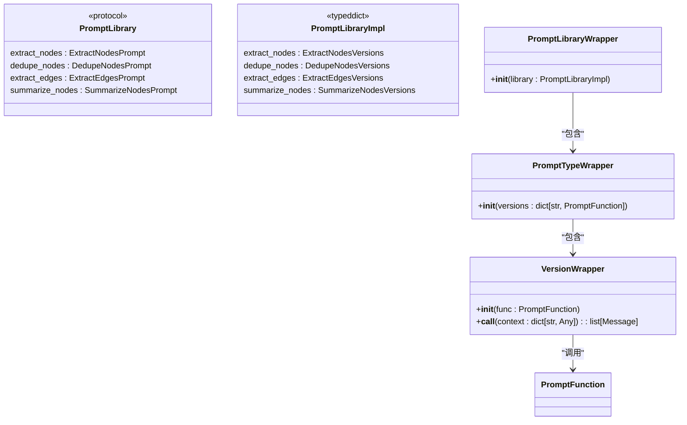
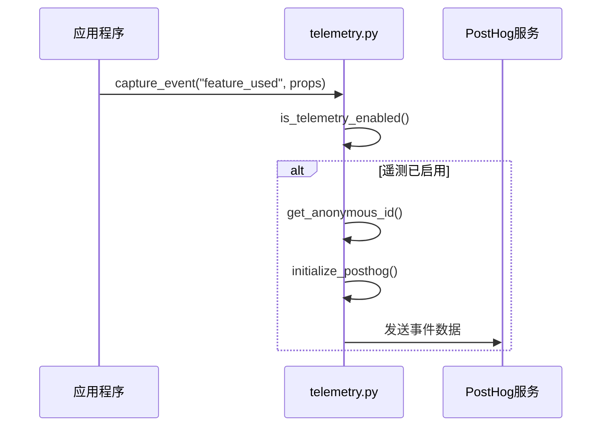

# 高级特性

<cite>
**本文档引用的文件**   
- [community_operations.py](file://graphiti_core/utils/maintenance/community_operations.py)
- [lib.py](file://graphiti_core/prompts/lib.py)
- [telemetry.py](file://graphiti_core/telemetry/telemetry.py)
- [tracer.py](file://graphiti_core/tracer.py)
- [node_operations.py](file://graphiti_core/utils/maintenance/node_operations.py)
- [edge_operations.py](file://graphiti_core/utils/maintenance/edge_operations.py)
- [dedup_helpers.py](file://graphiti_core/utils/maintenance/dedup_helpers.py)
- [temporal_operations.py](file://graphiti_core/utils/maintenance/temporal_operations.py)
- [driver.py](file://graphiti_core/driver/driver.py)
- [client.py](file://graphiti_core/llm_client/client.py)
- [otel_stdout_example.py](file://examples/opentelemetry/otel_stdout_example.py)
</cite>

## 目录
1. [社区检测算法](#社区检测算法)
2. [提示库复用与自定义](#提示库复用与自定义)
3. [OpenTelemetry集成](#opentelemetry集成)
4. [大规模图数据维护与性能调优](#大规模图数据维护与性能调优)
5. [扩展框架指导](#扩展框架指导)

## 社区检测算法

该模块实现了基于标签传播（Label Propagation）的社区检测算法，用于在知识图谱中发现聚类结构。算法通过分析实体节点之间的关系网络，自动识别出具有紧密连接的节点群组，并为每个群组生成语义摘要。

算法流程如下：
1. **图投影构建**：对于每个组（group_id），收集所有实体节点，并构建节点间的邻接关系映射。
2. **标签传播**：每个节点初始时拥有独立的社区标签，通过迭代过程，每个节点采纳其邻居节点中占多数的社区标签，直至社区分配稳定。
3. **社区聚合**：将具有相同社区标签的节点聚合成社区簇。
4. **语义摘要生成**：使用LLM对每个社区簇中的节点摘要进行递归两两合并，最终生成代表整个社区的摘要和名称。

该功能支持异步并发处理，可通过`build_communities`函数批量构建社区，或通过`update_community`函数动态更新单个实体所属的社区。

**Section sources**
- [community_operations.py](file://graphiti_core/utils/maintenance/community_operations.py#L29-L332)

## 提示库复用与自定义

提示库（Prompt Library）采用模块化设计，提供了一套可复用的提示模板系统，支持动态版本管理和自定义提示开发。

### 提示库架构

提示库通过`PromptLibraryWrapper`类实现，该类封装了所有提示类型及其版本。每个提示类型（如`extract_nodes`, `dedupe_nodes`等）都包含多个版本的实现，允许平滑升级和A/B测试。



**Diagram sources**
- [lib.py](file://graphiti_core/prompts/lib.py#L47-L102)

### 自定义提示模板

开发者可通过以下步骤创建自定义提示模板：

1. 在`graphiti_core/prompts/`目录下创建新的提示模块（如`custom_prompt.py`）。
2. 定义提示函数和版本映射：
```python
def custom_prompt_v1(context: dict[str, Any]) -> list[Message]:
    # 实现提示逻辑
    pass

versions = {
    'v1': custom_prompt_v1
}
```
3. 在`lib.py`的`PROMPT_LIBRARY_IMPL`中注册新提示：
```python
PROMPT_LIBRARY_IMPL: PromptLibraryImpl = {
    # ... existing prompts
    'custom_prompt': custom_prompt_versions,
}
```
4. 通过`prompt_library.custom_prompt.v1(context)`调用自定义提示。

所有提示模板均遵循统一的上下文（context）输入格式，通常包含`episode_content`、`previous_episodes`、`extracted_entities`等字段，确保一致性和可预测性。

**Section sources**
- [lib.py](file://graphiti_core/prompts/lib.py#L1-L102)

## OpenTelemetry集成

系统通过`telemetry.py`和`tracer.py`两个模块实现了全面的分布式追踪与监控功能。

### 匿名使用统计

`telemetry.py`模块负责收集匿名使用统计数据，以帮助改进产品。该功能默认启用，但可通过环境变量`GRAPHITI_TELEMETRY_ENABLED`控制。

核心功能包括：
- **事件捕获**：通过`capture_event`函数记录用户行为事件。
- **匿名ID管理**：在用户主目录下生成`.cache/graphiti/telemetry_anon_id`文件，持久化存储匿名ID。
- **PostHog集成**：使用PostHog作为后端分析服务，收集的事件包含版本号、架构信息等元数据。



**Diagram sources**
- [telemetry.py](file://graphiti_core/telemetry/telemetry.py#L1-L118)

### 分布式追踪

`tracer.py`模块提供了与OpenTelemetry兼容的追踪接口，支持跨服务调用的链路追踪。

关键组件：
- **Tracer抽象类**：定义了`start_span`等核心接口，支持多种追踪后端。
- **OpenTelemetryTracer**：具体实现，包装OpenTelemetry的Tracer实例。
- **NoOpTracer**：空操作实现，当OpenTelemetry未安装时使用，避免运行时错误。

在应用程序中启用追踪：
```python
from opentelemetry import trace
from opentelemetry.sdk.trace import TracerProvider
from opentelemetry.sdk.trace.export import ConsoleSpanExporter, SimpleSpanProcessor

# 配置OpenTelemetry
provider = TracerProvider()
provider.add_span_processor(SimpleSpanProcessor(ConsoleSpanExporter()))
trace.set_tracer_provider(provider)
otel_tracer = trace.get_tracer(__name__)

# 创建Graphiti客户端并注入追踪器
graphiti = Graphiti(
    graph_driver=kuzu_driver, 
    tracer=otel_tracer, 
    trace_span_prefix='graphiti.example'
)
```

示例代码`otel_stdout_example.py`演示了如何配置OpenTelemetry将追踪数据输出到控制台。

**Section sources**
- [tracer.py](file://graphiti_core/tracer.py#L1-L194)
- [otel_stdout_example.py](file://examples/opentelemetry/otel_stdout_example.py#L1-L126)

## 大规模图数据维护与性能调优

系统提供了一套完整的维护脚本和性能优化机制，用于处理大规模图数据。

### 维护脚本

位于`graphiti_core/utils/maintenance/`目录下的维护脚本提供了以下核心功能：

- **节点操作**：`node_operations.py`负责实体节点的提取、去重和属性填充。
- **边操作**：`edge_operations.py`处理关系边的提取、去重和时间有效性管理。
- **图数据操作**：`graph_data_operations.py`提供清除数据、检索片段等工具。
- **去重辅助**：`dedup_helpers.py`实现了基于MinHash和LSH的高效模糊匹配算法。

### 性能调优技巧

1. **并发控制**：使用`semaphore_gather`函数限制并发任务数量，避免资源耗尽。例如，社区构建的并发数由`MAX_COMMUNITY_BUILD_CONCURRENCY`常量控制。

2. **高效去重**：
   - 使用精确匹配（`_normalize_string_exact`）快速处理完全相同的名称。
   - 对于模糊匹配，采用MinHash算法计算签名，再通过LSH（局部敏感哈希）进行候选过滤，显著降低计算复杂度。

3. **缓存机制**：
   - LLM客户端内置磁盘缓存（`diskcache`），避免重复调用相同提示。
   - 去重辅助函数使用`@lru_cache`装饰器缓存计算结果。

4. **批量操作**：在数据导入场景中，使用`bulk_utils`进行批量处理，减少I/O开销。

```mermaid
flowchart TD
A[开始] --> B[提取节点]
B --> C[收集候选节点]
C --> D{存在候选?}
D --> |否| E[创建新节点]
D --> |是| F[构建候选索引]
F --> G[精确匹配]
G --> H{匹配成功?}
H --> |是| I[返回现有节点]
H --> |否| J[模糊匹配 (MinHash+LSH)]
J --> K{相似度达标?}
K --> |是| L[返回最相似节点]
K --> |否| M[标记为未解决]
M --> N[调用LLM去重]
N --> O[返回解析结果]
```

**Diagram sources**
- [node_operations.py](file://graphiti_core/utils/maintenance/node_operations.py#L1-L588)
- [edge_operations.py](file://graphiti_core/utils/maintenance/edge_operations.py#L1-L712)
- [dedup_helpers.py](file://graphiti_core/utils/maintenance/dedup_helpers.py#L1-L263)

## 扩展框架指导

系统设计为高度可扩展，支持通过实现自定义驱动或客户端来集成新的图数据库或LLM服务。

### 自定义驱动

要实现自定义图数据库驱动，需继承`GraphDriver`抽象基类并实现以下方法：

- `execute_query`: 执行Cypher查询
- `session`: 获取数据库会话
- `close`: 关闭连接
- `delete_all_indexes`: 删除所有索引
- `build_indices_and_constraints`: 构建索引和约束

参考现有驱动实现：
- `neo4j_driver.py`: Neo4j驱动
- `falkordb_driver.py`: FalkorDB驱动
- `kuzu_driver.py`: Kùzu驱动

### 自定义客户端

#### LLM客户端
继承`LLMClient`抽象基类，实现`_generate_response`方法。系统已提供多个参考实现：
- `openai_client.py`: OpenAI API客户端
- `anthropic_client.py`: Anthropic API客户端
- `gemini_client.py`: Google Gemini客户端

#### 嵌入客户端
继承`EmbedderClient`抽象基类，实现`create`方法。参考实现：
- `openai.py`: OpenAI嵌入
- `voyage.py`: Voyage AI嵌入
- `gemini.py`: Google Gemini嵌入

通过这种模块化设计，开发者可以轻松集成新的AI服务或图数据库，而无需修改核心业务逻辑。

**Section sources**
- [driver.py](file://graphiti_core/driver/driver.py#L1-L125)
- [client.py](file://graphiti_core/llm_client/client.py#L1-L243)
- [embedder/client.py](file://graphiti_core/embedder/client.py#L1-L39)